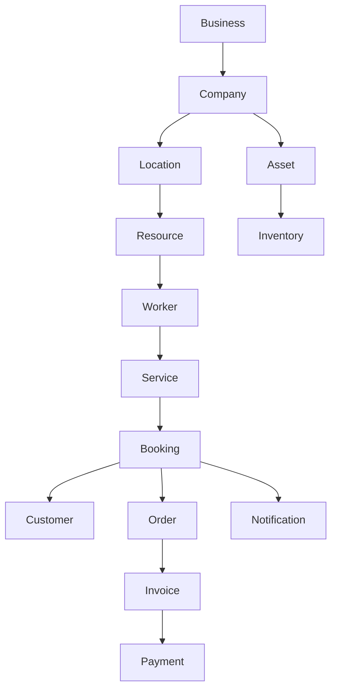

# 07 — Core Meta Model

**Build Once. Configure Everywhere.**

> Coração da CoreFlow Platform. O core opera apenas sobre conceitos universais; plugins especializam terminologia e regras.

Ver análise completa: [`COREFLOW_GAP_ANALYSIS.md`](../COREFLOW_GAP_ANALYSIS.md)

## Cadeia universal

## Mapeamento por plugin

| Conceito universal | Beauty | Sports | Clinic |
|-------------------|--------|--------|--------|
| Worker | Trancista | Árbitro | Médico |
| Resource | Cadeira | Quadra | Consultório |
| Service | Trança | Esporte | Consulta |
| Booking | Agendamento | Reserva | Consulta |
| Asset | Cabelo sintético | Bola | Equipamento |
| Inventory | Estoque salão | Bar | Medicamentos |

## Implementação no código

| Conceito | Tabela | API v1 | Sprint |
|----------|--------|--------|--------|
| Company | `companies` | `/companies` | CF-0 ✅ |
| Location | `core_locations` | `/v1/locations` | CF-2 ✅ |
| Resource | `core_resources` | `/v1/resources` | CF-2 ✅ |
| Worker | `core_workers` | `/v1/workers` | CF-2 ✅ |
| Catalog | `core_catalogs` | `/v1/catalogs` | CF-1 ✅ |
| Offering | `core_offerings` | `/v1/catalogs/{id}/offerings` | CF-1 ✅ |
| Booking | `core_bookings` | `/v1/bookings` | CF-1 ✅ |
| Customer | `core_customers` | `/v1/customers` | CF-5 ✅ |
| Payment | `payments` → `core_payments` | `/v1/payments` | CF-6 ✅ |
| Waitlist | `fila` → `core_waitlist` | `/v1/waitlist` | CF-7 ✅ |
| Order | `agendamentos` → `core_orders` | `/v1/orders` | CF-9 ✅ |
| Invoice | `financeiro` → `core_invoices` | `/v1/invoices` | CF-9 ✅ |
| Asset | `inventory_items` → `core_assets` | `/v1/assets` | CF-10 ✅ |
| Inventory | `inventory_items` → `core_inventory` | `/v1/inventory` | CF-10 ✅ |
| Marketplace | `marketplace/catalog.yaml` | `/v1/marketplace` | CF-10 ✅ |

Enum: `app/core/metamodel/concepts.py` · ADR: [`19-ADR/ADR001-metamodel.md`](../06-ADR/ADR001-metamodel.md)

## Princípio

> 90% do código permanece igual entre verticais. Plugins alteram **manifest**, **terminologia** e **metadata JSON** — não duplicam entidades core.
