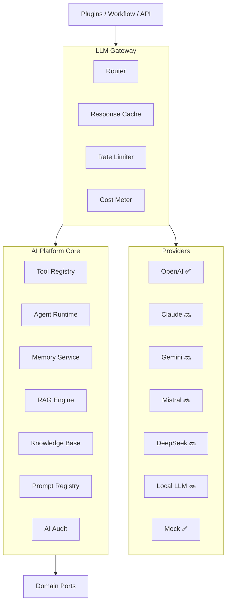
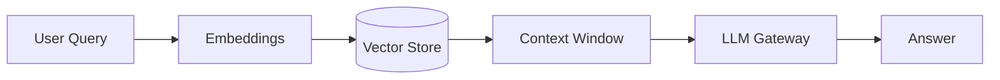

# CoreFlow — AI Architecture

**Documento:** `docs/AIArchitecture.md`  
**Versão:** 1.0 · **Data:** 2026-07-09  
**Status:** Estratégico — LLM Gateway e AI Platform  
**Complementa:** `AgenticAIArchitecture.md`

---

## Visão

CoreFlow AI não é chatbot — é **infraestrutura empresarial de IA** reutilizável: gateway multi-provider, tools, agents, memory, RAG, audit e cost control. Mini **LangChain empresarial** integrado ao Event Bus.



---

## LLM Gateway

| Responsabilidade | Detalhe |
|------------------|---------|
| Provider routing | Config per tenant, fallback chain |
| API key vault | Tenant keys or platform pooled |
| Retry / timeout | Exponential backoff |
| Token counting | Input/output per request |
| Cost allocation | Charge tenant / plugin |
| Content filter | Safety policies |
| Caching | Identical prompt hash TTL |

**Código atual:** `LLMService` + providers mock/OpenAI — evoluir para Gateway R4.

---

## Providers

| Provider | Status | Use case |
|----------|--------|----------|
| Mock | ✅ | Tests, dev |
| OpenAI | ✅ | Production optional |
| Anthropic Claude | 🔜 R4 | Long context |
| Google Gemini | 🔜 R4 | Multimodal |
| Mistral | 🔜 R5 | EU latency |
| DeepSeek | 🔜 R5 | Cost optimization |
| Local (Ollama/vLLM) | 🔜 R6 | On-prem enterprise |

Plugin manifest: `ai.provider_preference: [openai, mock]`

---

## Tool Registry

Tools = funções seguras sobre **ports** — nunca SQL direto.

| Tool | Port | Release |
|------|------|---------|
| `get_booking` | BookingQueryPort | R4 |
| `list_customer_bookings` | CustomerPort | R4 |
| `send_notification` | NotificationPort | R4 |
| `create_workflow_run` | WorkflowPort | R5 |
| `query_analytics` | BIPort | R5 |

Plugins register: `manifest.ai_tools: [custom_tool]`

---

## Agents

| Layer | Owner | Example |
|-------|-------|---------|
| Agent shell | Core | BaseAgent, lifecycle |
| Vertical agent | Plugin | Beauty CRM follow-up |
| Marketplace agent | Partner | No-show predictor |

Ver `AgenticAIArchitecture.md`.

---

## Memory Service

| Type | Scope | Storage |
|------|-------|---------|
| Session | Conversation turn | Redis TTL |
| Customer | Per customer context | Tenant DB encrypted |
| Tenant | Business preferences | tenant_config |

---

## RAG — Retrieval Augmented Generation



| Component | Release |
|-----------|---------|
| Document ingestion | R4 |
| Chunking + embeddings | R4 |
| Vector store (pgvector) | R4 |
| Tenant isolation | Mandatory |
| Knowledge Base UI | R5 |

Sources: FAQ tenant, service descriptions, policy docs — **never** cross-tenant.

---

## Prompt Registry

| Feature | Detalhe |
|---------|---------|
| Versioned prompts | Git + DB |
| Variables | `{{customer.name}}`, `{{booking.date}}` |
| A/B testing | R5 |
| Rollback | One-click |
| Audit | Who changed prompt when |

Path: `prompts/{plugin_id}/{agent_id}/v{version}.yaml`

---

## AI Audit & compliance

Log every invocation:

```json
{
  "agent_id": "beauty.crm_followup",
  "tenant_id": 42,
  "user_id": 7,
  "provider": "openai",
  "model": "gpt-4o-mini",
  "tokens_in": 450,
  "tokens_out": 120,
  "cost_usd": 0.002,
  "tools_called": ["get_booking"],
  "latency_ms": 890,
  "correlation_id": "..."
}
```

Event: `ai.agent.invoked` → Audit domain + Platform Billing.

---

## Cost control

| Mechanism | Detail |
|-----------|--------|
| Per-tenant budget | Monthly cap USD |
| Per-agent limit | Rate + token cap |
| Kill switch | `FEATURE_AI_CORE_ENABLED=false` |
| Billing | `PlatformBilling.md` — AI consumption |

---

## Feature flags

| Flag | Default |
|------|---------|
| `FEATURE_AI_CORE_ENABLED` | false |
| `FEATURE_AI_RAG_ENABLED` | false |
| `FEATURE_AI_GATEWAY_CACHE_ENABLED` | true |

---

## Roadmap

| Release | Entrega |
|---------|---------|
| R2 | Migrate BeautyAgent → plugin |
| R3 | Gateway design RFC |
| R4 | Gateway MVP, 2 providers, tools, prompt registry |
| R5 | RAG, memory, AI marketplace |
| R6 | Local LLM, enterprise audit export |

---

## Referências

- `docs/AgenticAIArchitecture.md`
- `docs/PlatformBilling.md`
- `modules/ai/`
- `docs/CoreVsPlugins.md` — agents in plugins
