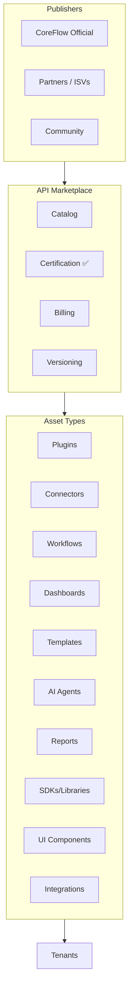

# CoreFlow — API Marketplace

**Documento:** `docs/APIMarketplace.md`  
**Versão:** 1.0 · **Data:** 2026-07-09  
**Status:** Estratégico — marketplace além de plugins  
**Escopo:** Conectores, workflows, dashboards, templates, agents, SDKs, componentes

---

## Visão

O **Plugin Marketplace** distribui verticais completos. O **API Marketplace** distribui **ativos composáveis** que estendem qualquer vertical — acelerando time-to-value sem fork do core.



---

## Tipos de ativos

| Asset Type | Descrição | Exemplo | Consumer |
|------------|-----------|---------|----------|
| **plugin** | Vertical completo | SportsOS | Tenant install |
| **connector** | Integration Hub adapter | Stripe BR v2 | Integration Hub |
| **workflow** | Automation pack | Deposit reminder 3-step | WorkflowEngine |
| **dashboard** | BI widget set | Salon KPI pack | BI / LCP |
| **template** | Multi-artifact bundle | Clinic onboarding pack | Tenant setup wizard |
| **ai_agent** | Configured agent | No-show predictor | AI Platform |
| **report** | Report definition | Monthly revenue PDF | Reporting |
| **sdk** | Client library | `@coreflow/plugin-sports` | Developers |
| **component** | UI block | Gallery catalog widget | Frontend LCP |
| **integration** | Pre-built mapping | WhatsApp booking confirm | Integration Hub |
| **rule_pack** | BRE rules | Sports weekend pricing | BRE |
| **theme** | Visual theme pack | Dark beauty pro | TCE |

---

## Metadados de publicação

```json
{
  "asset_id": "connector.stripe.br",
  "asset_type": "connector",
  "name": "Stripe Brasil",
  "version": "2.1.0",
  "publisher_id": "coreflow-official",
  "pricing": {
    "model": "free",
    "subscription_monthly": null,
    "revenue_share_pct": null
  },
  "compatibility": {
    "min_platform_version": "2.0.0",
    "plugins": ["beauty", "sports", "clinic"],
    "regions": ["BR", "LATAM"]
  },
  "certification": {
    "level": "official",
    "scanned_at": "2026-07-01",
    "signature": "sha256:..."
  }
}
```

---

## Estratégia de monetização

### Modelos de receita

| Modelo | Aplicação | Split plataforma |
|--------|-----------|------------------|
| **Free** | Connectors core, basic templates | — |
| **Freemium** | Basic free, pro features paid | 30% |
| **Subscription** | Agent, dashboard packs / month | 30% |
| **One-time purchase** | Template bundle | 30% |
| **Usage-based** | AI agent per invocation | 20% + LLM pass-through |
| **Revenue share** | Partner plugin SaaS | 15–30% tiered |
| **Enterprise license** | Private marketplace, white-label | Custom |

### Tiers de publisher

| Tier | Revenue share | Listing fee | Support |
|------|---------------|-------------|---------|
| Community | 30% | Free | Forum |
| Certified Partner | 20% | $99/mo | Email |
| Premier ISV | 15% | Waived | Dedicated |
| CoreFlow Official | — | — | Full |

### Projeção (referência estratégica)

| Ano | Marketplace GMV | Platform take (30%) |
|-----|-----------------|---------------------|
| 2028 | $500K | $150K |
| 2029 | $2M | $600K |
| 2030 | $8M | $2.4M |

*Projeções ilustrativas — validar com PMF.*

---

## Fluxo de publicação

```
Upload → Schema validation → Certification pipeline → Review → Publish → Tenant install
```

Detalhes: `docs/PluginCertification.md` (aplica a todos asset types).

---

## Instalação por tenant

| Asset type | Install behavior |
|------------|------------------|
| connector | Register in Integration Hub |
| workflow | Copy to tenant lowcode_artifacts |
| dashboard | Merge into tenant BI config |
| ai_agent | Register in agent registry |
| rule_pack | Merge BRE rules (tenant scope) |
| theme | Apply TCE theme |
| plugin | Full plugin install (existing) |

Event: `marketplace.asset.installed`

---

## API Marketplace vs Plugin Marketplace

| Aspecto | Plugin Marketplace | API Marketplace |
|---------|-------------------|-----------------|
| Unidade | Vertical completo | Ativo composável |
| Instalação | Manifest + hooks | Per asset type |
| Dependências | Core modules | Pode depender de plugin |
| Certificação | Full security scan | Proporcional ao type |
| Billing | SaaS tier ou rev share | Multi-model |

**Unificação UI:** Single storefront com filtros por type — backend `asset_type` discriminator.

---

## APIs (propostas)

| Method | Path | Descrição |
|--------|------|-----------|
| GET | `/v1/marketplace/assets` | Browse catalog |
| GET | `/v1/marketplace/assets/{id}` | Detail + versions |
| POST | `/v1/marketplace/assets/{id}/install` | Install for tenant |
| DELETE | `/v1/marketplace/assets/{id}/uninstall` | Remove |
| POST | `/v1/marketplace/publish` | Publisher upload |
| GET | `/v1/marketplace/publisher/earnings` | Revenue dashboard |

---

## Roadmap

| Release | Entrega |
|---------|---------|
| R2 | — |
| R3 | Asset model design |
| R4 | Catalog API stub |
| R5 | MVP: workflows + connectors + dashboards |
| R6 | Full types + billing + publisher portal |
| R7 | Global marketplace + regional pricing |

---

## Referências

- `docs/EcosystemStrategy.md`
- `docs/PluginCertification.md`
- `docs/IntegrationHub.md`
- `docs/LowCodePlatform.md`
- `modules/marketplace/` — stub existente
