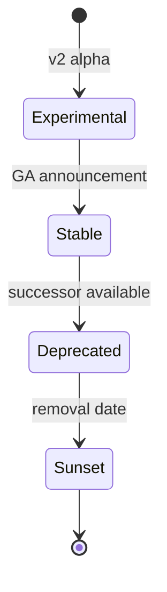

# CoreFlow — API Versioning Policy

**Documento:** `docs/APIVersioning.md`  
**Versão:** 1.0 · **Data:** 2026-07-09  
**Status:** Normativo — política de versionamento de APIs  
**Autoridade:** Complementa `CONSTITUTION.md` Artigo I (Backward Compatibility)

---

## Princípio

A API CoreFlow é produto. Versionamento previsível permite evolução da plataforma sem quebrar tenants, SDK, plugins e parceiros.

---

## Estratégia URL + Header

| Mecanismo | Uso |
|-----------|-----|
| **URL path** | `/v1/bookings` — versão major |
| **Header** | `CoreFlow-Version: 2026-07-09` — date-based optional (public API R6) |
| **OpenAPI** | `info.version` semver documentação |

---

## Ciclo de vida de versão



| Estado | Significado | SLA |
|--------|-------------|-----|
| **Experimental** | `/v2/*` ou header beta — breaking allowed | No SLA |
| **Stable** | `/v1/*` — production default | 99.9%+ |
| **Deprecated** | Funciona + headers Deprecation | 12 meses mínimo |
| **Sunset** | Removido — 410 Gone | — |

---

## Regras de compatibilidade

### Non-breaking (minor/patch — mesma `/v1`)

- Adicionar campos optional em response
- Adicionar endpoints novos
- Adicionar query params optional
- Adicionar valores enum novos (se clients toleram unknown)

### Breaking (requer nova major)

- Remover campo response
- Renomear campo
- Alterar tipo de campo
- Alterar semântica status HTTP
- Alterar auth requirements
- Remover endpoint

**Breaking = `/v2` + ADR + migration guide + período deprecação.**

---

## Deprecation headers (RFC 8594)

```
Deprecation: true
Sunset: Sat, 01 Jan 2028 00:00:00 GMT
Link: </v2/bookings>; rel="successor-version"
X-CoreFlow-Enforcement: warn
```

Legacy routes: `LegacySunsetMiddleware` ✅  
v1 routes: aplicar ao deprecar subpaths.

---

## Versionamento paralelo

| Superfície | v1 Stable | v2 Experimental | Legado |
|------------|-----------|-----------------|--------|
| Core API | `/v1/*` ✅ | `/v2/*` 🔜 | PT-BR routes sunset |
| Events Avro | `.v1`, `.v2` ✅ | `.v3` | `reservation.*` sunset |
| SDK | `@coreflow/sdk@1.x` ✅ | `@2.x` com v2 API | — |
| Webhooks | version in payload | envelope_version | — |

---

## Migration guide template

Cada major release publica em `docs/migrations/v1-to-v2.md`:

1. Breaking changes list
2. Before/after examples
3. SDK upgrade steps
4. Timeline (deprecation → sunset)
5. Feature flags for gradual client migration

---

## Eventos vs REST

| Artefato | Versionamento |
|----------|---------------|
| REST `/v1/*` | URL major |
| Domain events | `event_version` + Avro schema major |
| Webhooks | `envelope_version` |
| Plugin manifest | `api_version` + `min_platform_version` |

---

## Cronograma referência

| Milestone | Target |
|-----------|--------|
| v1 stable GA | ✅ Current |
| v2 experimental spike | R4 (select endpoints) |
| v1 sunset earliest | 2028+ (no plan before v2 GA 12m) |
| Legado API sunset | R3–R4 (enforcement block → remove) |

---

## Referências

- `docs/APIGovernance.md`
- `docs/architecture/LegacyToCoreRouteMap.md`
- `docs/rfc/RFC-002-CoreEnforcementSunset.md`
- `docs/EngineeringHandbook.md` § API
