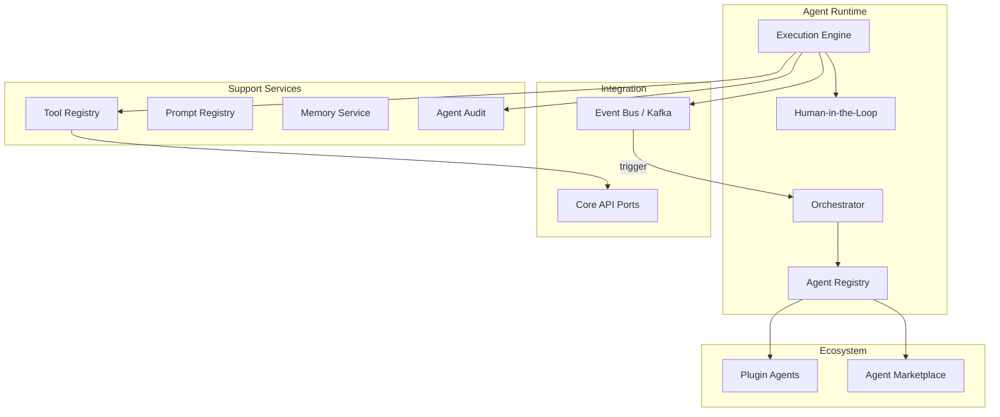

# CoreFlow — Agentic AI Architecture

**Documento:** `docs/AgenticAIArchitecture.md`  
**Versão:** 1.0 · **Data:** 2026-07-09  
**Status:** Estratégico — arquitetura para IA agêntica  
**Base:** Kafka/event experience + `AIArchitecture.md`

---

## Visão

Preparar CoreFlow para **ecossistema de agentes autônomos** — plugins publicam agents especializados que interagem via **mesmo event bus** e **domain ports**, com human-in-the-loop e audit completos.

Inspirado em: LangGraph, AutoGPT patterns, Salesforce Einstein Agents — **enterprise-grade**.



---

## Componentes

### Agent Runtime

| Componente | Responsabilidade |
|------------|------------------|
| **Orchestrator** | Recebe triggers, seleciona agent, gerencia loop |
| **Execution Engine** | Plan → act → observe cycle |
| **Agent Registry** | Catalog agents by plugin/marketplace |
| **Scheduler** | Cron + event triggers |
| **Human-in-the-Loop** | Approval gates for sensitive actions |

### Tool Registry

- Typed tools bound to domain ports
- Permission check per tool per role
- Idempotent tools preferred
- Max tool calls per run (default 10)

### Prompt Registry

- Versioned system/user prompts
- Variable injection from context
- Plugin overrides

### Memory Service

- Short-term: conversation buffer
- Long-term: customer/tenant facts (with consent)
- Episodic: past agent runs for learning

### Agent Audit

- Full trace: inputs, tool calls, outputs, cost
- Immutable log for compliance
- Export for enterprise

---

## Agent lifecycle

```
Register → Configure → Trigger → Plan → [HITL?] → Execute Tools → Publish Result → Audit
```

| Trigger type | Example |
|--------------|---------|
| Event | `booking.created` → confirmation agent |
| Schedule | Daily CRM follow-up |
| API | `POST /v1/ai/agents/{id}/run` |
| Workflow | workflow action `ai.agent.run` |
| Human | Staff clicks "Suggest reply" |

---

## Human-in-the-loop

| Action tier | HITL |
|-------------|------|
| Read-only (query booking) | Auto |
| Notify customer | Auto with template |
| Apply discount >10% | **Require approval** |
| Cancel booking | **Require approval** |
| Payment refund | **Require approval** |

Queue: `agent_hitl_pending` → admin approves in app.

---

## Plugin agents

```yaml
# plugins/beauty/manifest.yaml
ai_agents:
  - id: beauty.crm_followup
    name: CRM Follow-up
    triggers: [booking.completed, schedule.daily]
    tools: [get_customer, list_bookings, send_notification]
    hitl_policy: notify_only
```

Code: `app/plugins/beauty/agents/crm_followup.py`

**Proibido:** agent vertical em `modules/ai/` — R2 migration.

---

## Agent Marketplace

- Publish agent configs + optional fine-tuned prompts
- Billing: per invocation or subscription
- Certification: `PluginCertification.md` extended for agents
- See `APIMarketplace.md` asset type `ai_agent`

---

## Event integration

Agents **consomem** e **publicam** eventos:

```
(EVT) booking.no_show_risk_high 🔜
  → {POL} Orchestrator → agent no_show_prevention
    → (EVT) ai.agent.invoked
      → (EVT) notification.sent
```

Correlation via `correlation_id` — trace in OpenTelemetry.

---

## MCP (Model Context Protocol)

Future port for external tool providers (R5+):

- MCP server exposes CoreFlow tools to Claude Desktop etc.
- MCP client imports external tools into agents

---

## Safety

| Control | Detail |
|---------|--------|
| Tool allowlist | Per agent |
| Tenant isolation | Strict |
| PII masking | In logs |
| Output filter | Block harmful content |
| Budget cap | Per run + per tenant |

---

## Roadmap

| Release | Entrega |
|---------|---------|
| R2 | BeautyAgent → plugin structure |
| R3 | Agent registry design |
| R4 | Runtime MVP, orchestrator, HITL basic |
| R5 | Agent marketplace, multi-step plans |
| R6 | MCP port, federated agents |

---

## RFC/ADR

| Artefato | Release |
|----------|---------|
| RFC-010 Agentic AI Architecture | R3 prep |
| ADR-023 Agent Runtime Boundaries | R4 |

---

## Referências

- `docs/AIArchitecture.md`
- `docs/EventStorming.md` — Fluxo 7
- `docs/EventDrivenArchitecture.md`
- `docs/MarketplaceEconomy.md`
