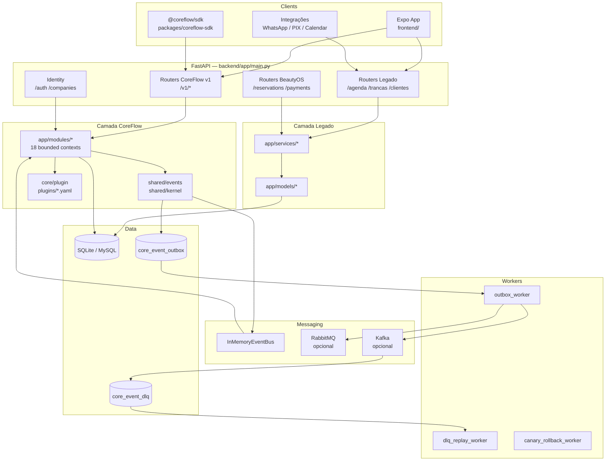
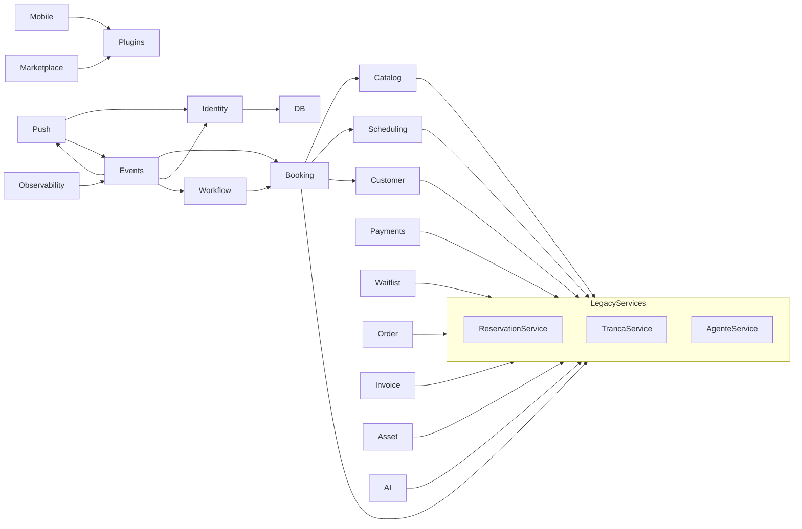
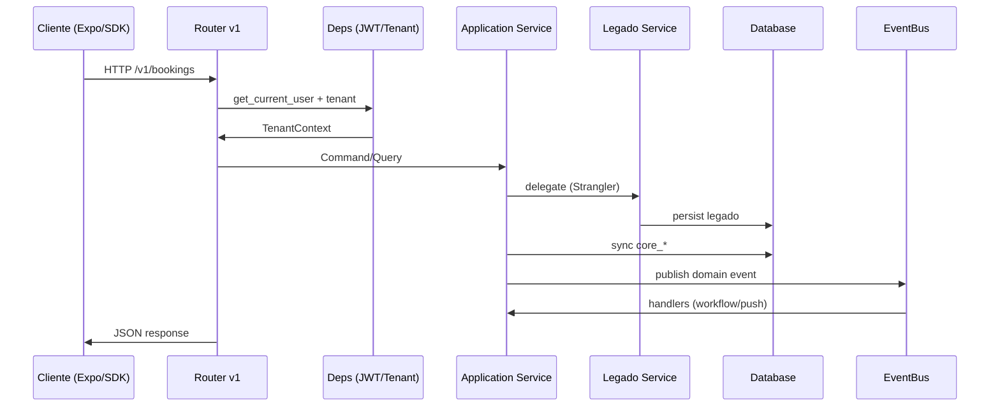

# CoreFlow Platform — Architecture Assessment

**Documento:** `docs/ArchitectureAssessment.md`  
**Data da auditoria:** 9 de julho de 2026  
**Versão do código analisada:** `1.15.0-sprint25` (`backend/app/core/config.py`)  
**Escopo:** análise exclusivamente baseada no código e documentação existentes no repositório  
**Referências principais:** `BEAUTYOS_BLUEPRINT.md`, `DOCUMENTACAO.md`, `docs/README.md`, `docs/COREFLOW_GAP_ANALYSIS.md`

---

## 1. Executive Summary

### Objetivo do sistema

O repositório implementa a **CoreFlow Platform** — uma plataforma modular para gestão de negócios orientados a serviços (agendamento, pagamentos, fila, CRM, financeiro, mobile OTA, observabilidade). O vertical piloto em produção de desenvolvimento é **BeautyOS** (trancistas), registrado como plugin `beauty` em `backend/plugins/beauty/manifest.yaml`.

A API é servida por **FastAPI** (`backend/app/main.py`). Clientes incluem app **Expo/React Native** (`frontend/`), integrações futuras (WhatsApp, agentes IA) e APIs legadas ainda ativas.

### Stack utilizada

| Camada | Tecnologia | Evidência |
|--------|------------|-----------|
| Backend API | Python 3.11, FastAPI 0.104, Uvicorn | `backend/requirements.txt`, `backend/Dockerfile` |
| ORM / DB | SQLAlchemy 2.0, Alembic, SQLite (dev), MySQL (Docker/CI) | `backend/app/db/`, `docker-compose.mysql.yml` |
| Auth | JWT (python-jose), bcrypt (passlib) | `backend/app/core/security.py`, `backend/app/modules/identity/` |
| Eventos | InMemoryEventBus, Outbox, RabbitMQ (pika), Kafka (kafka-python), Avro | `backend/app/shared/events/` |
| Observabilidade | Prometheus client, OpenTelemetry (opcional), Grafana/Alertmanager as code | `backend/app/core/prometheus_metrics.py`, `backend/app/modules/observability/` |
| Mobile | Expo ~50, React Native 0.73, Expo Router | `frontend/package.json`, `frontend/app/` |
| SDK | TypeScript `@coreflow/sdk` | `packages/coreflow-sdk/` |
| Infra | Docker Compose overlays, Terraform AWS CDN, nginx CDN | `docker-compose*.yml`, `infra/terraform/` |
| CI/CD | GitHub Actions (8 workflows) | `.github/workflows/` |

### Nível de maturidade

| Dimensão | Avaliação |
|----------|-----------|
| **Produto piloto (Beauty/trancista)** | Alto — fluxos operacionais completos via API legada + parcialmente via v1 |
| **Plataforma CoreFlow (genérica)** | Médio-alto em infraestrutura transversal (plugins, eventos, mobile DevOps); médio em domínio genérico; baixo em AI Platform, marketplace real e offline mobile |
| **Arquitetura alvo (Blueprint v3.0)** | Em transição ativa — padrão **Strangler Fig** documentado em `DOCUMENTACAO.md` e `docs/COREFLOW_GAP_ANALYSIS.md` |
| **Sprints entregues** | CF-0 a CF-25 concluídos (`DOCUMENTACAO.md`, `docs/04-SPRINTS/Sprint00.md` … `Sprint25.md`) |

### Principais pontos positivos

1. **Modular monolith bem iniciado** — 18 módulos em `backend/app/modules/` com separação domain/application parcial.
2. **Plugin framework funcional** — loader, registry, 3 manifests (beauty, clinic, sports), API `/v1/plugins`.
3. **Metamodelo CoreFlow v1** — entidades `core_*` + API `/v1/*` com sync legado (`legacy_sync_service.py` em vários módulos).
4. **Event-driven infrastructure** — outbox, Kafka adapter, DLQ, replay worker, schema registry Avro.
5. **DevOps mobile maduro** — EAS build/submit/update, canary OTA, CDN, Terraform policy (OPA/Sentinel/TFC).
6. **Testes backend robustos** — 246 testes coletados (`pytest --collect-only`), suite CF-0→CF-25.
7. **Multi-tenant base** — `TenantContext`, JWT com `company_id`, RBAC por papel.
8. **Scheduling Engine genérico** — `backend/app/modules/scheduling/engine/scheduling_engine.py` desacoplado de domínio beauty.

### Principais riscos

1. **Coexistência tripla de APIs** — legado PT-BR, BeautyOS (`/reservations`), CoreFlow v1 (`/v1/*`) aumenta complexidade e risco de regras divergentes (`backend/app/main.py`).
2. **Regras de negócio ainda no legado** — commands CQRS de booking delegam a `ReservationService` legado (`backend/app/modules/booking/application/commands/`).
3. **Hexagonal/DDD incompletos** — maioria dos módulos não possui camada `infrastructure/` nem ports explícitos.
4. **AI First aspiracional** — módulo `ai/` existe, mas sem RAG, agents genéricos ou prompt engine; `BeautyAgent` acoplado ao domínio beauty.
5. **Frontend consome APIs mistas** — serviços legados e v1 coexistem em `frontend/src/services/`.
6. **Sem Redis, cache distribuído, rate limiting ou OAuth** — não encontrados no código.
7. **Observabilidade export-only** — Grafana/Alertmanager/Prometheus gerados como artefatos; sem stack completa em Docker Compose.
8. **Documentação SAB parcial** — `docs/COREFLOW_GAP_ANALYSIS.md` estima ~65% da documentação alvo ausente.

---

## 2. Estrutura do Projeto

### Mapa de diretórios (raiz)

```
Atendente Salao trancista/
├── backend/                 # API FastAPI, workers, plugins, testes
├── frontend/                # App Expo/React Native (BeautyOS mobile + web)
├── packages/coreflow-sdk/   # SDK TypeScript cliente
├── docs/                    # Software Architecture Blueprint (SAB)
├── infra/                   # Terraform, nginx
├── scripts/                 # Shell scripts DevOps (13 arquivos .sh)
├── .github/workflows/       # CI/CD (8 workflows)
├── docker-compose*.yml      # 6 arquivos compose (base + overlays)
├── Makefile                 # Targets dev/ops
├── BEAUTYOS_BLUEPRINT.md    # Product Blueprint v3.0
├── BEAUTYOS_ARCHITECTURE.md # Arquitetura detalhada
├── DOCUMENTACAO.md          # Documentação operacional consolidada
└── [dezenas de .md operacionais na raiz]
```

### Backend

| Path | Conteúdo |
|------|----------|
| `backend/app/main.py` | Entrypoint FastAPI, registro de routers, startup handlers |
| `backend/app/core/` | Config, security, RBAC, tenant, plugin registry, metamodel, telemetry, prometheus |
| `backend/app/modules/` | 18 bounded contexts (domain/application/infrastructure parcial) |
| `backend/app/routers/` | Routers v1 + legado + well-known |
| `backend/app/schemas/` | Pydantic schemas (incl. `coreflow_v1.py`) |
| `backend/app/services/` | **20 services legados** (camada pré-CoreFlow) |
| `backend/app/models/` | **17 models ORM legados** |
| `backend/app/shared/events/` | Event bus, outbox, Kafka, RabbitMQ, DLQ, Avro |
| `backend/app/shared/kernel/` | TenantContext, RBAC shared kernel |
| `backend/app/workers/` | outbox_worker, dlq_replay_worker, canary_rollback_worker |
| `backend/app/integrations/` | expo_push, pix, whatsapp, google_calendar |
| `backend/plugins/` | Manifests YAML: beauty, clinic, sports |
| `backend/alembic/versions/` | 10 migrations cf001–cf010 |
| `backend/tests/` | 35 arquivos test + conftest |
| `backend/schemas/events/` | JSON + Avro event schemas |
| `backend/workflows/` | `beauty_booking_approval.yaml` |
| `backend/marketplace/` | `catalog.yaml` |

### Frontend

| Path | Conteúdo |
|------|----------|
| `frontend/app/` | Rotas Expo Router: `(auth)`, `(tabs)`, `(admin)` |
| `frontend/src/components/` | 14 componentes UI |
| `frontend/src/contexts/` | AuthContext, AdminOperacionalContext |
| `frontend/src/services/` | 12 services HTTP (legado + coreflowService) |
| `frontend/src/hooks/` | `useAdminOperacional.ts` |
| `frontend/eas.json` | Perfis EAS build/submit/update |
| `frontend/app.json` | Bundle IDs, scheme deep link |

**Não encontrado:** aplicação web separada (Next.js/Vite). O frontend Expo exporta web via `expo export --platform web`.

### Mobile

- **Não existe** diretório `mobile/` com app Flutter (sem `pubspec.yaml` no repositório).
- App mobile = `frontend/` (Expo/React Native).
- Backend mobile (EAS/CDN/Terraform/canary) = `backend/app/modules/mobile/`.

### Infra

| Path | Conteúdo |
|------|----------|
| `infra/terraform/environments/dev/` | Terraform CDN AWS (S3/CloudFront) |
| `infra/terraform/modules/coreflow-cdn/` | Módulo CDN |
| `infra/terraform/policies/` | OPA (`cdn.rego`), Sentinel (`cdn.sentinel`) |
| `infra/nginx/` | `cdn-default.conf`, `well-known.conf` |
| `infra/grafana/`, `infra/alertmanager/` | **Gerados por export scripts** — não versionados como stack completa |

### Docs

Estrutura SAB em `docs/` — ver `docs/README.md`. Pastas: `00-EXECUTIVE-SUMMARY/` … `20-FUTURE-VISION/`, `04-SPRINTS/` (Sprint00–Sprint25), `COREFLOW_GAP_ANALYSIS.md`.

### Scripts

13 scripts shell em `scripts/` — EAS, CDN, Terraform, Grafana, Alertmanager (ver `Makefile`).

### Containers

| Arquivo | Serviços |
|---------|----------|
| `docker-compose.yml` | `api` (SQLite) |
| `docker-compose.mysql.yml` | `mysql` + override api |
| `docker-compose.rabbitmq.yml` | `rabbitmq`, `outbox-worker` |
| `docker-compose.kafka.yml` | `zookeeper`, `kafka`, workers |
| `docker-compose.schema-registry.yml` | Confluent Schema Registry |
| `docker-compose.cdn.yml` | `cdn` (nginx), `canary-rollback-worker` |

**Não encontrado em Docker Compose:** Redis, Celery, Prometheus container, Grafana container, Alertmanager container.

### Ferramentas

- **Makefile** — 40+ targets (`test`, `migrate`, `docker-*`, `terraform-*`, workers)
- **Alembic** — migrations versionadas
- **pytest** — testes backend
- **GitHub Actions** — CI, EAS, CDN, Terraform (8 workflows)

---

## 3. Arquitetura

### Padrão identificado: **Modular Monolith em transição Strangler Fig**

O sistema **não** implementa uma arquitetura pura (Clean, Hexagonal ou DDD completo). A combinação real é:

| Padrão | Presença | Evidência |
|--------|----------|-----------|
| **Layered (camadas)** | Forte no legado | `routers → services → models` |
| **Modular Monolith** | Forte no CoreFlow v1 | `backend/app/modules/*` |
| **DDD (parcial)** | Médio | domain/application em módulos; aggregates/VOs ausentes |
| **Hexagonal (parcial)** | Baixo-médio | ports/adapters em identity e payments apenas |
| **Event-Driven (parcial)** | Médio | bus in-process + outbox + adapters externos |
| **CQRS (parcial)** | Baixo-médio | commands booking + query services; sem read models separados |
| **MVC** | Não como arquitetura principal | FastAPI usa routers, não MVC clássico |
| **Onion** | Não identificado | dependências não seguem regra estrita inside-out |

### Por que esta conclusão

1. **`backend/app/main.py`** registra simultaneamente routers legados (`/agenda`, `/trancas`) e v1 (`/v1/bookings`).
2. **Módulos CoreFlow** seguem `domain/` + `application/` (`backend/app/modules/booking/`, `scheduling/`, etc.).
3. **Strangler Fig explícito** — `legacy_sync_service.py`, `LegacySchedulingAdapter`, middleware `LegacySunsetMiddleware`, `CoreEnforcementMiddleware` (`backend/app/core/`).
4. **Event bus substituível** — docstring em `backend/app/shared/events/event_bus.py`: "Substituível por RabbitMQ/Kafka adapter".
5. **Blueprint confirma** — `BEAUTYOS_BLUEPRINT.md` §4: Modular Monolith + DDD + Hexagonal + Event-Driven.

### Diagrama — arquitetura atual



---

## 4. Organização dos Módulos

### Inventário (`backend/app/modules/`)

| Módulo | Responsabilidade | Dependências principais | Isolamento | Qualidade |
|--------|------------------|-------------------------|------------|-----------|
| **identity** | Auth JWT, companies, RBAC, repositórios | `core/security`, models User/Company | **Alto** — único com api/infrastructure completa | ⭐⭐⭐⭐ |
| **booking** | CoreBooking, CQRS commands, event handlers | legado ReservationService, scheduling, catalog | Médio — delega ao legado | ⭐⭐⭐ |
| **scheduling** | Location, Worker, Resource, ScheduleBlock, **SchedulingEngine** | legado AgendaDiaService via adapter | Médio — engine genérico + adapter | ⭐⭐⭐⭐ |
| **catalog** | CoreCatalog, CoreOffering, queries | legado Tranca/ServiceImage sync | Médio | ⭐⭐⭐ |
| **customer** | CoreCustomer, queries, sync | legado Cliente | Médio | ⭐⭐⭐ |
| **payments** | CorePayment, **PaymentProviderPort** | legado Payment, PIX integration | Médio-alto (port hexagonal) | ⭐⭐⭐⭐ |
| **waitlist** | CoreWaitlist, queries, sync | legado Fila | Médio | ⭐⭐⭐ |
| **workflow** | WorkflowEngine YAML, CoreWorkflowRun | event bus, booking events | Médio-alto | ⭐⭐⭐⭐ |
| **order** | CoreOrder, queries, sync | legado Agendamento | Médio | ⭐⭐⭐ |
| **invoice** | CoreInvoice, queries, sync | legado Financeiro | Médio | ⭐⭐⭐ |
| **asset** | CoreAsset, queries, sync | legado InventoryItem | Médio | ⭐⭐⭐ |
| **inventory** | CoreInventory, queries | asset sync | Médio | ⭐⭐⭐ |
| **marketplace** | MarketplaceService, catalog.yaml | plugin registry | Baixo — stub funcional | ⭐⭐ |
| **push** | DeviceToken, push, deep links, handlers | expo integration, event bus | Médio-alto | ⭐⭐⭐⭐ |
| **mobile** | EAS, CDN, Terraform, canary OTA | plugin manifests, observability | Especializado DevOps | ⭐⭐⭐⭐ |
| **observability** | Grafana dashboards, Alertmanager rules | prometheus metrics | Export as code | ⭐⭐⭐ |
| **ai** | LLM factory, providers, BeautyAgent | legado AgenteService | Baixo — acoplado beauty | ⭐⭐ |
| **(shared)** | events, kernel | transversal | N/A | ⭐⭐⭐⭐ |

**Arquivos analisados:** listagem via glob em `backend/app/modules/` (98 arquivos).

---

## 5. Domain Driven Design

### Separação de camadas

| Camada | Existe? | Onde | Cobertura |
|--------|---------|------|-----------|
| **Domain** | Sim (parcial) | `*/domain/models.py`, `*/domain/events.py`, `workflow/domain/definition.py` | ~70% módulos v1 |
| **Application** | Sim | `*/application/*_service.py`, `commands/`, `handlers.py` | ~80% módulos v1 |
| **Infrastructure** | Parcial | `identity/infrastructure/`, `mobile/infrastructure/` | ~15% módulos |
| **Presentation/API** | Sim | `routers/v1_*.py`, `identity/api/` | v1 + identity |

### Artefatos DDD

| Artefato | Existe? | Evidência |
|----------|---------|-----------|
| **Entities** | Sim | SQLAlchemy models em `*/domain/models.py` e `app/models/` |
| **Value Objects** | **Não encontrado** | Sem classes VO imutáveis; usa dataclasses pontuais (`EngineSlot` em scheduling) |
| **Aggregates** | **Não formalizado** | Sem AggregateRoot; entidades independentes |
| **Factories** | Parcial | Factory functions em `booking/domain/events.py`, `identity/domain/events.py` |
| **Repositories** | Parcial | `identity/infrastructure/persistence/repositories.py`, `mobile/infrastructure/canary_promotion_repository.py`; demais módulos usam SQLAlchemy direto nos services |
| **Domain Events** | Sim | `booking/domain/events.py`, `identity/domain/events.py`, `shared/events/domain_event.py` |
| **Policies** | Parcial | RBAC em `shared/kernel/rbac.py`; Terraform OPA/Sentinel para infra CDN |
| **Specifications** | **Não encontrado** | — |
| **Domain Services** | Parcial | Lógica em application services; legado em `app/services/` |

### Nível de aderência DDD: **4/10**

**Pontos fortes:** bounded contexts nomeados, eventos de domínio, commands booking, linguagem ubíqua documentada em `backend/app/core/metamodel/concepts.py`.

**Gaps:** ORM = domain model (anêmico), sem aggregates, repositórios só em 2 módulos, regras críticas no legado.

---

## 6. Hexagonal Architecture

### Ports & Adapters identificados

| Port | Adapter | Arquivo |
|------|---------|---------|
| `TokenServicePort` | `JwtTokenService` | `identity/application/ports/token_port.py` → `identity/infrastructure/security/jwt_token_service.py` |
| Repository ports (User, Company) | `SqlAlchemy*Repository` | `identity/application/ports/repositories.py` → `identity/infrastructure/persistence/repositories.py` |
| `PaymentProviderPort` | Mock / integrações PIX | `payments/application/ports/payment_provider.py` |
| Event bus (implícito) | `InMemoryEventBus`, `KafkaEventAdapter`, `RabbitMQ` adapter | `shared/events/` |
| LLM provider (implícito) | `MockProvider`, `OpenAIProvider` | `ai/providers/` |

### Inversão de dependência

- **Identity:** boa — application depende de ports, infrastructure implementa.
- **Payments:** port definido; implementações concretas limitadas.
- **Demais módulos:** application services dependem diretamente de SQLAlchemy Session e services legados.

### Acoplamentos identificados

| Acoplamento | Local | Impacto |
|-------------|-------|---------|
| CQRS booking → ReservationService legado | `booking/application/commands/*.py` | Alto |
| SchedulingEngine → AgendaDiaService legado | `scheduling/engine/scheduling_engine.py` | Médio |
| BeautyAgent → AgenteService legado | `ai/beauty_agent.py` | Médio |
| Routers v1 → query services + Session | `routers/v1_*.py` | Médio |
| Plugin registry → filesystem YAML | `core/plugin/registry.py` | Baixo (esperado) |

### Nível de aderência Hexagonal: **3/10**

---

## 7. API

### Versionamento

| Namespace | Prefixo | Arquivo(s) | Status |
|-----------|---------|------------|--------|
| CoreFlow v1 | `/v1/*` | `backend/app/routers/v1_*.py` | Ativo, evolução principal |
| Identity | `/auth`, `/companies` | `modules/identity/api/` | Ativo |
| Legado PT-BR | `/agenda`, `/trancas`, etc. | `backend/app/routers/*.py` | Ativo, sunset middleware |
| BeautyOS | `/reservations`, `/payments`, `/queue` | `reservations.py`, `payments.py`, `queue.py` | Ativo |
| Well-known | `/.well-known/*` | `well_known.py` | CDN/mobile |
| Docs | `/docs`, `/redoc` | FastAPI auto | OpenAPI 3 |

### Routers CoreFlow v1 (registrados em `main.py`)

| Router | Prefixo | Arquivo |
|--------|---------|---------|
| plugins | `/v1/plugins` | `routers/plugins.py` |
| catalogs | `/v1/catalogs` | `v1_catalogs.py` |
| bookings | `/v1/bookings` | `v1_bookings.py` |
| customers | `/v1/customers` | `v1_customers.py` |
| payments | `/v1/payments` | `v1_payments.py` |
| waitlist | `/v1/waitlist` | `v1_waitlist.py` |
| ai | `/v1/ai` | `v1_ai.py` |
| workflows | `/v1/workflows` | `v1_workflows.py` |
| orders | `/v1/orders` | `v1_orders.py` |
| invoices | `/v1/invoices` | `v1_invoices.py` |
| assets | `/v1/assets` | `v1_assets.py` |
| inventory | `/v1/inventory` | `v1_inventory.py` |
| marketplace | `/v1/marketplace` | `v1_marketplace.py` |
| devices | `/v1/devices` | `v1_devices.py` |
| outbox | `/v1/outbox` | `v1_outbox.py` |
| mobile | `/v1/mobile` | `v1_mobile.py` |
| events | `/v1/events` | `v1_events.py` |
| scheduling | `/v1/locations`, `/v1/workers`, `/v1/resources`, `/v1/scheduling` | `v1_scheduling.py` |

### Controllers / Schemas / DTOs / Validações

- **Controllers:** funções FastAPI nos routers (não há camada controller separada).
- **Schemas Pydantic:** `backend/app/schemas/` — inclui `coreflow_v1.py`, `plugin.py`, schemas legados.
- **Validação:** Pydantic v2 nos request/response models; `RequestValidationError` handler em `core/error_handler.py`.
- **DTOs explícitos:** parcial — schemas servem como DTOs HTTP.

### Swagger / OpenAPI

- Habilitado em `/docs` e `/redoc` (`backend/app/main.py` linhas 32–33).
- Título: `settings.APP_NAME`, versão: `settings.APP_VERSION`.

### Endpoints transversais

| Método | Path | Arquivo |
|--------|------|---------|
| GET | `/` | `main.py` |
| GET | `/health` | `main.py` |
| GET | `/metrics` | `main.py` (Prometheus, configurável via `PROMETHEUS_METRICS_PATH`) |

---

## 8. Banco de Dados

### ORM

- **SQLAlchemy 2.0** — `backend/app/db/base.py` (`declarative_base()`), `session.py`.
- Default dev: **SQLite** (`settings.DATABASE_URL`).
- Produção/CI: **MySQL 8** via Docker (`docker-compose.mysql.yml`, `.github/workflows/ci.yml` job `test-mysql`).

### Entidades

**Legado (`app/models/`):** User, Company, UserCompany, Cliente, Tranca, ServiceImage, Agendamento, Payment, Fila, AgendaDia, Schedule, QueueEntry, Financeiro, NotificationLog, SatisfactionSurvey, AgentTask, InventoryItem.

**CoreFlow v1 (`modules/*/domain/models.py`):** CoreCatalog, CoreOffering, CoreBooking, CoreLocation, CoreWorker, CoreResource, CoreScheduleBlock, CoreCustomer, CorePayment, CoreWaitlist, CoreWorkflowRun, CoreOrder, CoreInvoice, CoreAsset, CoreInventory, CoreDeviceToken, CoreCanaryPromotion, CoreEventOutbox, CoreEventDlq.

### Migrações Alembic

| Revision | Arquivo | Descrição |
|----------|---------|-----------|
| cf001 | `cf001_metamodel.py` | Metamodelo base |
| cf002 | `cf002_scheduling.py` | Scheduling |
| cf003 | `cf003_customers_outbox.py` | Customers + outbox |
| cf004 | `cf004_payments.py` | Payments |
| cf005 | `cf005_waitlist.py` | Waitlist |
| cf006 | `cf006_workflow_runs.py` | Workflow runs |
| cf007 | `cf007_orders_invoices.py` | Orders/invoices |
| cf008 | `cf008_assets_inventory.py` | Assets/inventory |
| cf009 | `cf009_device_tokens.py` | Device tokens |
| cf010 | `cf010_canary_promotions.py` | Canary promotions |

**Alternativa legado:** `app/db/migrate_schema.py`, `init_db.py` (bootstrap SQLite dev).

### Relacionamentos

- Multi-tenant: `company_id` em entidades core e legado (quando aplicável).
- User ↔ Company: `user_company` (`app/models/user_company.py`) com roles.
- Sync legado ↔ core: FKs `legacy_*_id` nas tabelas core (ex. `legacy_tranca_id` em CoreCatalog).

### Índices

- Alembic migrations criam índices explícitos (ex. `ix_core_canary_promotions_*` em `cf010_canary_promotions.py`).
- Índices adicionais via `migrate_schema.py` em dev bootstrap.

### Performance

- **Não encontrado:** connection pooling avançado, read replicas, cache query, materialized views.
- SQLite `StaticPool` apenas em testes (`tests/conftest.py`).
- Prometheus expõe métricas DLQ/outbox (`backend/app/core/prometheus_metrics.py`).

---

## 9. Segurança

| Aspecto | Status | Evidência |
|---------|--------|-----------|
| **JWT Access Token** | ✅ Implementado | `core/security.py`, `JwtTokenService` |
| **Refresh Token** | ✅ Implementado | `create_refresh_token` em `core/security.py`; `REFRESH_TOKEN_EXPIRE_DAYS` em config |
| **RBAC** | ✅ Implementado | `CompanyRole` enum, `shared/kernel/rbac.py`, deps `get_current_admin` |
| **OAuth2/OIDC social login** | ❌ Não encontrado | Google OAuth comentado em `requirements.txt` e `integrations/google_calendar.py` |
| **Criptografia senha** | ✅ bcrypt | `passlib` em `core/security.py` |
| **CORS** | ✅ Configurável | `CORSMiddleware` em `main.py`, `CORS_ORIGINS` |
| **Rate limiting** | ❌ Não encontrado | — |
| **CSRF** | N/A API stateless | — |
| **Input validation** | ✅ Pydantic | routers + schemas |
| **Secrets management** | ⚠️ .env local | `Settings` com `env_file = ".env"` — sem Vault/KMS |
| **Audit log** | ❌ Não encontrado | — |
| **OWASP hardening doc** | ⚠️ Stub | `docs/13-SECURITY/` — implementação parcial no código |
| **HTTPS/TLS** | ⚠️ Infra externa | nginx CDN; API sem TLS nativo |

### Proteção contra ataques comuns

- **SQL Injection:** mitigado por ORM parametrizado (SQLAlchemy).
- **XSS:** responsabilidade do cliente; API retorna JSON.
- **Auth bypass:** `HTTPBearer` + deps em endpoints admin (`identity/api/deps.py`).
- **Deprecation/sunset legado:** `LegacySunsetMiddleware` (`core/legacy_sunset.py`).

---

## 10. Multi Tenant

### Existe?

**Sim** — tenant = **Company** (empresa).

### Implementação

| Componente | Arquivo |
|------------|---------|
| TenantContext | `shared/kernel/tenant.py` |
| Resolução tenant | `identity/api/deps.py` — JWT `company_id`, header `X-Company-Slug`, query `company` |
| JWT claims | `identity/infrastructure/security/jwt_token_service.py` |
| Membership | `models/user_company.py` — roles owner/professional/receptionist/customer |
| Isolamento dados | `company_id` column em entidades (row-level, shared database) |

### Preparado para escala multi-tenant?

| Capacidade | Status |
|------------|--------|
| Row-level isolation | ✅ |
| Schema-per-tenant | ❌ |
| Database-per-tenant | ❌ |
| Branch/Department (Blueprint) | ❌ Não encontrado |
| White-label completo | ⚠️ Parcial — EAS whitelabel services existem (`mobile/application/eas_whitelabel_service.py`) |

---

## 11. Event Driven

### Existe?

**Sim** — infraestrutura e handlers in-process; adapters para brokers externos.

### Eventos

| Evento | Arquivo schema |
|--------|----------------|
| booking.created | `schemas/events/`, Avro |
| booking.approved | Avro v1/v2 |
| booking.rejected | Avro |
| reservation.created | Avro |
| payment.deposit.confirmed | Avro |
| identity events | `identity/domain/events.py` |

Factories: `booking/domain/events.py`.

### Publishers

- Application handlers publicam via `InMemoryEventBus` (`shared/events/event_bus.py`).
- Outbox persiste eventos (`shared/events/outbox.py`) — worker publica para RabbitMQ/Kafka.

### Consumidores

| Handler | Arquivo |
|---------|---------|
| Booking | `booking/application/handlers.py` |
| Identity | `identity/application/handlers.py` |
| Workflow | `workflow/application/handlers.py` |
| Push | `push/application/handlers.py` |

Registro no startup: `main.py` linhas 169–179.

### Broker

| Broker | Status | Arquivo |
|--------|--------|---------|
| InMemoryEventBus | Default | `event_bus.py` |
| RabbitMQ | Opcional | `rabbitmq_adapter.py`, `docker-compose.rabbitmq.yml` |
| Kafka | Opcional | `kafka_adapter.py`, `docker-compose.kafka.yml` |
| DLQ | Kafka mode | `kafka_dlq.py`, replay em `dlq_handler_replay.py` |

**CQRS event sourcing:** ❌ Não implementado.

---

## 12. Mensageria

| Tecnologia | Presente? | Uso |
|------------|-----------|-----|
| **Kafka** | ✅ | Outbox dispatch, DLQ, schema registry Avro |
| **RabbitMQ** | ✅ | Outbox dispatch alternativo |
| **Celery** | ❌ | Não encontrado |
| **Redis Queue** | ❌ | Não encontrado |
| **BullMQ** | ❌ | Não encontrado |
| **Redis** | ❌ | Não encontrado em `requirements.txt` |

**Workers:** scripts Python com loop (`outbox_worker.py`, `dlq_replay_worker.py`, `canary_rollback_worker.py`) — não usam framework de task queue.

**Config:** `OUTBOX_DISPATCH_MODE`, `KAFKA_*`, `RABBITMQ_*` em `backend/app/core/config.py`.

---

## 13. Inteligência Artificial

### Integração existe?

**Sim, parcial.**

| Componente | Arquivo | Status |
|------------|---------|--------|
| LLM Factory | `modules/ai/llm_service.py` | ✅ |
| Provider abstraction | `ai/providers/base.py` (`LLMProvider`) | ✅ |
| Mock provider | `ai/providers/mock_provider.py` | ✅ |
| OpenAI provider | `ai/providers/openai_provider.py` | ✅ |
| BeautyAgent | `ai/beauty_agent.py` | ✅ — acoplado plugin beauty |
| API | `routers/v1_ai.py` | ✅ |
| Agente legado rule-based | `services/agente_service.py` | ✅ |
| AgentTask model | `models/agent_task.py` | ✅ |

### Não encontrado

- **RAG** — ❌
- **Prompt Engine dedicado** — ❌ (prompts inline nos agents/services)
- **Agent framework genérico** — ❌ (apenas BeautyAgent)
- **Vision API integrada** — ❌ (manifest declara `ai_vision`; implementação não verificada como serviço dedicado)
- **LangChain / Anthropic** — ❌
- **AI tools sobre domínio** — ⚠️ parcial via AgenteService legado

**Config:** `AI_LLM_ENABLED`, `AI_LLM_PROVIDER`, `AI_LLM_MODEL`, `OPENAI_API_KEY` (`config.py`).

---

## 14. Frontend

### Framework

**Expo + React Native + TypeScript** — `frontend/package.json` (`beautyos-mobile`, Expo ~50).

### Estrutura

| Área | Path | Qtd |
|------|------|-----|
| Rotas | `frontend/app/` | 28 arquivos (auth, tabs, admin) |
| Componentes | `frontend/src/components/` | 14 |
| Contextos | `frontend/src/contexts/` | 2 (Auth, AdminOperacional) |
| Hooks | `frontend/src/hooks/` | 1 (`useAdminOperacional`) |
| Services | `frontend/src/services/` | 12 |
| Config API | `frontend/src/config/api.ts` | base URL |

### Rotas principais (Expo Router)

- **Cliente:** dashboard, catálogo, agendamentos, clientes, financeiro, fila, agendar/[id]
- **Admin:** agenda, reservas, CRM, fila operacional, pagamentos, agente, catálogo CRUD
- **Auth:** login, register

### Estado

- **React Context** — AuthContext, AdminOperacionalContext.
- **Não encontrado:** Redux, Zustand, TanStack Query, offline store.

### Organização

- Separação services/components/contexts razoável.
- **Acoplamento beauty:** nomenclatura tranca, fila, serviços legados predominantes.
- SDK CoreFlow consumido em `services/coreflowService.ts` — adoção parcial.

---

## 15. Mobile

| Aspecto | Status | Evidência |
|---------|--------|-----------|
| App existe | ✅ | `frontend/` (Expo) |
| Flutter | ❌ | Sem `pubspec.yaml` |
| Arquitetura | File-based routing + contexts | `frontend/app/_layout.tsx` |
| Offline | ❌ Não encontrado | Sem sync engine, SQLite local, ou queue offline |
| Sincronização | ❌ Não encontrado | Apenas HTTP online |
| Push | ✅ | `pushNotificationService.ts`, expo-notifications |
| Deep links | ✅ | `deepLinkService.ts`, scheme `trancapro` |
| EAS Build/Submit/Update | ✅ | `eas.json`, backend mobile module |
| Canary OTA | ✅ | Backend `eas_update_canary_*` services |

**Blueprint vs realidade:** Blueprint menciona Flutter (`BEAUTYOS_BLUEPRINT.md` §5); código usa **Expo/React Native**.

---

## 16. Testes

### Ferramentas

- **pytest** 7.4 + httpx TestClient (`backend/requirements.txt`, `tests/conftest.py`)
- **pytest-asyncio** presente; maioria testes síncronos

### Contagem

- **246 testes coletados** (`pytest --collect-only`, jul/2026)
- **Última execução registrada:** 240 passed, 6 skipped (CF-25)

### Estrutura

| Diretório | Arquivos | Foco |
|-----------|----------|------|
| `tests/test_core/` | 25 | CF-5 a CF-25, coreflow v1, plugins, scheduling |
| `tests/test_services/` | 5 | Services legados |
| `tests/test_integration/` | 2 | Integração |
| `tests/test_modules/` | 1 | Identity |
| `tests/test_shared/` | 1 | Event bus |
| `tests/test_utils/` | 1 | Utils |

### Tipos

| Tipo | Existe? |
|------|---------|
| Unitários | ✅ (majoritário) |
| Integração API | ✅ (TestClient + DB in-memory) |
| Integração MySQL | ✅ (CI job `test-mysql`) |
| E2E (Playwright/Detox) | ❌ Não encontrado |
| Frontend tests | ❌ Não encontrado |
| Cobertura % report | ❌ Não configurado (sem pytest-cov no requirements) |

---

## 17. DevOps

### Docker

- `backend/Dockerfile` — Python 3.11-slim, uvicorn :8000
- 6 compose files (ver §2)

### CI/CD — GitHub Actions

| Workflow | Arquivo |
|----------|---------|
| CI (pytest SQLite + MySQL) | `.github/workflows/ci.yml` |
| Mobile EAS | `mobile-eas.yml` |
| CDN Sync | `cdn-sync.yml` |
| Terraform CDN | `terraform-cdn.yml` |
| Terraform Drift | `terraform-drift.yml` |
| Terraform Policy (OPA) | `terraform-policy.yml` |
| Terraform Sentinel | `terraform-sentinel.yml` |
| Terraform Cloud Policy | `terraform-cloud-policy.yml` |

### Observabilidade

| Componente | Código | Runtime Docker |
|------------|--------|----------------|
| Logs estruturados | `structlog`, middleware request log | ✅ |
| OpenTelemetry | `core/telemetry.py` (opcional) | ⚠️ |
| Prometheus metrics | `/metrics` endpoint | ⚠️ Sem container Prometheus |
| Grafana dashboards | Export service → `infra/grafana/` | ❌ Stack não dockerizada |
| Alertmanager | Export service → `infra/alertmanager/` | ❌ Stack não dockerizada |
| PagerDuty/Opsgenie | Config export CF-25 | ⚠️ Receivers as code |

---

## 18. Qualidade do Código

| Princípio | Avaliação | Observação |
|-----------|-----------|------------|
| **SOLID** | Médio | Ports em identity/payments; SRP violado em services legados grandes |
| **DRY** | Médio-baixo | Duplicação legado vs v1; sync services repetitivos |
| **KISS** | Médio | Strangler Fig adiciona complexidade necessária |
| **YAGNI** | Médio | Terraform/observability avançados antes de domínio core completo |
| **Clean Code** | Médio-alto | Docstrings extensas, logging consistente |
| **Naming** | Bom no v1 | Mistura PT/EN entre legado e CoreFlow |
| **Organização** | Bom | Módulos claros; legado paralelo confunde |
| **Complexidade** | Média-alta | 3 camadas API + sync bidirecional |
| **Acoplamento** | Alto legado↔v1 | Commands delegam a services legados |
| **Coesão** | Média-alta por módulo | Cohesão baixa transversal (tenant enforcement inconsistente) |

---

## 19. Plugins

### Existe estrutura de plugins?

**Sim — implementada e funcional.**

| Componente | Arquivo |
|------------|---------|
| Manifest schema | `core/plugin/manifest.py` (`PluginManifest` Pydantic) |
| Registry | `core/plugin/registry.py` — carrega `backend/plugins/*/manifest.yaml` |
| API | `routers/plugins.py` — `GET /v1/plugins` |
| Plugins registrados | `beauty`, `clinic`, `sports` |
| Metamodelo terminologia | `manifest.yaml` → `terminology:` por plugin |
| Hooks declarados | `beauty/manifest.yaml` → `hooks.booking.created`, etc. |
| SDK routes mapping | `manifest.yaml` → `sdk.routes` |
| Mobile/CDN config | `manifest.yaml` → `mobile:` block |

### Limitações

- **Não encontrado:** carregamento dinâmico de código Python por plugin (hooks apontam módulos fixos do core).
- **Não encontrado:** plugin SDK para terceiros publicar plugins isolados.
- Menus/routes frontend por plugin: parcial via deep links, não dynamic routing.

---

## 20. Resource Engine

### Abstrações existentes

| Conceito | Entidade/API | Arquivo |
|----------|--------------|---------|
| **Resource** | `CoreResource` | `scheduling/domain/models.py`, `/v1/resources` |
| **Worker** | `CoreWorker` | `scheduling/domain/models.py`, `/v1/workers` |
| **Location** | `CoreLocation` | `scheduling/domain/models.py`, `/v1/locations` |
| **Booking** | `CoreBooking` | `booking/domain/models.py`, `/v1/bookings` |
| **Service/Offering** | `CoreCatalog`, `CoreOffering` | `catalog/domain/models.py` |
| **Customer** | `CoreCustomer` | `customer/domain/models.py` |
| **Company** | `Company` (legado) + identity module | `models/company.py` |
| **Asset** | `CoreAsset` | `asset/domain/models.py` |
| **ScheduleBlock** | `CoreScheduleBlock` | `scheduling/domain/models.py` |

### Resource Engine

- `ResourceConflictService` — `scheduling/engine/resource_conflict.py`
- Capacity por resource (`capacity` field)
- **Não encontrado:** hierarquia de resources, tipos plugáveis extensíveis, resource pools

### Metamodelo

- 18 conceitos em `CoreConcept` enum (`core/metamodel/concepts.py`)
- **Business** (holding acima de Company): ❌ não implementado

---

## 21. Scheduling Engine

### Motor reutilizável?

**Sim — parcialmente implementado.**

| Componente | Arquivo |
|------------|---------|
| SchedulingEngine | `scheduling/engine/scheduling_engine.py` |
| ResourceConflictService | `scheduling/engine/resource_conflict.py` |
| LegacySchedulingAdapter | `scheduling/engine/legacy_adapter.py` |
| AvailabilityService | `scheduling/application/availability_service.py` |
| API | `/v1/scheduling/availability`, conflict check |

### Capacidades confirmadas no código

- Verificação de disponibilidade por resource + data
- Detecção de conflitos (capacity)
- Slots de 15 min (`SLOT_MINUTES`)
- Merge com ocupação legado via adapter

### Limitações

- Depende de `AgendaDiaService` legado (`services/agenda_dia_service.py`)
- Não cobre 12 capacidades documentadas em `docs/09-SCHEDULING-ENGINE/` (doc stub)
- Sem suporte multi-timezone explícito verificado
- Sem recurrence rules genéricas

**Conclusão:** motor genérico **iniciado**, não completo vs blueprint.

---

## 22. Core Framework

Componentes que podem ser considerados **Core** (reutilizáveis cross-vertical):

| Componente | Status | Path |
|------------|--------|------|
| Autenticação / Identity | ✅ Core | `modules/identity/` |
| Multi-tenant / Companies | ✅ Core | identity + models |
| Plugin framework | ✅ Core | `core/plugin/` |
| Metamodelo / Catalog / Offering | ✅ Core | `modules/catalog/` |
| Booking genérico | ⚠️ Core com delegação legado | `modules/booking/` |
| Scheduling engine | ⚠️ Core parcial | `modules/scheduling/` |
| Payments (port) | ⚠️ Core parcial | `modules/payments/` |
| Waitlist | ✅ Core | `modules/waitlist/` |
| Workflow engine | ✅ Core | `modules/workflow/` |
| Event infrastructure | ✅ Core | `shared/events/` |
| Outbox / DLQ | ✅ Core | `shared/events/` |
| Push / Devices | ✅ Core | `modules/push/` |
| Marketplace (stub) | ⚠️ | `modules/marketplace/` |
| Mobile DevOps (EAS/CDN/TF) | ✅ Core platform ops | `modules/mobile/` |
| Observability as code | ✅ Core ops | `modules/observability/` |
| SDK TypeScript | ✅ Core | `packages/coreflow-sdk/` |

**Legado ainda não absorvido pelo Core:** Tranca, Agendamento, Fila operacional detalhada, Financeiro completo, Agente CRM rule-based.

---

## 23. Plugins de Domínio vs Core

### Core (plataforma)

Tudo em `backend/app/modules/` exceto lógica específica beauty, `backend/app/core/`, `backend/app/shared/`, infra transversal.

### Beauty (domínio)

| Elemento | Local | Tipo |
|----------|-------|------|
| Plugin manifest | `plugins/beauty/manifest.yaml` | Config |
| Terminologia tranca/modelo | manifest `terminology` | Config |
| Models legados | `models/tranca.py`, `service_image.py` | Domínio beauty |
| Routers legados | `trancas.py`, `agendamentos.py` | API beauty |
| Services legados | `tranca_service.py`, etc. | Domínio beauty |
| BeautyAgent | `modules/ai/beauty_agent.py` | AI beauty |
| Workflow YAML | `workflows/beauty_booking_approval.yaml` | Regra beauty |
| Frontend | `frontend/` — UI trancista | Cliente beauty |
| Constantes | `frontend/src/constants/tranca.ts` | UI beauty |

### Outros plugins (config only)

- `plugins/clinic/manifest.yaml` — ClinicOS
- `plugins/sports/manifest.yaml` — SportsOS

**Sem código de domínio separado** para clinic/sports — apenas manifests e testes de registry.

---

## 24. Dependências entre Módulos

### Mapa simplificado



### Dependências circulares

**Não identificada dependência circular import-time crítica** entre módulos CoreFlow v1.

**Acoplamento bidirecional funcional (não circular de imports):**
- Booking commands → ReservationService → sync → CoreBooking (Strangler intencional)
- SchedulingEngine → LegacySchedulingAdapter → legado → core sync

**Risco:** `main.py` importa todos routers; qualquer import pesado no startup chain afeta boot time.

---

## 25. Dívidas Técnicas

| # | Dívida | Severidade | Evidência |
|---|--------|------------|-----------|
| DT-01 | Três superfícies API paralelas | **Alta** | `main.py` |
| DT-02 | Regras negócio no legado, v1 delega | **Alta** | `booking/application/commands/` |
| DT-03 | ORM = domain (modelos anêmicos) | **Média** | `*/domain/models.py` |
| DT-04 | Hexagonal só identity/payments | **Média** | modules scan |
| DT-05 | Frontend acoplado API legado | **Alta** | `frontend/src/services/*` |
| DT-06 | Blueprint Flutter vs Expo RN | **Média** | docs vs `frontend/` |
| DT-07 | AI platform incompleta | **Média** | `modules/ai/` |
| DT-08 | Sem offline mobile | **Média** | frontend scan |
| DT-09 | Observabilidade sem stack runtime | **Média** | docker-compose |
| DT-10 | `@app.on_event("startup")` deprecated FastAPI | **Baixa** | `main.py:160` |
| DT-11 | `declarative_base()` deprecated SQLAlchemy 2 | **Baixa** | `db/base.py` |
| DT-12 | Pydantic class Config deprecated | **Baixa** | warnings pytest |
| DT-13 | Documentação SAB ~65% gap | **Média** | `COREFLOW_GAP_ANALYSIS.md` |
| DT-14 | Marketplace sem billing/instalação real | **Baixa** | `marketplace/` |
| DT-15 | Business entity (holding) ausente | **Média** | metamodel gap |
| DT-16 | Rate limit / audit log ausentes | **Média** | security scan |
| DT-17 | Testes frontend/E2E ausentes | **Média** | tests/ |
| DT-18 | Redis/cache ausente | **Baixa** | requirements |

---

## 26. Oportunidades de Refatoração

| ID | Problema | Impacto | Benefício | Prioridade |
|----|----------|---------|-----------|------------|
| RF-01 | Commands booking delegam 100% ao legado | Alto | Regras no core genérico | **P0** |
| RF-02 | Frontend usa serviços legados | Alto | API First real | **P0** |
| RF-03 | Consolidar API em `/v1` + sunset legado | Alto | Reduz superfície | **P0** |
| RF-04 | Extrair repositories por módulo | Médio | Testabilidade, hexagonal | **P1** |
| RF-05 | Desacoplar SchedulingEngine do AgendaDiaService | Médio | Scheduling engine puro | **P1** |
| RF-06 | Generalizar AI module (remover BeautyAgent do core) | Médio | AI First | **P1** |
| RF-07 | Implementar read models CQRS | Médio | Performance queries | **P2** |
| RF-08 | Lifespan handlers FastAPI | Baixo | Remove deprecation | **P2** |
| RF-09 | pytest-cov + frontend tests | Médio | Qualidade | **P2** |
| RF-10 | Stack observabilidade dockerizada | Médio | Ops produção | **P2** |

---

## 27. Comparação com o Product Blueprint

Referência: `BEAUTYOS_BLUEPRINT.md` v3.0 e princípios SAB em `docs/README.md`.

| Princípio Blueprint | Nota (0–10) | Justificativa factual |
|---------------------|-------------|----------------------|
| **API First** | 6 | v1 existe e cresce; legado + frontend ainda dependem de rotas antigas |
| **AI First** | 3 | LLM factory + BeautyAgent; sem RAG, agents, prompt engine, IA transversal |
| **DDD** | 4 | Módulos + events; sem aggregates/VOs/repositories generalizados |
| **Hexagonal** | 3 | Ports só identity/payments; acoplamento ORM/legado |
| **Event Driven** | 6 | Bus + outbox + Kafka + handlers; default in-memory; sem saga orchestration |
| **CQRS** | 4 | Commands booking + query services; sem read DB separado |
| **Plugin Architecture** | 6 | Loader + 3 manifests + terminology; sem runtime plugin isolation |
| **Multi Tenant** | 6 | company_id + RBAC; sem branch/dept/white-label completo |
| **Resource Engine** | 5 | CoreResource + conflict service; sem hierarquia/tipos plugáveis |
| **Scheduling Engine** | 5 | Engine genérico iniciado; adapter legado ainda central |
| **Marketplace** | 2 | catalog.yaml + API stub; sem billing/instalação/reviews |
| **Mobile First** | 5 | Expo app maduro; sem offline; Blueprint prevê Flutter |

**Média ponderada blueprint:** ~4.7/10

---

## 28. Roadmap Técnico Sugerido

Baseado no gap atual (pós CF-25) e `docs/COREFLOW_GAP_ANALYSIS.md`.

| Sprint | Objetivo | Prioridade | Complexidade | Dependências |
|--------|----------|------------|--------------|--------------|
| **CF-26** | Slack Alertmanager + audit log canary + TFC run tasks | Alta | Média | CF-25 observability |
| **CF-27** | Core Enforcement `block` + sunset rotas legado write | Alta | Alta | Frontend migrado parcial |
| **CF-28** | Booking domain puro (eliminar delegação ReservationService) | Alta | Alta | CF-27 |
| **CF-29** | Repositories + ports em catalog/customer/scheduling | Média | Média | CF-28 |
| **CF-30** | Frontend 100% SDK CoreFlow v1 | Alta | Alta | CF-27 |
| **CF-31** | AI Platform — agent registry, prompt engine, provider abstraction | Média | Alta | CF-29 |
| **CF-32** | Scheduling Engine v2 — remover adapter legado | Média | Alta | CF-28 |
| **CF-33** | Business entity + branch/dept multi-tenant | Média | Média | Identity module |
| **CF-34** | Marketplace MVP — install plugin per tenant | Baixa | Alta | Plugin framework |
| **CF-35** | Observability runtime stack (Prometheus/Grafana/AM docker) | Média | Média | CF-26 |
| **CF-36** | Offline mobile — sync engine MVP | Baixa | Muito alta | SDK + v1 API |

---

## 29. Score Final

| Dimensão | Nota (0–10) | Comentário |
|----------|-------------|------------|
| **Arquitetura** | 6 | Modular monolith sólido; Strangler Fig necessário mas complexo |
| **DDD** | 4 | Bounded contexts ok; domain rico ausente |
| **Hexagonal** | 3 | 2 módulos com ports; resto acoplado |
| **API** | 7 | v1 amplo, OpenAPI, versionamento; legado parallel |
| **Segurança** | 5 | JWT/RBAC ok; sem OAuth, rate limit, audit |
| **Frontend** | 5 | Expo funcional; legado + sem testes |
| **Backend** | 7 | Feature-rich, testado, evolutivo |
| **Escalabilidade** | 5 | Kafka/outbox preparados; monolith SQLite dev |
| **Performance** | 4 | Sem cache, read replicas, profiling |
| **Observabilidade** | 6 | Métricas + export as code; stack incompleta |
| **Testes** | 7 | 246 testes backend; sem E2E/frontend |
| **DevOps** | 8 | CI, EAS, Terraform, compose overlays excelentes |
| **IA** | 3 | Factory LLM; plataforma AI incompleta |
| **Plugins** | 6 | Framework base; runtime isolation ausente |
| **Core** | 6 | Metamodelo ~60% vs blueprint |

### Score global médio: **5.4 / 10**

---

## 30. Conclusão

### O projeto está preparado para evoluir para a plataforma CoreFlow?

**Sim, parcialmente.** A fundação estratégica está construída:

- Plugin loader e metamodelo (`core/metamodel/concepts.py`, `plugins/*/manifest.yaml`)
- API v1 extensa com 18 módulos
- Event infrastructure (outbox, Kafka, DLQ, Avro)
- Mobile/DevOps platform ops maduros (EAS, CDN, Terraform, canary)
- 25 sprints CoreFlow entregues (CF-0 → CF-25)
- SDK TypeScript publicável (`packages/coreflow-sdk/`)

### O que impede?

1. **Domínio genérico ainda não governa** — legado (`app/services/`, `app/models/`) detém regras críticas.
2. **Três APIs paralelas** — impede API First pleno e aumenta custo de manutenção.
3. **AI, Marketplace, Resource/Scheduling engines** — abaixo do blueprint v3.0.
4. **Frontend mobile** — Expo (não Flutter blueprint); sem offline/sync.
5. **Hexagonal/DDD** — não enforced além de identity/payments.
6. **Documentação SAB** — incompleta vs 21 capítulos alvo.

### Próximos passos recomendados

1. **Enforcement e sunset** — ativar `CoreEnforcementMiddleware` em `block` para escritas legado (`core/core_enforcement.py`).
2. **Migrar frontend** para `@coreflow/sdk` exclusivamente (`packages/coreflow-sdk/`, `frontend/src/services/coreflowService.ts`).
3. **Internalizar regras booking** no módulo booking (remover delegação em `commands/create_booking.py`).
4. **Completar Scheduling Engine** sem `LegacySchedulingAdapter` (`scheduling/engine/`).
5. **AI Platform module** conforme `docs/08-AI-PLATFORM/README.md`.
6. **Formalizar documentação** — absorver arquivos raiz nos capítulos SAB (`docs/COREFLOW_GAP_ANALYSIS.md` §2).
7. **Observabilidade runtime** — dockerizar Prometheus/Grafana/Alertmanager exportados.

---

## Apêndice A — Arquivos-chave analisados

| Categoria | Arquivos |
|-----------|----------|
| Entrypoint | `backend/app/main.py` |
| Config | `backend/app/core/config.py` |
| Metamodelo | `backend/app/core/metamodel/concepts.py` |
| Plugins | `backend/app/core/plugin/registry.py`, `backend/plugins/beauty/manifest.yaml` |
| Identity | `backend/app/modules/identity/` |
| Scheduling | `backend/app/modules/scheduling/engine/scheduling_engine.py` |
| Events | `backend/app/shared/events/event_bus.py`, `outbox.py`, `kafka_adapter.py` |
| Workers | `backend/app/workers/*.py` |
| Tests | `backend/tests/conftest.py`, `backend/tests/test_core/` |
| Frontend | `frontend/package.json`, `frontend/app/`, `frontend/src/services/` |
| SDK | `packages/coreflow-sdk/` |
| CI | `.github/workflows/ci.yml` |
| Docker | `docker-compose.yml`, overlays |
| Terraform | `infra/terraform/environments/dev/main.tf` |
| Blueprint | `BEAUTYOS_BLUEPRINT.md`, `DOCUMENTACAO.md` |
| Gap analysis | `docs/COREFLOW_GAP_ANALYSIS.md` |
| Sprints | `docs/04-SPRINTS/Sprint00.md` … `Sprint25.md` |

## Apêndice B — Fluxo de requisição v1



---

---

## Apêndice C — Atualização R1-F2 (2026-07-09)

**Versão código:** `1.17.0-r1-f2` · **Testes:** 268 passed

| Entrega R1-F2 | Impacto no score |
|---------------|------------------|
| Platform Health + Architecture Metrics | Observability ↑ |
| Enforcement WARN | API migration governance ↑ |
| ACL Booking wiring | Hexagonal / ACL ↑ |
| Plugin Registry documentado | Plugin Architecture estável |
| Feature flags default false | Rollout risk ↓ |

Sprint doc: `docs/sprints/R1-F2.md` · DoD: `docs/decisions/DefinitionOfDone-Architecture.md`

*Relatório gerado por auditoria estática do repositório. Seção C atualizada pós R1-F2 — código de produção alterado conforme sprint aprovada.*
