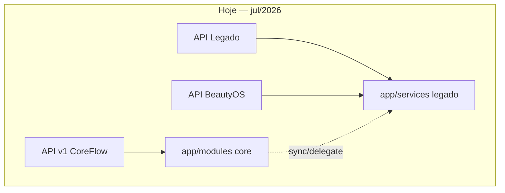
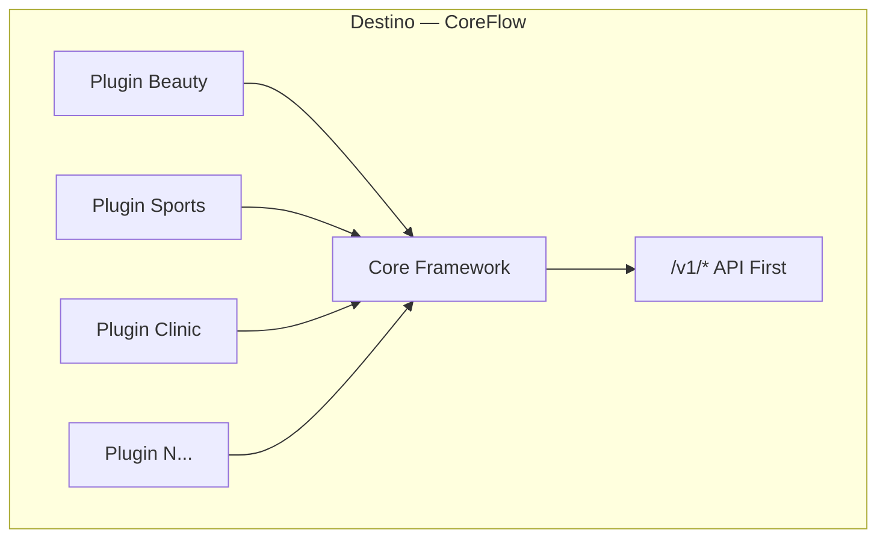
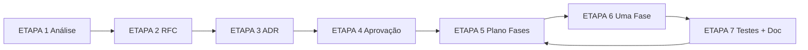

# CoreFlow — Architecture Evolution Plan

**Documento:** `docs/ArchitectureEvolutionPlan.md`  
**Versão:** 1.0  
**Data:** 9 de julho de 2026  
**Base factual:** `docs/ArchitectureAssessment.md` (código v `1.15.0-sprint25`)  
**Status:** Ativo — **nenhuma implementação de código sem RFC+ADR aprovados**

---

## 1. Onde estamos?

### 1.1 Posição atual

| Dimensão | Estado | Evidência |
|----------|--------|-----------|
| **Produto piloto** | BeautyOS/trancista operacional | `frontend/`, routers legado |
| **Plataforma CoreFlow** | CF-0 → CF-25 entregues | `DOCUMENTACAO.md` §13 |
| **Arquitetura runtime** | Modular Monolith + Strangler Fig | `backend/app/modules/`, `app/services/` |
| **APIs** | 3 superfícies paralelas | `backend/app/main.py` |
| **Testes** | 246 testes pytest backend | `backend/tests/` |
| **Plugins** | beauty, clinic, sports (manifest) | `backend/plugins/` |
| **Score vs Blueprint** | ~5.4/10 médio | `ArchitectureAssessment.md` §29 |

### 1.2 O que já funciona bem (não reescrever)

| Área | Módulo/Path | Por quê preservar |
|------|-------------|-------------------|
| Identity + JWT + RBAC | `modules/identity/` | Hexagonal completo, base multi-tenant |
| Event infrastructure | `shared/events/` | Outbox, Kafka, DLQ, Avro — investimento CF-14→CF-21 |
| Plugin registry | `core/plugin/` | Loader YAML, API `/v1/plugins` |
| Workflow engine | `modules/workflow/` | YAML event-driven funcional |
| Mobile DevOps | `modules/mobile/` | EAS, CDN, Terraform, canary CF-15→CF-25 |
| Observability as code | `modules/observability/` | Grafana/Alertmanager export |
| SDK cliente TS | `packages/coreflow-sdk/` | Consumo v1 tipado |
| Scheduling engine (base) | `scheduling/engine/` | Genérico, domain-agnostic na intenção |
| CI/CD | `.github/workflows/` | 8 pipelines incl. MySQL CI |

### 1.3 Diagrama — estado atual

---

## 2. Para onde vamos?

### 2.1 Visão alvo (12 meses)

**CoreFlow Platform** — SaaS modular onde novos produtos nascem adicionando **Plugins**, compartilhando o mesmo Core Framework.

### 2.2 Core Framework alvo

Authentication · Authorization · Company · Tenant · Location · Worker · Customer · Resource · Booking · Service Catalog · Inventory · Order · Payment · Notification · Workflow · Analytics · Marketplace · AI Platform · Storage · Audit

### 2.3 Engines alvo

| Engine | Estado | Meta Release |
|--------|--------|--------------|
| Resource Engine | Parcial | R1–R2 |
| Scheduling Engine | Parcial | R2–R3 |
| Workflow Engine | Funcional | R2 (visual editor Could) |
| Plugin Engine | Loader OK | R2 (SDK geradores) |
| AI Platform | Stub | R3–R4 |

Detalhes: `docs/architecture/TargetArchitecture.md`

---

## 3. O que falta?

Priorizado por impacto arquitetural (ver `docs/Backlog.md` completo):

| # | Gap | MoSCoW | Release |
|---|-----|--------|---------|
| G1 | Domínio booking no core (sem delegação legado) | Must | R2 |
| G2 | Frontend 100% SDK v1 | Must | R2 |
| G3 | Core enforcement + sunset | Must | R1 |
| G4 | Repositories/ports em todos módulos v1 | Should | R2 |
| G5 | AI Platform (provider registry, prompt engine) | Should | R3 |
| G6 | Scheduling Engine sem legacy adapter | Should | R3 |
| G7 | Event Catalog completo + versionamento | Should | R1 |
| G8 | Audit trail | Should | R3 |
| G9 | Marketplace install/billing | Could | R4 |
| G10 | Offline mobile sync | Could | R4 |
| G11 | Business entity (holding) | Could | R3 |
| G12 | OAuth social login | Could | R4 |

---

## 4. Quais riscos?

| ID | Risco | Severidade | Mitigação |
|----|-------|------------|-----------|
| R1 | Quebrar piloto beauty ao forçar v1 | Alta | Strangler Fig, enforcement gradual (RFC-002) |
| R2 | Regras divergentes legado vs v1 | Alta | Testes paridade antes de block |
| R3 | Big-bang refactor | Alta | Processo RFC/ADR, uma fase por PR |
| R4 | AI acoplada a beauty | Média | Mover BeautyAgent → plugin (Backlog) |
| R5 | Doc SAB desatualizada | Média | Consolidar em `docs/architecture/` |
| R6 | Observabilidade sem runtime | Média | Docker stack Release 3 |
| R7 | Plugin runtime isolation ausente | Baixa | Manifest-only OK até R4 |

---

## 5. Quais módulos precisam evoluir?

| Módulo | Ação | Prioridade |
|--------|------|------------|
| **booking** | Internalizar regras; remover delegação ReservationService | P0 |
| **scheduling** | Remover LegacySchedulingAdapter | P1 |
| **catalog / customer / payments / waitlist** | Adicionar repositories + ports | P1 |
| **ai** | Generalizar; extrair BeautyAgent para plugin | P1 |
| **marketplace** | MVP install per tenant | P2 |
| **identity** | Audit log, rate limit | P2 |
| **push** | OK — manter | — |
| **workflow** | Expandir action catalog | P2 |
| **mobile** | OK — ops platform | — |
| **observability** | Runtime stack docker | P2 |

### Módulos corretos (evolução mínima)

- `identity` — referência hexagonal
- `shared/events` — referência event-driven
- `core/plugin` — referência plugin architecture
- `workflow/engine` — referência automation
- `payments/ports` — referência ports

---

## 6. O que NÃO deve ser alterado?

| Item | Motivo |
|------|--------|
| Regras de negócio validadas em produção piloto | Sem testes paridade |
| JWT claim shape (`sub`, `company_id`, `role`) | Breaking all clients |
| Eventos Avro publicados (`schemas/events/avro/`) | Breaking consumers |
| Plugin manifest schema v1 campos existentes | Breaking 3 plugins |
| Migrations Alembic cf001–cf010 | Irreversível sem plano |
| Fluxos legado **read** até frontend migrado | RFC-002 |
| `TenantContext` / row-level `company_id` | Fundação multi-tenant |
| Workers outbox/DLQ/canary em produção | Ops crítico CF-19→CF-25 |

---

## 7. Processo de evolução (obrigatório)

| Etapa | Entrega | Status atual |
|-------|---------|--------------|
| 1 | Análise | ✅ `ArchitectureAssessment.md` |
| 2 | RFC | ✅ RFC-001/002 aprovados |
| 3 | ADR | ✅ ADR-003–008 aceitos |
| 4 | Aprovação | ✅ Condicional jul/2026 |
| 5–7 | R1-F1 | ✅ Concluído — ver `docs/sprints/R1-F1.md` |
| 5–7 | R1-F2 | ✅ Concluído — ver `docs/sprints/R1-F2.md` |
| — | Documentação estratégica | ✅ PlatformVision, BoundedContexts, R2-ExecutionPlan, etc. |
| 5–7 | R2-F0+ | ⏳ Aguarda aprovação R2-ExecutionPlan + RFC-003 |

---

## 8. Plano de fases imediato (pós-aprovação)

### Release 1 — Fundação (jul–set/2026)

| Fase | Escopo | RFC/ADR | Risco |
|------|--------|---------|-------|
| R1-F1 | Event Catalog documentado | — | Baixo |
| R1-F2 | Platform health, ACL wiring, enforcement warn, Grafana layers | RFC-002 Fase 1 | ✅ Concluído |
| R1-F3 | CF-26 observability (Slack, audit canary) | Sprint doc | Baixo |
| R1-F4 | Enforcement `warn` staging | RFC-002 Fase 2 | Médio |

### Release 2 — API First (out–dez/2026)

| Fase | Escopo | Risco |
|------|--------|-------|
| R2-F1 | Booking create sem delegação legado | Alto → mitigado com paridade tests |
| R2-F2 | Repository pattern catalog + customer | Médio |
| R2-F3 | Frontend admin bookings via SDK | Médio |
| R2-F4 | Enforcement `block` rotas com paridade | Médio |

### Release 3 — Engines + AI (jan–mar/2027)

Scheduling v2 · AI Platform base · Audit trail · Observability runtime

### Release 4 — Platform (abr–jun/2027)

Marketplace MVP · Plugin SDK geradores · Offline mobile spike

Roadmap detalhado: `docs/roadmap/Roadmap-12M.md`

---

## 9. Meta Model — regra de ouro

**Nunca** implementar no core pensando em Trancista, Quadra ou Consultório.

| Core (genérico) | Plugin (especializa) |
|-----------------|----------------------|
| Worker | Profissional / Atleta / Médico |
| Resource | Cadeira / Quadra / Sala |
| Catalog | Categoria / Modalidade / Especialidade |
| Offering | Modelo / Plano / Procedimento |
| Booking | Reserva / Partida / Consulta |

Fonte: `backend/app/core/metamodel/concepts.py`, ADR-001.

---

## 10. Métricas de sucesso

| Métrica | Hoje | Meta R2 | Meta R4 |
|---------|------|---------|---------|
| % escritas via `/v1/*` | ~20% est. | 70% | 95% |
| Módulos com ports | 2/18 | 8/18 | 15/18 |
| Frontend via SDK | ~15% | 60% | 90% |
| Eventos documentados | ~8 | 25 | 40+ |
| Score ArchitectureAssessment | 5.4 | 6.5 | 8.0 |

---

## 11. Referências

| Documento | Path |
|-----------|------|
| Auditoria | `docs/ArchitectureAssessment.md` |
| Backlog | `docs/Backlog.md` |
| Roadmap 12M | `docs/roadmap/Roadmap-12M.md` |
| RFC-001 Governança | `docs/rfc/RFC-001-ArchitectureGovernanceProcess.md` |
| RFC-002 Enforcement | `docs/rfc/RFC-002-CoreEnforcementSunset.md` |
| ADR-003 | `docs/adr/ADR-003-GovernanceProcess.md` |
| ADR-004 Strangler | `docs/adr/ADR-004-IncrementalEvolutionStrategy.md` |
| PR Checklist | `docs/decisions/PR-Checklist.md` |
| Gap Analysis | `docs/COREFLOW_GAP_ANALYSIS.md` |
| Product Blueprint | `BEAUTYOS_BLUEPRINT.md` |

---

*Documento vivo. Atualizar após cada Release aprovada.*
