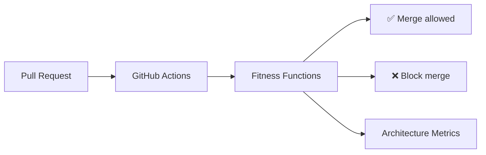

# CoreFlow — Architecture Fitness Functions

**Documento:** `docs/ArchitectureFitnessFunctions.md`  
**Versão:** 2.0 · **Data:** 2026-07-09 (R2 consolidation)  
**Status:** Normativo — testes arquiteturais automáticos em CI  
**Princípio:** Toda violação da Constituição **falha o build**

---

## O que são Fitness Functions

**Architecture Fitness Functions** (termo de Neal Ford / Rebecca Parsons) são testes automatizados que verificam se o código continua alinhado às decisões arquiteturais — complementando testes unitários de comportamento.



---

## Categorias de validação

### 1. Dependências circulares

| ID | Regra | Ferramenta |
|----|-------|------------|
| FF-DEP-001 | Zero cycles between `app/modules/*` packages | `import-linter` |
| FF-DEP-002 | `shared/` must not import from `modules/` | import-linter |
| FF-DEP-003 | `core/` must not import from `services/` (legado) | grep CI |
| FF-DEP-004 | Plugins must not import `app.models.*` legado | grep CI |

```ini
# .importlinter (proposta)
[importlinter:contract:1]
name = Modules independent
type = forbidden
source_modules = app.modules.*
forbidden_modules = app.services
```

### 2. Importações proibidas

| ID | Proibido | Motivo |
|----|----------|--------|
| FF-IMP-001 | `modules/*/domain` → `sqlalchemy` | Hexagonal |
| FF-IMP-002 | `modules/ai/*` → `beauty` | Plugin separation |
| FF-IMP-003 | `modules/booking/commands` → `ReservationService` direct | ACL (R2+) |
| FF-IMP-004 | Core modules → `app.models.tranca` | Meta model |
| FF-IMP-005 | Domain → `kafka`, `requests`, `httpx` | Infrastructure in domain |

### 3. Acoplamento

| ID | Métrica | Threshold |
|----|---------|-----------|
| FF-CPL-001 | `identified_couplings()` count | ≤4 (decrease over time) |
| FF-CPL-002 | New couplings without ADR reference in PR | 0 |
| FF-CPL-003 | Cross-context domain model imports | 0 |

Script: `scripts/architecture_coupling_check.py`

### 4. Hexagonal Architecture

| ID | Regra |
|----|-------|
| FF-HEX-001 | Application services depend on Protocol ports, not concrete adapters |
| FF-HEX-002 | Infrastructure adapters in `infrastructure/` or `shared/acl/` |
| FF-HEX-003 | Routers only call application layer — no ORM in routers |
| FF-HEX-004 | New bounded context must have domain + application folders |

### 5. DDD

| ID | Regra |
|----|-------|
| FF-DDD-001 | Domain events named `{aggregate}.{action}` |
| FF-DDD-002 | New events registered in `event_catalog.py` |
| FF-DDD-003 | Tenant entities include `company_id` |
| FF-DDD-004 | Core vocabulary English in code — no `Tranca` in new core files |

### 6. Plugins

| ID | Regra |
|----|-------|
| FF-PLG-001 | Plugin hooks registered only via manifest |
| FF-PLG-002 | Plugin code under `app/plugins/{id}/` or `plugins/{id}/` |
| FF-PLG-003 | Manifest validates against JSON Schema |
| FF-PLG-004 | No plugin imports another plugin's domain |

### 7. API compatibility

| ID | Regra | Ferramenta |
|----|-------|------------|
| FF-API-001 | No breaking change `/v1/*` without version bump | oasdiff |
| FF-API-002 | New endpoints documented in OpenAPI | spectral |
| FF-API-003 | Deprecation headers on legacy routes | integration test |
| FF-API-004 | JWT claims unchanged without ADR | contract test |

### 8. Eventos

| ID | Regra |
|----|-------|
| FF-EVT-001 | Published events exist in event catalog |
| FF-EVT-002 | Avro schemas backward compatible | schema registry check |
| FF-EVT-003 | Event payloads include `company_id` when tenant-scoped |
| FF-EVT-004 | No PII in event type names |

### 9. Cobertura mínima

| ID | Regra | Threshold |
|----|-------|-----------|
| FF-TST-001 | Total pytest tests | ≥268 (increase per release) |
| FF-TST-002 | New module has `test_*.py` | Required |
| FF-TST-003 | R2+ booking paridade tests pass | 100% when flag on |
| FF-TST-004 | Platform governance tests pass | Always |

### 10. Performance

| ID | Regra | Threshold |
|----|-------|-----------|
| FF-PER-001 | pytest suite duration | <120s |
| FF-PER-002 | CI pipeline duration | <15 min |
| FF-PER-003 | No N+1 in new repository code | optional ORM lint |

### 11. Constituição da Plataforma

| ID | Artigo | Verificação |
|----|--------|-------------|
| FF-CON-001 | III Meta Model | No new core entities without ADR file reference |
| FF-CON-002 | IV Cinco Perguntas | PR template checkbox enforced |
| FF-CON-003 | II Nunca | Feature flag for migrations — grep `FEATURE_` in PR |
| FF-CON-004 | V Governança | Structural change requires `docs/adr/` or `docs/rfc/` in PR |
| FF-CON-005 | VI ACL | Legado bridge only via `shared/acl/` |

---

## Implementação CI

### GitHub Actions workflow (proposta)

```yaml
# .github/workflows/architecture-fitness.yml
name: Architecture Fitness
on: [pull_request]
jobs:
  fitness:
    runs-on: ubuntu-latest
    steps:
      - uses: actions/checkout@v4
      - name: Import linter
        run: lint-imports
      - name: Coupling check
        run: python scripts/architecture_coupling_check.py --max 4
      - name: Forbidden imports
        run: python scripts/architecture_forbidden_imports.py
      - name: Event catalog sync
        run: python scripts/architecture_event_catalog_check.py
      - name: OpenAPI compatibility
        run: oasdiff breaking openapi-base.json openapi.json
      - name: Constitution ADR check
        run: python scripts/architecture_adr_required.py
      - name: Tests minimum
        run: pytest -o addopts= --co -q | python scripts/architecture_test_count_gate.py --min 268
```

### Local execution

```bash
make fitness
# ou
coreflow test fitness
```

---

## Severidade

| Level | Ação |
|-------|------|
| **ERROR** | Block merge |
| **WARNING** | Merge allowed, create backlog item |
| **INFO** | Metrics only |

Coupling increase, constitution violation = ERROR always.

---

## Relatório PR

Bot comment on PR:

```markdown
## Architecture Fitness Report
| Check | Status |
|-------|--------|
| Circular dependencies | ✅ |
| Forbidden imports | ✅ |
| Coupling count (3/4) | ✅ |
| Event catalog | ✅ |
| OpenAPI breaking | ✅ |
| Test count (271 ≥ 268) | ✅ |
```

---

## Evolução das thresholds

| Release | Min tests | Max couplings | Modules w/ infrastructure |
|---------|-----------|---------------|---------------------------|
| R1 ✅ | 268 | 4 | 2 |
| R2 | 300 | 3 | 6 |
| R3 | 350 | 2 | 12 |
| R4 | 400 | 1 | 14 |
| R7 | 500 | 0 | 18 |

Atualizar este doc + CI gates each release.

---

## R2 — Fitness Functions adicionais

### Booking & ACL

| ID | Regra | F0.5 | F1 | F2 | F5 |
|----|-------|------|----|----|-----|
| FF-BKG-001 | Zero `ReservationService` in booking commands | WARN | WARN | **ERROR** | ERROR |
| FF-BKG-002 | Zero direct `LegacySyncService` in commands | WARN | WARN | **ERROR** | ERROR |
| FF-BKG-003 | Booking create uses `SchedulingPort` | — | WARN | ERROR | ERROR |
| FF-BKG-004 | `sync_status` field on core_bookings | — | WARN | ERROR | ERROR |

### Scheduling & Resource

| ID | Regra | F1 | F3 | F5 |
|----|-------|----|----|-----|
| FF-SCH-001 | No `tranca_id` in new scheduling code (outside ACL) | WARN | **ERROR** | ERROR |
| FF-RES-001 | Resource module exists with domain/application/infrastructure | — | WARN | ERROR |
| FF-RES-002 | `/v1/resources` in OpenAPI | — | WARN | ERROR |

### Events

| ID | Regra | F1 | F1b | F2 |
|----|-------|----|-----|-----|
| FF-EVT-005 | `booking.created` on core path | WARN | **ERROR** | ERROR |
| FF-EVT-006 | `correlation_id` when HTTP-originated | — | WARN | ERROR |
| FF-EVT-007 | Alias `reservation.created` dual-publish | — | WARN | ERROR |

### API

| ID | Regra | F1b | F2 |
|----|-------|-----|-----|
| FF-API-005 | `Idempotency-Key` on POST `/v1/bookings` in OpenAPI | WARN | ERROR |
| FF-API-006 | Approve/reject return Problem Details on business rule | — | WARN |
| FF-API-007 | ETag/version on GET booking | — | WARN |

### Hexagonal & Repositories

| ID | Regra | F0.5 | F3b | F5 |
|----|-------|------|-----|-----|
| FF-HEX-005 | New booking code only in domain/application/infrastructure | WARN | ERROR | ERROR |
| FF-HEX-006 | Catalog + Customer have repository ports | — | WARN | ERROR |
| FF-ACL-001 | Legado bridge only in `shared/acl/` | WARN | ERROR | ERROR |

### Plugins

| ID | Regra | F4 | F5 |
|----|-------|----|-----|
| FF-PLG-005 | Zero `beauty` imports in `modules/` (except tests) | WARN | **ERROR** |
| FF-PLG-006 | Hooks registered via manifest only | WARN | ERROR |

### Payments

| ID | Regra | F2 | F5 |
|----|-------|----|-----|
| FF-PAY-001 | Approve uses `PaymentQueryPort` not payment ORM | WARN | ERROR |

### Observability

| ID | Regra | F5 |
|----|-------|-----|
| FF-OBS-001 | Core booking path emits OTEL span | WARN → ERROR |
| FF-OBS-002 | `drift_count` metric registered | ERROR |

### Feature Flags

| ID | Regra | F0+ |
|----|-------|-----|
| FF-FLAG-001 | New flag entry in ADR-032 table | WARN |
| FF-FLAG-002 | Sprint doc mentions flag + rollback | WARN |

### Paridade

| ID | Regra | F2b | F6 |
|----|-------|-----|-----|
| FF-PAR-001 | Paridade suite ≥12 scenarios PASS flag ON | **ERROR** | ERROR |

### DDD

| ID | Regra | F1+ |
|----|-------|-----|
| FF-DDD-005 | Booking aggregate transitions via domain methods only | WARN |
| FF-DDD-006 | State machine transitions match ADR-026 | F2 ERROR |

---

## Gates por fase R2

| Fase | BLOCK (ERROR) | WARN allowed |
|------|---------------|--------------|
| F0 | FF-CON-004 (ADR in PR) | All new rules |
| F0.5 | FF-DEP-003, FF-CON-005 | FF-BKG-001/002 |
| F1 | FF-TST-003 (parity subset), FF-EVT-001 | FF-BKG-001 |
| F1b | FF-API-005 | FF-EVT-005 |
| F2 | FF-BKG-001/002, FF-PAY-001, FF-PAR subset | — |
| F2b | FF-PAR-001 (8+ scenarios) | — |
| F3 | FF-SCH-001, FF-RES-001 | — |
| F3b | FF-HEX-006 | — |
| F4 | FF-PLG-005, FF-IMP-002 | — |
| F5 | **All R2 ERROR rules** | — |
| F6 | FF-PAR-001 12/12 | — |

**BLOCK** = merge proibido. **WARN** = merge permitido com backlog. **ERROR** = BLOCK a partir da fase indicada.

---

## Roadmap implementação

| Release | Entrega |
|---------|---------|
| R2-F0 | Scripts locais + PR checklist manual |
| R2-F5 | CI workflow ERROR on R2 critical rules |
| R3 | Full CI ERROR all fitness |
| R4 | import-linter full contracts |
| R5 | oasdiff + schema registry in CI |
| R6 | Plugin certification = fitness superset |

---

## Referências

- `docs/CONSTITUTION.md`
- `docs/ArchitectureMetrics.md`
- `docs/EngineeringHandbook.md`
- `docs/decisions/PR-Checklist.md`
- `backend/app/core/architecture_metrics.py` — `identified_couplings()`
