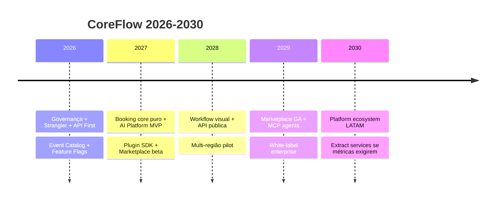

# CoreFlow — Architecture Vision 2030

**Horizonte:** 2026 – 2030  
**Documento:** `docs/ArchitectureVision2030.md`  
**Base:** Constituição + Meta Modelo + estado v1.15.0-sprint25

---

## Visão

Em 2030, CoreFlow é a **plataforma latino-americana** para construir sistemas de gestão orientados a serviços — qualquer vertical via Plugin, mesma infraestrutura, mesma API pública.

**Não somos um ERP de beleza.** Somos o **runtime** onde ERPs verticais nascem.

---

## Pilares 2030

| Pilar | 2026 (hoje) | 2030 (alvo) |
|-------|-------------|-------------|
| Core API | `/v1/*` + legado | `/v1/*` + API pública versionada |
| Plugins | 3 manifests | Marketplace + 10+ verticais |
| AI | LLM factory + BeautyAgent | AI Platform completa + agents por plugin |
| Events | Outbox + Kafka + Avro | Event streaming multi-região |
| Mobile | Expo + EAS OTA | Offline sync + white-label |
| Ops | Export as code | Full observability + SLOs |

---

## Capacidades estratégicas

### AI Agents & MCP

- **Agents** registrados por plugin com tools sobre domínio (booking, customer)
- **MCP (Model Context Protocol)** como port de integração LLM ↔ tools
- Provider registry: OpenAI, Anthropic, Gemini, Azure, local
- RAG sobre dados tenant-scoped com isolamento
- **Nunca** agent vertical no core — apenas AI Platform shell

### Plugin Marketplace

- Publicação, instalação, billing, reviews
- Plugin SDK CLI: `coreflow plugin init sports`
- Certificação de plugins (security scan, manifest validation)

### Workflow Visual

- Editor drag-and-drop sobre event catalog
- Triggers: `booking.created`, `payment.received`, …
- Actions: notify, invoice, CRM, webhook, AI agent

### Business Automation

- No-code/low-code para profissionais
- Integração WhatsApp, email, push como action adapters

### White Label

- EAS whitelabel (✅ base CF-17) + theming API
- Custom domains per tenant
- Manifest-driven branding

### SDK & API Pública

- `@coreflow/sdk` (✅) + Plugin SDK Python/TS
- API pública documentada OpenAPI 3.1 + rate limits + API keys
- Webhooks outbound para integradores

### Event Streaming

- Kafka multi-tenant topics ou subject per event type
- Schema Registry Confluent (✅ base)
- Event sourcing para audit select aggregates (Could)

### Microservices (quando fizer sentido)

- **Default:** Modular Monolith até ~100k tenants ou team scale
- **Extract** apenas bounded context com carga independente comprovada (ex.: AI inference, notification dispatch)
- **Never** microservice por plugin — plugins permanecem manifests + hooks

### Multi-Região

- DB read replicas por região
- Kafka mirroring
- CDN edge (✅ CloudFront base)

### Multi-Idioma / Multi-Moeda

- i18n via plugin manifest + core locale port
- Payment providers por região (PaymentProviderPort)
- Currency em Offering/Order — Value Object futuro

---

## Roadmap estratégico (2026–2030)

---

## Métricas de sucesso 2030

| Métrica | Alvo |
|---------|------|
| Verticais em produção | ≥ 8 plugins |
| API v1 adoption | 100% writes |
| Time-to-new-vertical | < 4 semanas (manifest + UI) |
| Uptime SLA | 99.9% |
| Event delivery | 99.99% com DLQ |

---

## Riscos longo prazo

| Risco | Mitigação |
|-------|-----------|
| Legado nunca sunset | Constituição + telemetria + enforcement |
| AI vendor lock-in | Provider registry + MCP |
| Plugin quality | Marketplace certification |
| Monolith limits | Extract criteria documentados em ADR futuro |

---

## Referências

- `docs/CONSTITUTION.md`
- `docs/CoreMetaModel.md`
- `docs/roadmap/Roadmap-12M.md`
- `BEAUTYOS_BLUEPRINT.md`
- `docs/20-FUTURE-VISION/README.md`
