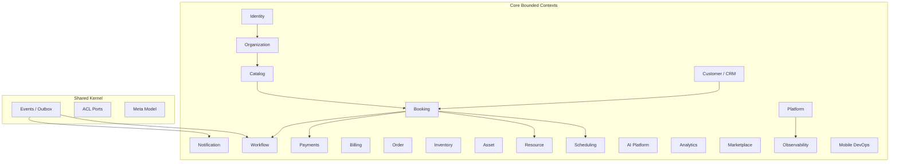

# CoreFlow — Bounded Contexts

**Documento:** `docs/BoundedContexts.md`  
**Versão:** 1.0 · **Data:** 2026-07-09  
**Status:** Estratégico — mapa de domínio DDD  
**Base:** Meta Modelo + módulos `backend/app/modules/` + Shared Kernel

---

## Visão geral

**Regra:** Comunicação entre contextos preferencialmente via **eventos de domínio** ou **ports** — nunca import direto de models de outro contexto.

---

## Identity

| Aspecto | Detalhe |
|---------|---------|
| **Responsabilidade** | Autenticação JWT, usuários, roles, RBAC, sessões |
| **Módulo** | `modules/identity/` |
| **Dependências** | Organization (tenant context) |
| **Publica** | `user.registered`, `company.created` |
| **Consome** | — |
| **APIs** | `/auth/*`, `/companies/*`, deps `get_current_user`, `TenantContext` |

**Notas:** Base multi-tenant. Claims JWT incluem `company_id`, `role`. Superuser para platform ops.

---

## Organization

| Aspecto | Detalhe |
|---------|---------|
| **Responsabilidade** | Tenant (`Company`), unidades (`Location`), configuração plugin ativo |
| **Módulo** | Parcial em `identity/` + `core_locations` (🔜 módulo dedicado) |
| **Dependências** | Identity, Plugin Registry |
| **Publica** | `company.created`, `location.created` (🔜) |
| **Consome** | `plugin.installed` (🔜) |
| **APIs** | `/companies/*`, `/v1/locations` (🔜), `/v1/plugins/config/by-company/{slug}` |

**Notas:** `Business` (holding) planejado Release 3+. Plugin ativo define terminology por tenant.

---

## Catalog

| Aspecto | Detalhe |
|---------|---------|
| **Responsabilidade** | Catalog, Service, Offering — catálogo comercial universal |
| **Módulo** | `modules/catalog/` |
| **Dependências** | Organization, ACL legado (transitório) |
| **Publica** | `catalog.created`, `offering.updated` (🔜) |
| **Consome** | — |
| **APIs** | `/v1/catalogs`, `/v1/catalogs/{id}/offerings` |

**Legado:** `Tranca`, `ServiceImage` via `legacy_sync_service`. Sunset Release 2–3.

---

## Customer (CRM)

| Aspecto | Detalhe |
|---------|---------|
| **Responsabilidade** | Cliente final, histórico, segmentação básica |
| **Módulo** | `modules/customer/` |
| **Dependências** | Organization, Identity |
| **Publica** | `customer.created`, `customer.updated` (🔜) |
| **Consome** | `booking.created`, `payment.received` (🔜 CRM enrichment) |
| **APIs** | `/v1/customers` |

**Plugin:** CRM avançado (campanhas, LTV beauty-specific) → plugin hooks + AI agent.

---

## Booking

| Aspecto | Detalhe |
|---------|---------|
| **Responsabilidade** | Reserva universal — create, approve, reject, cancel, status lifecycle |
| **Módulo** | `modules/booking/` |
| **Dependências** | Catalog, Customer, Scheduling, Payments (sinal), ACL legado (transitório) |
| **Publica** | `booking.created`, `booking.approved`, `booking.rejected`, `booking.cancelled` (🔜) |
| **Consome** | `payment.deposit.confirmed`, `schedule.blocked` (🔜) |
| **APIs** | `/v1/bookings`, commands CQRS |

**Estado R1-F2:** Commands delegam via ACL → `ReservationService` legado. **Release 2:** domínio puro no core.

---

## Scheduling

| Aspecto | Detalhe |
|---------|---------|
| **Responsabilidade** | Disponibilidade, slots, conflitos, bloqueios, fila operacional |
| **Módulo** | `modules/scheduling/` + `scheduling/engine/` |
| **Dependências** | Resource, Worker, Booking |
| **Publica** | `schedule.blocked`, `slot.available` (🔜) |
| **Consome** | `booking.created`, `booking.cancelled`, `resource.updated` (🔜) |
| **APIs** | `/v1/scheduling/*`, engine interno |

**Engine:** `SchedulingEngine` domain-agnostic. `legacy_adapter` transitório.

---

## Resource

| Aspecto | Detalhe |
|---------|---------|
| **Responsabilidade** | Recursos reserváveis — cadeira, quadra, sala, equipamento |
| **Módulo** | Parcial em scheduling + `core_resources` (🔜 Resource Engine R2) |
| **Dependências** | Organization (Location) |
| **Publica** | `resource.created`, `resource.updated` (🔜) |
| **Consome** | `location.created` (🔜) |
| **APIs** | `/v1/resources` (🔜 R2) |

**ADR-007:** Resource Engine formalizado Release 2.

---

## Workflow

| Aspecto | Detalhe |
|---------|---------|
| **Responsabilidade** | Automação event-driven — definições YAML, runs, steps |
| **Módulo** | `modules/workflow/` |
| **Dependências** | Events (Shared Kernel), Notification (actions) |
| **Publica** | `workflow.started`, `workflow.completed`, `workflow.failed` |
| **Consome** | `booking.*`, `payment.*`, qualquer evento catalogado |
| **APIs** | `/v1/workflows` |

**Futuro:** Editor visual Release 4+.

---

## Payments

| Aspecto | Detalhe |
|---------|---------|
| **Responsabilidade** | Pagamentos, sinal, confirmação, providers |
| **Módulo** | `modules/payments/` |
| **Dependências** | Booking, Organization |
| **Publica** | `payment.deposit.confirmed`, `payment.received` (🔜) |
| **Consome** | `booking.created` (🔜 auto-deposit) |
| **APIs** | `/v1/payments` |

**Plugin:** Regras de split, comissão profissional → plugin ou billing context.

---

## Billing

| Aspecto | Detalhe |
|---------|---------|
| **Responsabilidade** | Faturamento, invoices, finance entries, reconciliação |
| **Módulo** | `modules/invoice/` + `modules/order/` + legado `financeiro/` |
| **Dependências** | Order, Payments, Booking |
| **Publica** | `invoice.generated`, `order.created` (🔜) |
| **Consome** | `booking.approved`, `payment.received` |
| **APIs** | `/v1/invoices`, `/v1/orders`, legado `/financeiro/*` |

---

## Inventory

| Aspecto | Detalhe |
|---------|---------|
| **Responsabilidade** | Estoque, movimentações, níveis |
| **Módulo** | `modules/inventory/` |
| **Dependências** | Asset, Organization |
| **Publica** | `inventory.updated` (🔜) |
| **Consome** | `order.created` (🔜) |
| **APIs** | `/v1/inventory` |

---

## Asset

| Aspecto | Detalhe |
|---------|---------|
| **Responsabilidade** | Ativos fixos vinculados ao negócio |
| **Módulo** | `modules/asset/` |
| **Dependências** | Organization |
| **Publica** | `asset.created` (🔜) |
| **Consome** | — |
| **APIs** | `/v1/assets` |

---

## Notification

| Aspecto | Detalhe |
|---------|---------|
| **Responsabilidade** | Push, email, SMS, in-app — dispatch e templates |
| **Módulo** | `modules/push/` + legado `notifications/` |
| **Dependências** | Identity (devices), Mobile DevOps (deep links) |
| **Publica** | `notification.sent`, `push.delivered` (🔜) |
| **Consome** | Eventos de workflow, booking, payment |
| **APIs** | `/v1/devices`, legado `/notifications/*` |

---

## AI Platform

| Aspecto | Detalhe |
|---------|---------|
| **Responsabilidade** | LLM providers, agent shell, tools registry, prompt engine (🔜) |
| **Módulo** | `modules/ai/` |
| **Dependências** | Ports de Booking, Customer, Workflow |
| **Publica** | `ai.agent.invoked` (🔜) |
| **Consume** | Eventos CRM/booking para triggers |
| **APIs** | `/v1/ai` |

**Regra Constitucional:** Agents verticais (`BeautyAgent`) → migrar para plugin beauty Release 2–3.

---

## Analytics

| Aspecto | Detalhe |
|---------|---------|
| **Responsabilidade** | Métricas agregadas, dashboards, export |
| **Módulo** | 🔜 dedicado; parcial em platform metrics |
| **Dependências** | Events (stream), Organization |
| **Publica** | `analytics.snapshot.generated` (🔜) |
| **Consome** | Todos eventos de negócio (read models) |
| **APIs** | `/v1/analytics/*` (🔜) |

---

## Marketplace

| Aspecto | Detalhe |
|---------|---------|
| **Responsabilidade** | Descoberta, instalação, billing de plugins/extensões |
| **Módulo** | `modules/marketplace/` (stub) |
| **Dependências** | Plugin Registry, Organization, Billing |
| **Publica** | `plugin.installed`, `plugin.published` (🔜) |
| **Consome** | `company.created` |
| **APIs** | `/v1/marketplace` |

**Status:** Experimental — Release 5.

---

## Platform

| Aspecto | Detalhe |
|---------|---------|
| **Responsabilidade** | Governança runtime — health, flags, readiness, plugin registry doc |
| **Módulo** | `modules/platform/` |
| **Dependências** | Observability, Feature Flags, Plugin Registry |
| **Publica** | — (métricas internas) |
| **Consome** | HTTP telemetry, event metrics |
| **APIs** | `/v1/platform/*` |

---

## Observability

| Aspecto | Detalhe |
|---------|---------|
| **Responsabilidade** | Prometheus, Grafana, Alertmanager export, architecture dashboards |
| **Módulo** | `modules/observability/` + `core/prometheus_metrics.py` |
| **Dependências** | Platform |
| **Publica** | — |
| **Consome** | Métricas HTTP, outbox, DLQ |
| **APIs** | Export admin, `/metrics` |

---

## Mobile DevOps

| Aspecto | Detalhe |
|---------|---------|
| **Responsabilidade** | EAS build/submit/update, CDN, canary OTA, Terraform, well-known |
| **Módulo** | `modules/mobile/` |
| **Dependências** | Plugin manifest (mobile block), Organization |
| **Publica** | `mobile.update.deployed`, `canary.promoted` (🔜) |
| **Consome** | Plugin config changes |
| **APIs** | `/v1/mobile/*`, `/.well-known/*` |

**Nota:** Capacidade de plataforma, não feature de usuário final.

---

## Storage

| Aspecto | Detalhe |
|---------|---------|
| **Responsabilidade** | Arquivos, imagens, documentos — abstraction sobre S3/local |
| **Módulo** | Parcial (`StaticFiles`, CDN sync) — 🔜 port dedicado |
| **Dependências** | Organization (tenant isolation) |
| **Publica** | `file.uploaded` (🔜) |
| **Consome** | — |
| **APIs** | `/uploads/*`, CDN URLs via plugin manifest |

---

## Shared Kernel

| Componente | Path | Responsabilidade |
|------------|------|------------------|
| **Event Bus** | `shared/events/event_bus.py` | Publicação in-process + outbox |
| **Outbox** | `shared/events/outbox.py` | At-least-once dispatch |
| **Event Catalog** | `shared/events/event_catalog.py` | Machine-readable catalog |
| **Kafka Adapter** | `shared/events/kafka_adapter.py` | Streaming externo |
| **ACL Ports** | `shared/acl/` | Anti-corruption Core ↔ Legado |
| **Meta Model** | `core/metamodel/concepts.py` | Enum CoreConcept |
| **Feature Flags** | `core/feature_flags.py` | Rollout incremental |
| **Domain Event** | `shared/events/domain_event.py` | Base event type |

**Regra:** Shared Kernel muda apenas via ADR. Sem regra de negócio específica de vertical.

---

## Mapa de dependências (proibidas)

| De | Para | Status |
|----|------|--------|
| Core module genérico | `app.models.tranca` | ❌ Proibido — usar ACL |
| Plugin beauty | Core domain models | ✅ Permitido via ports/API |
| AI core | BeautyAgent | ❌ Migrar para plugin |
| Booking command | ReservationService direto | ⚠️ Transitório — ACL R1-F2, remover R2 |

---

## Referências

- `docs/CoreMetaModel.md`
- `docs/architecture/EventCatalog.md`
- `docs/shared/acl/` (contratos)
- `docs/CoreVsPlugins.md`
- ADR-005 Core Framework, ADR-007 Resource Engine, ADR-008 Scheduling Engine
