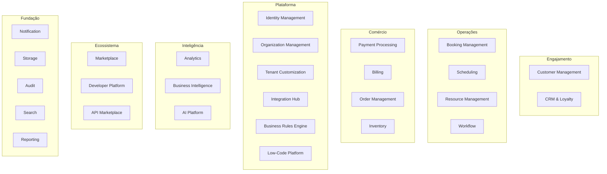

# CoreFlow — Business Capability Model

**Documento:** `docs/BusinessCapabilities.md`  
**Versão:** 1.0 · **Data:** 2026-07-09  
**Status:** Estratégico — modelo de capacidades de negócio  
**Autoridade:** CPO / Principal Enterprise Architect  
**Relacionados:** `ProductCapabilityMap.md` (inventário técnico), `BoundedContexts.md` (DDD)

---

## Propósito

O **Business Capability Model (BCM)** descreve **o que** a plataforma faz do ponto de vista de negócio — independente de implementação. Cada capability é reutilizável cross-segmento e mapeada a bounded contexts, eventos e APIs.

**Pergunta orientadora:**

> Esta capacidade torna o CoreFlow melhor para **todos** os segmentos de negócio?

---

## Mapa de capabilities

---

## Legenda de prioridade e roadmap

| Prioridade | Significado |
|------------|-------------|
| **P0** | Must — bloqueia plataforma |
| **P1** | Should — release corrente |
| **P2** | Could — próxima release |
| **P3** | Future — horizonte 2030 |

| Roadmap | Release |
|---------|---------|
| R1 ✅ | Foundation |
| R2 | Core Domain Consolidation |
| R3 | Business Platform |
| R4 | AI + Low-Code MVP |
| R5 | Marketplace + API Marketplace |
| R6 | Developer Platform |
| R7 | Enterprise Ecosystem |

---

## 1. Identity Management

| Campo | Detalhe |
|-------|---------|
| **Objetivo** | Autenticar usuários e autorizar ações por tenant e papel |
| **Responsabilidades** | JWT, RBAC, sessions, superuser, API keys (futuro) |
| **Bounded Contexts** | Identity |
| **Publica** | `user.registered` |
| **Consome** | — |
| **APIs** | `/auth/*`, JWT deps |
| **Dependências** | Organization (tenant claims) |
| **Plugins estendem** | SSO provider, custom roles via manifest |
| **Prioridade** | P0 · **Estado:** ✅ Produção |
| **Roadmap** | R3: OAuth2 · R6: API keys |

---

## 2. Organization Management

| Campo | Detalhe |
|-------|---------|
| **Objetivo** | Modelar tenant, unidades e configuração operacional |
| **Responsabilidades** | Company, Location, plugin config, branding base |
| **Bounded Contexts** | Organization, Platform |
| **Publica** | `company.created`, `location.created` (🔜) |
| **Consome** | `plugin.installed` (🔜) |
| **APIs** | `/companies/*`, `/v1/plugins/config/by-company/{slug}` |
| **Dependências** | Identity, Plugin Registry |
| **Plugins estendem** | Segmentos, features, terminology |
| **Prioridade** | P0 · **Estado:** ⚠️ Parcial |
| **Roadmap** | R2: Location module · R3: Business entity |

---

## 3. Customer Management

| Campo | Detalhe |
|-------|---------|
| **Objetivo** | Gerenciar clientes finais de qualquer vertical |
| **Responsabilidades** | CRUD customer, histórico básico, tags |
| **Bounded Contexts** | Customer |
| **Publica** | `customer.created`, `customer.updated` (🔜) |
| **Consome** | `booking.created`, `payment.received` |
| **APIs** | `/v1/customers` |
| **Dependências** | Organization |
| **Plugins estendem** | Campos custom (TCE), segmentação CRM |
| **Prioridade** | P0 · **Estado:** ✅ v1 + legacy sync |
| **Roadmap** | R2: Repository hexagonal · R3: CRM enrichment |

---

## 4. CRM & Loyalty

| Campo | Detalhe |
|-------|---------|
| **Objetivo** | Relacionamento, campanhas, fidelidade, LTV |
| **Responsabilidades** | Segments, campaigns, loyalty tiers, follow-up |
| **Bounded Contexts** | Customer (sub), AI Platform, Workflow |
| **Publica** | `campaign.sent`, `customer.segment.changed` (🔜) |
| **Consume** | `booking.*`, `customer.*`, `payment.*` |
| **APIs** | `/v1/crm/*` (🔜) |
| **Dependências** | Customer, Notification, BI |
| **Plugins estendem** | Regras fidelidade beauty/sports, AI follow-up |
| **Prioridade** | P2 · **Estado:** 🔜 Plugin hooks only |
| **Roadmap** | R3: CRM base · R4: AI agents · R5: templates marketplace |

---

## 5. Booking Management

| Campo | Detalhe |
|-------|---------|
| **Objetivo** | Reserva universal — lifecycle completo |
| **Responsabilidades** | Create, approve, reject, cancel, no-show, status |
| **Bounded Contexts** | Booking, Scheduling, Payments |
| **Publica** | `booking.created`, `booking.approved`, `booking.rejected`, `booking.cancelled` |
| **Consome** | `payment.deposit.confirmed`, `schedule.blocked` |
| **APIs** | `/v1/bookings` |
| **Dependências** | Catalog, Customer, Scheduling, ACL (transitório) |
| **Plugins estendem** | Deposit rules, approval workflow, gallery booking |
| **Prioridade** | P0 · **Estado:** ⚠️ Delega legado |
| **Roadmap** | **R2: Domain puro** · R3: cancel/no-show |

---

## 6. Scheduling

| Campo | Detalhe |
|-------|---------|
| **Objetivo** | Disponibilidade, slots, conflitos, bloqueios |
| **Responsabilidades** | Availability calc, schedule blocks, recurring (🔜) |
| **Bounded Contexts** | Scheduling, Resource |
| **Publica** | `schedule.blocked`, `slot.available` (🔜) |
| **Consome** | `booking.created`, `resource.updated` |
| **APIs** | `/v1/scheduling/*`, engine interno |
| **Dependências** | Resource, Worker, Booking |
| **Plugins estendem** | min_slot_duration, buffer time, weekend rules |
| **Prioridade** | P0 · **Estado:** ⚠️ Engine + legacy adapter |
| **Roadmap** | R2: Resource port · R3: Scheduling v2 |

---

## 7. Resource Management

| Campo | Detalhe |
|-------|---------|
| **Objetivo** | Modelar recursos reserváveis de forma universal |
| **Responsabilidades** | Resource CRUD, types, hierarchy, conflict |
| **Bounded Contexts** | Resource, Scheduling, Organization |
| **Publica** | `resource.created`, `resource.updated` (🔜) |
| **Consome** | `location.created` |
| **APIs** | `/v1/resources` (🔜 R2) |
| **Dependências** | Organization (Location) |
| **Plugins estendem** | resource_types no manifest (quadra, cadeira, sala) |
| **Prioridade** | P1 · **Estado:** 🔜 ADR-010 |
| **Roadmap** | **R2: Resource Engine v1** · R3: hierarchy |

---

## 8. Payment Processing

| Campo | Detalhe |
|-------|---------|
| **Objetivo** | Processar pagamentos e sinais de reserva |
| **Responsabilidades** | Deposit, confirm, refund, provider abstraction |
| **Bounded Contexts** | Payments |
| **Publica** | `payment.deposit.confirmed`, `payment.received` |
| **Consome** | `booking.created` |
| **APIs** | `/v1/payments` |
| **Dependências** | Booking, Integration Hub (providers) |
| **Plugins estendem** | Split payment, comissão profissional |
| **Prioridade** | P0 · **Estado:** ✅ v1 + legacy |
| **Roadmap** | R3: Stripe/MP/Pix via Integration Hub |

---

## 9. Billing

| Campo | Detalhe |
|-------|---------|
| **Objetivo** | Faturamento, invoices, reconciliação financeira |
| **Responsabilidades** | Invoice generation, order linkage, finance entries |
| **Bounded Contexts** | Billing, Order, Invoice |
| **Publica** | `invoice.generated`, `order.created` |
| **Consome** | `booking.approved`, `payment.received` |
| **APIs** | `/v1/invoices`, `/v1/orders` |
| **Dependências** | Payments, Booking |
| **Plugins estendem** | NFe rules (Brasil), export contábil |
| **Prioridade** | P1 · **Estado:** ⚠️ Parcial |
| **Roadmap** | R3: fluxo completo · R5: ERP connectors |

---

## 10. Inventory Management

| Campo | Detalhe |
|-------|---------|
| **Objetivo** | Controle de estoque vinculado a operações |
| **Responsabilidades** | Stock levels, movements, alerts |
| **Bounded Contexts** | Inventory, Asset |
| **Publica** | `inventory.updated` |
| **Consome** | `order.created` |
| **APIs** | `/v1/inventory`, `/v1/assets` |
| **Dependências** | Asset, Organization |
| **Plugins estendem** | Retail product catalog (restaurant) |
| **Prioridade** | P2 · **Estado:** ✅ API básica |
| **Roadmap** | R4: alerts · R5: marketplace components |

---

## 11. Workflow & Automation

| Campo | Detalhe |
|-------|---------|
| **Objetivo** | Automação event-driven configurável |
| **Responsabilidades** | YAML workflows, triggers, actions, runs |
| **Bounded Contexts** | Workflow |
| **Publica** | `workflow.started`, `workflow.completed`, `workflow.failed` |
| **Consome** | Todos eventos catalogados |
| **APIs** | `/v1/workflows` |
| **Dependências** | Events, Notification, Integration Hub |
| **Plugins estendem** | Custom actions, vertical templates |
| **Prioridade** | P1 · **Estado:** ✅ YAML engine |
| **Roadmap** | R4: Low-Code visual · R5: marketplace templates |

---

## 12. Notification

| Campo | Detalhe |
|-------|---------|
| **Objetivo** | Entregar mensagens multicanal |
| **Responsabilidades** | Push, email, SMS, in-app, deep links |
| **Bounded Contexts** | Notification, Mobile DevOps |
| **Publica** | `notification.sent`, `push.delivered` |
| **Consome** | Workflow actions, booking events |
| **APIs** | `/v1/devices`, legado notifications |
| **Dependências** | Identity, Integration Hub (SMS/email) |
| **Plugins estendem** | Templates por vertical, WhatsApp flows |
| **Prioridade** | P0 · **Estado:** ✅ Push Expo |
| **Roadmap** | R3: email/SMS hub · R4: template editor |

---

## 13. Analytics (Operational)

| Campo | Detalhe |
|-------|---------|
| **Objetivo** | Métricas operacionais e arquiteturais |
| **Responsabilidades** | Platform health, HTTP metrics, readiness |
| **Bounded Contexts** | Platform, Observability, Analytics |
| **Publica** | — (métricas pull) |
| **Consome** | HTTP telemetry, events |
| **APIs** | `/v1/platform/*`, `/metrics` |
| **Dependências** | Observability |
| **Plugins estendem** | Plugin usage dashboards |
| **Prioridade** | P1 · **Estado:** ✅ R1-F2 |
| **Roadmap** | R3: tenant analytics · ver BI |

---

## 14. Business Intelligence

| Campo | Detalhe |
|-------|---------|
| **Objetivo** | Insights, previsões, KPIs de negócio |
| **Responsabilidades** | Forecast, LTV, churn, heatmaps, benchmarks |
| **Bounded Contexts** | Analytics/BI (novo), AI Platform |
| **Publica** | `insight.generated`, `forecast.updated` (🔜) |
| **Consome** | Stream de eventos de negócio |
| **APIs** | `/v1/analytics/*`, `/v1/insights/*` (🔜) |
| **Dependências** | Events, Customer, Booking, Payments |
| **Plugins estendem** | KPIs verticais, modelos ML segment-specific |
| **Prioridade** | P2 · **Estado:** 🔜 |
| **Roadmap** | R3: read models · R4: predictions · ver `BusinessIntelligence.md` |

---

## 15. AI Platform

| Campo | Detalhe |
|-------|---------|
| **Objetivo** | Camada de IA reutilizável — agents, LLM, tools |
| **Responsabilidades** | Provider registry, agent shell, prompt engine, RAG |
| **Bounded Contexts** | AI Platform |
| **Publica** | `ai.agent.invoked` |
| **Consome** | CRM/booking triggers |
| **APIs** | `/v1/ai` |
| **Dependências** | Ports booking/customer, BI (context) |
| **Plugins estendem** | Vertical agents (beauty CRM, sports pricing) |
| **Prioridade** | P2 · **Estado:** ⚠️ MVP mock/OpenAI |
| **Roadmap** | R2: migrate BeautyAgent · R4: AI Platform · R5: AI Marketplace |

---

## 16. Integration Hub

| Campo | Detalhe |
|-------|---------|
| **Objetivo** | Conectar sistemas externos sem acoplar domínio |
| **Responsabilidades** | Connectors, adapters, event bridge, webhooks |
| **Bounded Contexts** | Integration (novo), Shared Kernel |
| **Publica** | `integration.connected`, `integration.event.received` (🔜) |
| **Consome** | Domain events (outbound) |
| **APIs** | `/v1/integrations/*` (🔜) |
| **Dependências** | Events, Workflow, Payments |
| **Plugins estendem** | Connectors verticais (NFe, WhatsApp templates) |
| **Prioridade** | P1 · **Estado:** 🔜 Design |
| **Roadmap** | R3: MVP WhatsApp+Stripe · ver `IntegrationHub.md` |

---

## 17. Tenant Customization Engine

| Campo | Detalhe |
|-------|---------|
| **Objetivo** | Personalização por tenant sem código |
| **Responsabilidades** | Custom fields, layouts, branding, menus, rules |
| **Bounded Contexts** | Platform, Organization, BRE, Low-Code |
| **Publica** | `tenant.config.changed` (🔜) |
| **Consome** | `plugin.installed` |
| **APIs** | `/v1/tenant/config/*` (🔜) |
| **Dependências** | Plugin Registry, Identity |
| **Plugins estendem** | Default configs, field schemas |
| **Prioridade** | P2 · **Estado:** 🔜 Terminology only |
| **Roadmap** | R3: custom fields · R4: full TCE · ver `TenantCustomizationEngine.md` |

---

## 18. Business Rules Engine

| Campo | Detalhe |
|-------|---------|
| **Objetivo** | Regras declarativas versionadas e auditáveis |
| **Responsabilidades** | Evaluate rules, versioning, rollback |
| **Bounded Contexts** | Rules (novo), Booking, Payments, Scheduling |
| **Publica** | `rule.evaluated`, `rule.version.deployed` (🔜) |
| **Consome** | Context events pre-action |
| **APIs** | `/v1/rules/*` (🔜) |
| **Dependências** | TCE, Workflow |
| **Plugins estendem** | Rule packs por vertical |
| **Prioridade** | P2 · **Estado:** 🔜 |
| **Roadmap** | R4: MVP · ver `BusinessRulesEngine.md` |

---

## 19. Low-Code Platform

| Campo | Detalhe |
|-------|---------|
| **Objetivo** | Construir automações e UIs sem código |
| **Responsabilidades** | Visual workflow, forms, dashboards, menus |
| **Bounded Contexts** | Low-Code (novo), Workflow, TCE |
| **Publica** | `lowcode.app.deployed` (🔜) |
| **Consome** | Event catalog |
| **APIs** | `/v1/lowcode/*` (🔜) |
| **Dependências** | Workflow, BRE, TCE, BI |
| **Plugins estendem** | Component library, templates |
| **Prioridade** | P3 · **Estado:** 🔜 |
| **Roadmap** | R4: workflow visual · R5: forms · ver `LowCodePlatform.md` |

---

## 20. Marketplace

| Campo | Detalhe |
|-------|---------|
| **Objetivo** | Distribuir plugins e extensões |
| **Responsabilidades** | Install, billing, reviews, certification |
| **Bounded Contexts** | Marketplace |
| **Publica** | `plugin.installed`, `plugin.published` |
| **Consome** | `company.created` |
| **APIs** | `/v1/marketplace` |
| **Dependências** | Plugin Engine, Billing, Certification |
| **Plugins estendem** | — (é o container) |
| **Prioridade** | P2 · **Estado:** Experimental stub |
| **Roadmap** | R5: MVP · ver `EcosystemStrategy.md` |

---

## 21. API Marketplace

| Campo | Detalhe |
|-------|---------|
| **Objetivo** | Publicar conectores, templates, agents, SDKs |
| **Responsabilidades** | Catalog, monetization, versioning |
| **Bounded Contexts** | Marketplace, Integration Hub |
| **Publica** | `asset.marketplace.published` (🔜) |
| **Consome** | Certification events |
| **APIs** | `/v1/marketplace/assets/*` (🔜) |
| **Dependências** | Marketplace, Plugin Certification |
| **Plugins estendem** | Publishers third-party |
| **Prioridade** | P3 · **Estado:** 🔜 |
| **Roadmap** | R5-R6 · ver `APIMarketplace.md` |

---

## 22. Developer Platform

| Campo | Detalhe |
|-------|---------|
| **Objetivo** | Produtividade para construir sobre CoreFlow |
| **Responsabilidades** | CLI, SDK, portal, sandbox, docs |
| **Bounded Contexts** | Platform |
| **Publica** | — |
| **Consome** | — |
| **APIs** | OpenAPI, CLI, `developers.coreflow.app` |
| **Dependências** | Plugin Engine, Fitness Functions |
| **Plugins estendem** | SDK generators |
| **Prioridade** | P2 · **Estado:** ⚠️ Docs + TS SDK |
| **Roadmap** | R6 · ver `DeveloperExperience.md` |

---

## 23. Storage

| Campo | Detalhe |
|-------|---------|
| **Objetivo** | Armazenar arquivos e mídia tenant-scoped |
| **Responsabilidades** | Upload, CDN, retention, access control |
| **Bounded Contexts** | Storage (novo), Mobile DevOps |
| **Publica** | `file.uploaded`, `file.deleted` (🔜) |
| **Consome** | — |
| **APIs** | `/uploads/*`, CDN URLs |
| **Dependências** | Identity, Organization |
| **Plugins estendem** | Gallery limits, image processing |
| **Prioridade** | P2 · **Estado:** ⚠️ StaticFiles + CDN |
| **Roadmap** | R3: Storage port · R7: multi-region |

---

## 24. Audit

| Campo | Detalhe |
|-------|---------|
| **Objetivo** | Trilha imutável de ações e decisões |
| **Responsabilidades** | Audit log, rule versioning audit, compliance export |
| **Bounded Contexts** | Audit (novo) |
| **Publica** | `audit.record.created` (🔜) |
| **Consome** | All write operations (event tap) |
| **APIs** | `/v1/audit/*` (🔜) |
| **Dependências** | Events, Identity |
| **Plugins estendem** | Compliance packs (LGPD, HIPAA stub) |
| **Prioridade** | P2 · **Estado:** 🔜 |
| **Roadmap** | R3: audit API · R7: compliance tooling |

---

## 25. Search

| Campo | Detalhe |
|-------|---------|
| **Objetivo** | Busca unificada cross-entidades |
| **Responsabilidades** | Full-text, filters, tenant isolation |
| **Bounded Contexts** | Search (novo) |
| **Publica** | `search.index.updated` (🔜) |
| **Consome** | `*.created`, `*.updated` |
| **APIs** | `/v1/search` (🔜) |
| **Dependências** | Customer, Booking, Catalog, Events |
| **Plugins estendem** | Custom indexed fields (TCE) |
| **Prioridade** | P3 · **Estado:** 🔜 |
| **Roadmap** | R4: PostgreSQL FTS · R6: Elasticsearch optional |

---

## 26. Reporting

| Campo | Detalhe |
|-------|---------|
| **Objetivo** | Relatórios configuráveis exportáveis |
| **Responsabilidades** | Report definitions, schedules, PDF/Excel export |
| **Bounded Contexts** | Reporting (novo), BI |
| **Publica** | `report.generated` (🔜) |
| **Consome** | BI read models |
| **APIs** | `/v1/reports/*` (🔜) |
| **Dependências** | BI, TCE, Storage |
| **Plugins estendem** | Report templates por vertical |
| **Prioridade** | P3 · **Estado:** 🔜 |
| **Roadmap** | R4: builder · R5: marketplace templates |

---

## Matriz capability × release

| Capability | R2 | R3 | R4 | R5 | R6 | R7 |
|------------|----|----|----|----|----|-----|
| Booking | ████ | ██ | ██ | ██ | ██ | ██ |
| Resource | ████ | ███ | ██ | ██ | ██ | ██ |
| Integration Hub | █ | ███ | ███ | ████ | ████ | ████ |
| TCE | █ | ██ | ████ | ████ | ███ | ████ |
| BRE | — | █ | ████ | ████ | ███ | ███ |
| Low-Code | — | █ | ████ | ████ | ███ | ███ |
| BI | — | ███ | ████ | ████ | ███ | ████ |
| Marketplace | — | █ | ██ | ████ | ████ | ████ |
| Developer Platform | ██ | ██ | ███ | ███ | ████ | ████ |

---

## Referências

- `docs/ProductCapabilityMap.md` — classificação técnica Core/Plugin/Future
- `docs/BoundedContexts.md` — DDD contexts
- `docs/PlatformRoadmap2030.md` — releases
- `docs/CoreMetaModel.md` — entidades universais
- `docs/CONSTITUTION.md` — Artigo IV
