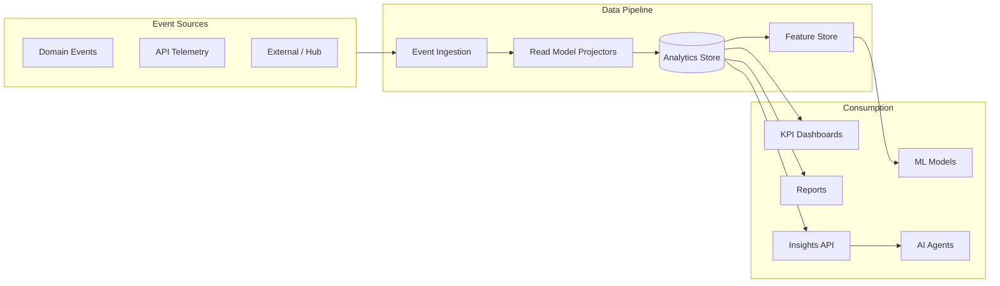

# CoreFlow — Business Intelligence

**Documento:** `docs/BusinessIntelligence.md`  
**Versão:** 1.0 · **Data:** 2026-07-09  
**Status:** Estratégico — contexto de insights e analytics de negócio  
**Distinção:** **Analytics** = ops/platform · **BI** = decisões de negócio

---

## Visão

O contexto **Business Intelligence** transforma eventos de domínio em **read models**, **KPIs**, **previsões** e **insights acionáveis** — reutilizáveis por qualquer plugin vertical.



---

## Capacidades de insights

### Operacionais (R3)

| Insight | Descrição | Fonte de dados |
|---------|-----------|----------------|
| Bookings hoje/semana | Volume agendamentos | `booking.*` events |
| Revenue period | Receita período | `payment.*`, `invoice.*` |
| Occupancy rate | Taxa ocupação resources | booking + resource |
| Top offerings | Serviços mais vendidos | booking + catalog |
| Worker productivity | Reservas por profissional | booking + worker |
| Peak hours heatmap | Horários demanda | booking scheduled_at |
| Waitlist conversion | Fila → booking | waitlist events |

### Preditivos (R4+)

| Insight | Modelo | Output |
|---------|--------|--------|
| **No-show prediction** | Classification ML | Probability 0-1 per booking |
| **Cancellation prediction** | Classification | Risk score |
| **Financial forecast** | Time series | Revenue 30/90 days |
| **Occupancy forecast** | Time series | Resource utilization |
| **LTV (Lifetime Value)** | Regression | Customer tier |
| **Churn prediction** | Classification | At-risk customers |
| **Dynamic pricing hint** | Regression + rules | Suggested multiplier |

### Estratégicos (R5+)

| Insight | Descrição |
|---------|-----------|
| **Benchmark** | Tenant vs segment median (anonymized) |
| **Cohort analysis** | Retention by acquisition month |
| **Revenue attribution** | Channel / worker / offering |
| **Scenario simulation** | What-if pricing rules |

---

## Arquitetura de dados

### Camada 1 — Event Ingestion (✅ base existente)

- Domain events via EventBus + Outbox
- Kafka stream (optional) for analytics consumer
- Event catalog as schema contract

### Camada 2 — Read Models (CQRS)

Projectors consume events → denormalized tables:

| Read Model | Atualizado por | Uso |
|------------|----------------|-----|
| `rm_booking_daily_stats` | booking.* | Dashboards |
| `rm_revenue_daily` | payment.*, invoice.* | Finance KPI |
| `rm_customer_activity` | booking.*, customer.* | CRM, churn |
| `rm_resource_utilization` | booking.*, resource.* | Heatmaps |
| `rm_worker_performance` | booking.*, worker | Rankings |

**Regra:** Read models são **descartáveis** — rebuild from event log.

### Camada 3 — Analytics Store

| Opção | Release | Uso |
|-------|---------|-----|
| PostgreSQL/MySQL tables | R3 | MVP read models |
| TimescaleDB extension | R4 | Time series |
| ClickHouse (optional) | R6 | High volume |
| Redis cache | R3 | Real-time KPIs |

Default: **same DB** com tabelas `analytics_*` — modular monolith. Extração só com métricas.

### Camada 4 — Feature Store (R4+)

Features para ML models:

```json
{
  "customer_id": 123,
  "features": {
    "booking_count_90d": 5,
    "no_show_rate": 0.2,
    "avg_ticket": 150.0,
    "days_since_last_booking": 14
  }
}
```

### Camada 5 — ML Models

| Approach | Release |
|----------|---------|
| Rule-based baseline | R3 |
| scikit-learn batch | R4 |
| Per-tenant fine-tune (optional) | R6 |
| LLM insights (AI Platform) | R4 |

**Models live in plugin or marketplace** — core provides Feature Store + inference port.

---

## KPIs padrão (cross-vertical)

| KPI | Fórmula | Unidade |
|-----|---------|---------|
| Occupancy | booked_slots / available_slots | % |
| No-show rate | no_shows / total_bookings | % |
| Avg ticket | revenue / bookings | currency |
| Conversion (waitlist) | converted / waitlist_entries | % |
| Customer retention | active_90d / active_prev_90d | % |
| Revenue per resource hour | revenue / resource_hours | currency |
| Cancellation rate | cancellations / bookings | % |

Plugin manifest pode definir `kpis:` adicionais (vertical-specific).

---

## Real-time vs batch

| Modo | Latência | Uso |
|------|----------|-----|
| **Real-time** | <5s | KPI cards, alerts |
| **Near-line** | 5–15 min | Dashboard refresh |
| **Batch daily** | Overnight | Reports, ML training |
| **On-demand** | API request | Custom report export |

Projectors: sync in-process (R3) → dedicated worker (R4 if needed).

---

## APIs

| Method | Path | Descrição |
|--------|------|-----------|
| GET | `/v1/analytics/kpis` | KPI bundle tenant |
| GET | `/v1/analytics/heatmap` | Demand heatmap |
| GET | `/v1/insights/no-show-risk/{booking_id}` | Prediction |
| GET | `/v1/analytics/forecast/revenue` | Financial forecast |
| GET | `/v1/analytics/benchmark` | Segment benchmark (R5) |
| POST | `/v1/reports/generate` | Report export |

---

## Eventos BI

| Publica | Consome |
|---------|---------|
| `insight.generated` | `ai.agent.invoked` |
| `forecast.updated` | workflow triggers |
| `anomaly.detected` | notification |
| — | all `booking.*`, `payment.*`, `customer.*` |

---

## Dashboards

| Dashboard | Audiência | Release |
|-----------|-----------|---------|
| Owner Overview | Tenant owner | R3 |
| Operations Today | Staff | R3 |
| Finance Summary | Admin | R3 |
| Marketing CRM | Admin | R4 |
| Predictions | Admin | R4 |
| Platform Analytics | CoreFlow ops | ✅ R1-F2 |

Low-Code Dashboard Editor (R4) consome mesmos read models.

---

## Privacidade & multi-tenant

- Strict `company_id` isolation
- Benchmark: aggregated anonymized — k-anonymity ≥10 tenants
- ML training: tenant-scoped default; federated optional enterprise
- LGPD: export/delete customer features on `customer.deleted`

---

## Roadmap

| Release | Entrega BI |
|---------|------------|
| R2 | — |
| R3 | Read models MVP, KPI API, owner dashboard |
| R4 | Predictions (no-show, churn), feature store, heatmaps |
| R5 | Benchmark, marketplace dashboard packs |
| R6 | Advanced ML, custom metrics API |
| R7 | Multi-region analytics, compliance export |

---

## RFC/ADR

| Artefato | Release |
|----------|---------|
| RFC-008 Business Intelligence Architecture | R3 prep |
| ADR-021 Read Model Strategy | R3 |
| ADR-022 ML Model Boundaries (core vs plugin) | R4 |

---

## Referências

- `docs/BusinessCapabilities.md` — BI capability
- `docs/LowCodePlatform.md` — dashboard editor
- `docs/APIMarketplace.md` — dashboard marketplace assets
- `docs/ArchitectureMetrics.md` — platform metrics (distinct from BI)
- `shared/events/event_catalog.py`
