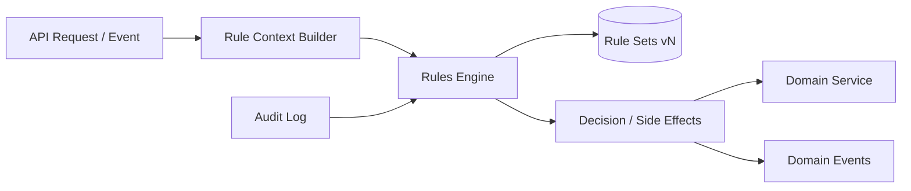

# CoreFlow — Business Rules Engine (BRE)

**Documento:** `docs/BusinessRulesEngine.md`  
**Versão:** 1.0 · **Data:** 2026-07-09  
**Status:** Estratégico — motor declarativo de regras  
**Princípio:** Regras de negócio **configuráveis** separadas de código — versionadas e auditáveis

---

## Visão

O **Business Rules Engine** avalia regras declarativas em pontos de decisão do Core (booking, payment, scheduling, pricing) sem deploy de código. Integra com TCE, Low-Code Platform e Workflow.



---

## Casos de uso universais

| Domínio | Exemplo regra | Segmentos |
|---------|---------------|-----------|
| **Pricing** | IF weekend AND resource.type=Court THEN price * 1.30 | sports, hotel |
| **Discount** | IF customer.tier == Gold THEN discount 10% | all |
| **Deposit** | IF booking.value > 500 THEN deposit optional | beauty, clinic |
| **Scheduling** | IF resource.type == Court THEN min_duration 60min | sports |
| **Cancellation** | IF hours_before < 24 THEN fee 50% | all |
| **Approval** | IF offering.requires_approval THEN status pending | beauty |
| **Capacity** | IF booking.party_size > resource.capacity THEN reject | restaurant |

---

## Modelo de regra

### Estrutura declarativa (YAML/JSON)

```yaml
rule_set:
  id: sports_weekend_pricing
  version: 2
  plugin_id: sports
  tenant_id: null          # null = plugin default; id = tenant override
  priority: 100
  effective_from: "2026-01-01"
  status: published

rules:
  - id: weekend_surge
    when:
      all:
        - field: resource.type
          op: eq
          value: court
        - field: scheduled_at.day_of_week
          op: in
          value: [saturday, sunday]
    then:
      - action: set
        field: offering.dynamic_price_multiplier
        value: 1.30
    else:
      - action: set
        field: offering.dynamic_price_multiplier
        value: 1.0
```

### Expressões suportadas (MVP → full)

| Fase | Operadores | Funções |
|------|------------|---------|
| MVP R4 | eq, ne, gt, lt, in, and, or, not | field, literal |
| R5 | contains, matches, between | date_diff, sum, count |
| R6 | custom functions | plugin-registered functions |

**Não Turing-complete** intencionalmente — evitar rules como código arbitrário.

---

## Pontos de avaliação (Hook Points)

| Hook Point | Contexto disponível | Release |
|------------|---------------------|---------|
| `booking.before_create` | customer, offering, resource, slot | R4 |
| `booking.before_approve` | booking, payments | R4 |
| `payment.before_deposit` | booking, customer, amount | R4 |
| `scheduling.before_slot` | resource, worker, datetime | R5 |
| `pricing.calculate` | offering, customer, datetime | R5 |
| `customer.before_save` | customer, custom_fields | R5 |

Domain service chama BRE **antes** de persistir:

```python
# Conceitual
decision = rules_engine.evaluate("booking.before_create", context)
if decision.blocked:
    raise DomainRuleViolation(decision.message)
context.apply(decision.mutations)
```

---

## Versionamento

| Conceito | Descrição |
|----------|-----------|
| **Draft** | Editável, não em produção |
| **Published** | Ativo em runtime |
| **Archived** | Histórico, não avaliado |
| **Version N** | Immutable após publish |

### Rollback

- One-click revert to version N-1
- Event `rule.version.rolled_back`
- Audit trail completo

---

## Auditoria

Cada avaliação registra:

```json
{
  "rule_set_id": "sports_weekend_pricing",
  "rule_id": "weekend_surge",
  "version": 2,
  "context_hash": "abc123",
  "result": "matched",
  "mutations": [{"field": "dynamic_price_multiplier", "value": 1.30}],
  "evaluated_at": "2026-07-09T12:00:00Z",
  "company_id": 42
}
```

Retenção: 90 dias default · enterprise 7 anos.

---

## Prioridade e conflitos

1. Tenant rule > Plugin default > Platform default
2. Higher `priority` number wins within same scope
3. First match vs accumulate mode (config per rule_set)
4. Conflicts → `rule.conflict.detected` event + block publish (CI)

---

## Integração com outros engines

| Engine | Integração |
|--------|------------|
| **Workflow** | Workflow chama `rule.evaluate` action |
| **TCE** | Validations reference BRE rules |
| **Low-Code** | Rule Editor visual |
| **BI** | Rule impact analytics (A/B) |
| **Plugin** | Rule packs in manifest `rule_packs:` |

---

## Separação Core vs Plugin

| Tipo | Onde |
|------|------|
| Regra universal (deposit min %, cancel policy template) | Core rule templates |
| Parâmetros por vertical | Plugin rule_pack defaults |
| Override por tenant | TCE tenant rules |

**Proibido:** Regra hardcoded "trancista" no core — usar rule com plugin scope.

---

## Performance

| Requisito | Target |
|-----------|--------|
| Eval latency p95 | <10ms (in-memory cache) |
| Rules per hook point | <50 active |
| Cache | Compiled rule sets per tenant+plugin |
| Invalidation | On `rule.version.deployed` |

---

## Feature flags

| Flag | Default |
|------|---------|
| `FEATURE_BUSINESS_RULES_ENABLED` | false |
| `FEATURE_BRE_AUDIT_VERBOSE` | false |

---

## Roadmap

| Release | Entrega |
|---------|---------|
| R2 | — (hardcoded rules remain in domain — paridade) |
| R3 | Rule hook point design + RFC |
| R4 | BRE MVP: 3 hook points, YAML rules, audit |
| R5 | Visual rule editor, plugin rule packs |
| R6 | A/B testing rules, advanced functions |
| R7 | Compliance rule export |

---

## RFC/ADR

| Artefato | Release |
|----------|---------|
| RFC-007 Business Rules Engine | R3 prep |
| ADR-019 BRE Expression Language | R4 |
| ADR-020 Rule vs Code Boundaries | R4 |

---

## Referências

- `docs/TenantCustomizationEngine.md`
- `docs/LowCodePlatform.md`
- `docs/CoreVsPlugins.md`
- `docs/CONSTITUTION.md` — não duplicar regra em core e plugin
