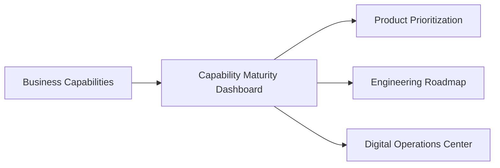

# CoreFlow — Capability Maturity Dashboard

**Documento:** `docs/CapabilityMaturityDashboard.md`  
**Versão:** 1.0 · **Data:** 2026-07-09  
**Status:** Estratégico — governança de evolução do BCM  
**Base:** `BusinessCapabilities.md`, Readiness Score R1-F2

---

## Visão

Acompanhar **maturidade de cada business capability** — não apenas score arquitetural global — para priorizar investimentos técnicos com dados.



---

## Dimensões de maturidade (por capability)

| Dimensão | Peso | Fonte |
|----------|------|-------|
| **Maturidade arquitetural** | 20% | Hexagonal, ports, DDD layer |
| **Cobertura de testes** | 15% | pytest files / paridade |
| **Cobertura de eventos** | 15% | Event catalog implemented % |
| **Documentação** | 10% | Domain Registry complete |
| **APIs públicas** | 15% | OpenAPI stable `/v1` |
| **Observabilidade** | 10% | Metrics, traces, dashboards |
| **Automação** | 15% | Workflow/BRE/LCP coverage |

**Score 0–100** per capability per dimension.

---

## Níveis qualitativos

| Score | Level | Cor |
|-------|-------|-----|
| 0–25 | Initial | 🔴 |
| 26–50 | Emerging | 🟡 |
| 51–75 | Maturing | 🟢 |
| 76–100 | Optimized | 🔵 |

---

## Exemplo — Booking capability

| Dimensão | Score | Notas |
|----------|-------|-------|
| Arquitetural | 40 | ACL wired, domain pending R2 |
| Testes | 75 | CF-8, paridade partial |
| Eventos | 80 | booking.* implemented |
| Documentação | 90 | Domain Registry, Event Storming |
| APIs | 85 | `/v1/bookings` stable |
| Observabilidade | 50 | HTTP metrics only |
| Automação | 70 | Workflow triggers |
| **Overall** | **67** | Maturing |

---

## Exemplo — Search capability

| Dimensão | Score |
|----------|-------|
| All | 5–15 |
| **Overall** | **10** Initial — planned R4 |

---

## Heatmap (release tracking)

| Capability | R1 | R2 target | R3 target |
|------------|----|-----------|-----------|
| Booking | 45 | 75 | 85 |
| Resources | 20 | 65 | 80 |
| Integration | 10 | 15 | 50 |
| Search | 5 | 10 | 25 |
| AI | 25 | 40 | 55 |
| BI | 15 | 20 | 60 |

---

## API (proposta)

```
GET /v1/platform/capability-maturity

{
  "generated_at": "2026-07-09T...",
  "capabilities": [
    {
      "id": "booking_management",
      "name": "Booking Management",
      "overall_score": 67,
      "level": "maturing",
      "dimensions": {
        "architectural": 40,
        "test_coverage": 75,
        "event_coverage": 80,
        "documentation": 90,
        "public_api": 85,
        "observability": 50,
        "automation": 70
      },
      "roadmap": "R2",
      "owner": "Core Domain Team"
    }
  ],
  "platform_average": 48
}
```

Extend `/v1/platform/readiness-score` or separate endpoint R3.

---

## Automação de coleta

| Signal | Script |
|--------|--------|
| Test files | `test_coverage_by_module()` ✅ |
| Event coverage | event catalog status count |
| API documented | OpenAPI path count |
| Couplings | `identified_couplings()` ✅ |
| Docs | Domain Registry status field |

CI weekly job updates scores — commit to `docs/metrics/capability-maturity.json` optional.

---

## Uso em governança

| Ritual | Uso CMD |
|--------|---------|
| Sprint planning | Pick capabilities below target |
| Release gate | No release if critical capability regresses |
| Quarterly review | Present heatmap to stakeholders |
| RFC prioritization | Data-driven backlog |

Link **PMM** (`PlatformMaturityModel.md`) — platform level vs capability level.

---

## Roadmap

| Release | Entrega |
|---------|---------|
| R2 | Manual scoring in Architecture Assessment |
| R3 | API + automated partial signals |
| R4 | DOC panel integration |
| R5 | Trend charts per quarter |

---

## Referências

- `docs/BusinessCapabilities.md`
- `docs/DomainRegistry.md`
- `docs/DigitalOperationsCenter.md`
- `docs/ArchitectureMetrics.md`
- `/v1/platform/readiness-score`
