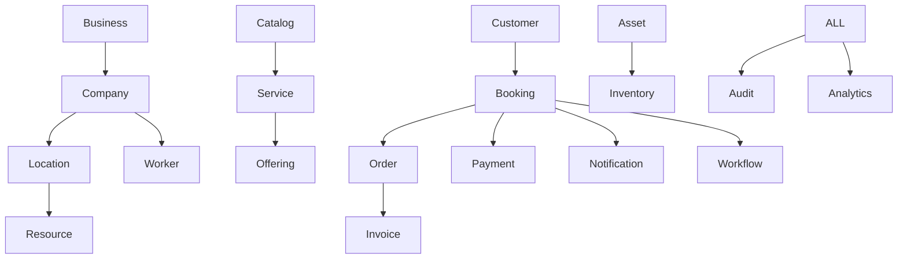

# CoreFlow — Meta Modelo Universal

**Documento:** `docs/CoreMetaModel.md`  
**Status:** Coração da plataforma — imutável salvo ADR  
**Versão:** 1.1 · **Data:** 2026-07-09 (pós R1-F2)  
**Código:** `backend/app/core/metamodel/concepts.py`, entidades `core_*`

---

## Princípio

O Core opera **somente** sobre estes conceitos. Cada Plugin **especializa terminologia** via `manifest.yaml` — nunca duplica entidades.

```
Plugin.specialize(terminology) → Core.operate(universal_concepts)
```

---

## Cadeia universal



---

## Conceitos

| Conceito | Descrição | Tabela / API | Plugin term (beauty) |
|----------|-----------|--------------|----------------------|
| **Business** | Holding / franquia acima de Company | 🔜 | — |
| **Company** | Tenant SaaS | `companies`, `/companies` | Empresa |
| **Location** | Unidade física | `core_locations`, `/v1/locations` | Unidade |
| **Worker** | Quem executa serviço | `core_workers`, `/v1/workers` | Profissional |
| **Resource** | O que é reservado | `core_resources`, `/v1/resources` | Cadeira |
| **Customer** | Cliente final | `core_customers`, `/v1/customers` | Cliente |
| **Catalog** | Agrupador de serviços | `core_catalogs`, `/v1/catalogs` | Categoria |
| **Service** | Tipo de serviço (metamodel) | via Catalog | Serviço |
| **Offering** | Variante comercial | `core_offerings` | Modelo |
| **Booking** | Reserva / agendamento | `core_bookings`, `/v1/bookings` | Reserva |
| **ScheduleBlock** | Bloqueio agenda | `core_schedule_blocks` | — |
| **Waitlist** | Fila de espera | `core_waitlist`, `/v1/waitlist` | Fila de espera |
| **Order** | Pedido | `core_orders`, `/v1/orders` | Pedido |
| **Invoice** | Fatura | `core_invoices`, `/v1/invoices` | Financeiro |
| **Payment** | Pagamento | `core_payments`, `/v1/payments` | Pagamento |
| **Asset** | Ativo | `core_assets`, `/v1/assets` | — |
| **Inventory** | Estoque | `core_inventory`, `/v1/inventory` | — |
| **Workflow** | Automação | `core_workflow_runs`, `/v1/workflows` | — |
| **Notification** | Notificação | push module, device tokens | — |
| **Audit** | Trilha auditoria | 🔜 | — |
| **Analytics** | Métricas agregadas | 🔜 | — |

---

## Enum `CoreConcept`

Definido em `backend/app/core/metamodel/concepts.py`:

`COMPANY`, `USER`, `WORKER`, `CUSTOMER`, `LOCATION`, `RESOURCE`, `CATALOG`, `SERVICE`, `OFFERING`, `BOOKING`, `SCHEDULE_BLOCK`, `WAITLIST`, `OPERATIONAL_QUEUE`, `PAYMENT`, `ORDER`, `INVOICE`, `FINANCE_ENTRY`, `ASSET`, `INVENTORY`

---

## Mapeamento legado Beauty (transitório)

Documentado em `LEGACY_BEAUTY_MAPPINGS` — **não** usar em código core novo.

| Core | Legado |
|------|--------|
| Catalog | Tranca |
| Offering | ServiceImage |
| Booking | Agendamento |
| Customer | Cliente |
| Waitlist | Fila |

Sync via `legacy_sync_service.py` (Strangler Fig — sunset).

---

## Regras de modelagem

1. Novo conceito → ADR + atualizar este documento + migration Alembic
2. Nome de coluna/API usa vocabulário core (snake_case inglês)
3. Labels UI vêm do plugin: `GET /v1/plugins/{id}` → `terminology`
4. `company_id` obrigatório em entidades tenant-scoped

---

## Referências

- ADR-001 Metamodelo (`docs/06-ADR/ADR001-metamodel.md`)
- ADR-005 Core Framework
- `docs/CONSTITUTION.md` Artigo III
- `docs/07-META-MODEL/README.md`
