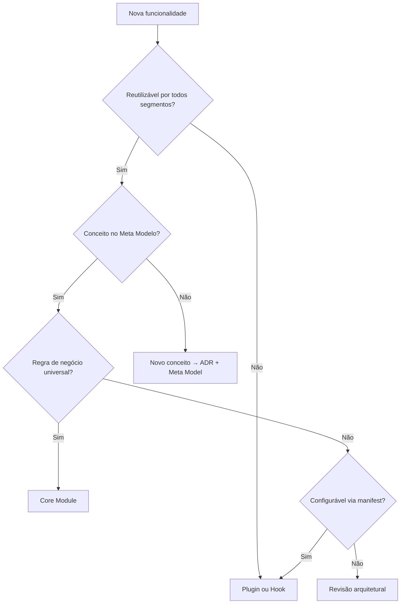

# CoreFlow — Core vs Plugins

**Documento:** `docs/CoreVsPlugins.md`  
**Versão:** 1.0 · **Data:** 2026-07-09  
**Status:** Estratégico — critérios de decisão obrigatórios  
**Autoridade:** `docs/CONSTITUTION.md` Artigo IV (Cinco Perguntas)

---

## Propósito

Definir **critérios objetivos** para decidir se uma funcionalidade pertence ao **Core Framework** ou a um **Plugin vertical**.

Esta decisão é **bloqueante**: implementação no lugar errado exige revisão arquitetural antes de merge.

---

## Perguntas obrigatórias

Antes de implementar, responder **sim/não** para cada item:

| # | Pergunta | Core = Sim | Plugin = Não |
|---|----------|------------|--------------|
| 1 | Pode ser reutilizada por **todos** os segmentos (beauty, sports, clinic, pet, …)? | ✅ | ❌ |
| 2 | Representa um **conceito universal** do Meta Modelo? | ✅ | ❌ |
| 3 | É **regra de negócio específica** de um vertical? | ❌ | ✅ |
| 4 | Depende de terminologia ou entidade do domínio Beauty (ou outro vertical)? | ❌ | ✅ |
| 5 | Facilita a criação de **novos produtos** sem alterar código core? | ✅ (no core) | ✅ (no plugin) |
| 6 | Existe **port/adapters** ou evento genérico que abstrai o comportamento? | ✅ | — |
| 7 | Está alinhado ao **Meta Modelo** (`docs/CoreMetaModel.md`)? | ✅ | N/A se plugin |
| 8 | Existe **ADR/RFC** para mudança estrutural? | Obrigatório | Recomendado |

**Regra de ouro:**

> Se a resposta à pergunta 1 for **não**, a funcionalidade **pertence a um Plugin** (ou a integração via hook/evento), salvo exceção documentada em ADR.

---

## Matriz de decisão

### Legenda

| Classificação | Significado |
|---------------|-------------|
| **CORE** | Implementar em `backend/app/modules/` ou `backend/app/core/` |
| **PLUGIN** | Implementar em `backend/plugins/{id}/` ou hooks do manifest |
| **SHARED** | Shared Kernel — eventos, ACL, infra transversal |
| **LEGACY** | Manter em `app/services/` até sunset — nunca expandir |

### Funcionalidades mapeadas

| Funcionalidade | Classificação | Justificativa |
|----------------|---------------|---------------|
| JWT + RBAC + multi-tenant | **CORE** | Universal |
| Company / Location | **CORE** | Meta Modelo |
| Catalog / Offering | **CORE** | Universal — "serviço comercial" |
| Booking lifecycle | **CORE** | Universal — reserva |
| Scheduling / availability | **CORE** | Universal — agenda |
| Resource (cadeira, quadra, sala) | **CORE** | Universal — Resource Engine |
| Customer CRUD | **CORE** | Universal |
| Payment / deposit | **CORE** | Universal — valor pode variar por plugin |
| Invoice / Order | **CORE** | Universal |
| Workflow engine | **CORE** | Automação genérica |
| Push notification dispatch | **CORE** | Infra de notificação |
| LLM provider registry | **CORE** | AI Platform shell |
| Plugin loader + registry | **CORE** | Platform capability |
| Feature flags + ACL | **SHARED** | Governança transversal |
| Event bus + outbox | **SHARED** | Infra event-driven |
| Terminology labels UI | **PLUGIN** | manifest `terminology` |
| Deposit % default 30% beauty | **PLUGIN** | `ui.default_deposit_pct` |
| Galeria de fotos por tranca | **PLUGIN** | `ui.catalog_layout: gallery` |
| AI follow-up trancista | **PLUGIN** | `ai_capabilities: crm_followup` |
| Segmentos trancista/barbearia | **PLUGIN** | `segments` no manifest |
| Regra "aprovar só com sinal pago" | **CORE** + config plugin | Core booking rule; plugin habilita feature |
| Comissão por profissional beauty | **PLUGIN** | Regra comercial específica |
| EAS whitelabel branding | **PLUGIN** | `mobile.app_name`, assets |
| Deep links trancapro:// | **PLUGIN** | `sdk.deep_links` |
| ReservationService legado | **LEGACY** | Sunset — não expandir |
| BeautyAgent | **PLUGIN** | Migrar de `modules/ai/` |
| Marketplace discovery consumer | **PLUGIN/FUTURE** | Pode ser plugin ou contexto separado |

---

## Árvore de decisão

---

## Anti-patterns (proibidos)

| Anti-pattern | Por quê | Correção |
|--------------|---------|----------|
| `Tranca` no core | Termo beauty-specific | `Catalog` + terminology plugin |
| `BeautyAgent` em `modules/ai/` | Acoplamento vertical | `plugins/beauty/agents/` |
| Import `app.models.agendamento` em command core | Bypass ACL | `BookingPort` + adapter |
| Duplicar booking logic no plugin | Viola API First | Plugin chama `/v1/bookings` |
| Nova entidade core por vertical | Fragmenta meta model | Estender manifest ou ADR |

---

## Exemplos práticos

### Exemplo 1 — "Fila de espera com prioridade VIP"

- **Universal?** Sim — waitlist existe no meta model (`Waitlist`)
- **Regra VIP beauty-specific?** Se "VIP" = tag de cliente beauty → **plugin hook** sobre `waitlist.approved`
- **Decisão:** Core mantém waitlist; plugin beauty adiciona priorização via hook

### Exemplo 2 — "Reserva de quadra com tempo mínimo 1h"

- **Universal?** Sim — booking + scheduling
- **Parâmetro configurável?** Sim — `scheduling.min_slot_duration` no manifest sports
- **Decisão:** Core scheduling engine lê config; plugin sports define 60 min

### Exemplo 3 — "Análise de cabelo por visão computacional"

- **Universal?** Não — feature beauty (`ai_vision`)
- **Decisão:** **Plugin beauty** — agent + API externa; core expõe apenas AI Platform shell

---

## Processo de escalação

1. Implementador preenche matriz no PR (seção "Core vs Plugin")
2. Se qualquer dúvida → RFC curto antes de código
3. Decisão registrada em ADR se estabelecer precedente
4. Atualizar este documento se novo padrão emergir

---

## Referências

- `docs/CONSTITUTION.md` — Artigo III (Meta Modelo), Artigo IV (Cinco Perguntas)
- `docs/CoreMetaModel.md`
- `docs/ProductCapabilityMap.md`
- `backend/plugins/beauty/manifest.yaml` — referência plugin piloto
- ADR-002 Beauty como Plugin Piloto
- ADR-006 Plugin Architecture
