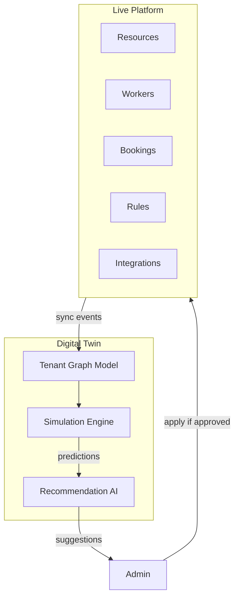

# CoreFlow — Digital Twin (Tenant)

**Documento:** `docs/DigitalTwin.md`  
**Versão:** 1.0 · **Data:** 2026-07-09  
**Status:** Estratégico — gêmeo digital por tenant  
**Release alvo:** R5–R6

---

## Visão

Cada tenant possui uma **representação estruturada e simulável** do ambiente operacional — recursos, equipes, horários, regras, serviços, clientes, integrações — enabling **what-if** antes de mudanças reais.



---

## Componentes do twin

| Dimensão | Source | Twin representation |
|----------|--------|---------------------|
| **Resources** | `/v1/resources` | Nodes with capacity, schedule |
| **Workers** | workers API | Skills, availability |
| **Schedules** | scheduling | Calendar blocks |
| **Rules** | BRE | Rule graph |
| **Services** | catalog/offerings | Pricing, duration |
| **Customers** | CRM aggregates | Segments, LTV (not PII dump) |
| **Integrations** | Integration Hub | Connection status |
| **Historical** | BI read models | Demand patterns |

---

## Casos de uso

### 1. Simulação de impacto

> "Se eu mudar deposit de 30% para 50%, qual impacto em conversão?"

Twin runs Monte Carlo or historical replay on past 90 days bookings.

### 2. Capacity planning

> "Preciso de mais uma quadra aos sábados?"

Simulate demand vs capacity — recommend resource add.

### 3. Rule change preview

> "Nova regra weekend +30% pricing"

BRE dry-run on twin before publish.

### 4. Integration failure drill

> "WhatsApp down — qual fallback?"

Simulate integration outage impact on notification delivery.

### 5. AI recommendations

Twin feeds Feature Store — agents suggest optimizations.

Output: `twin.simulation.completed` event with report JSON.

---

## API (proposta)

```
POST /v1/twin/simulate
{
  "scenario": "pricing_change",
  "parameters": {"deposit_pct": 0.5},
  "horizon_days": 90
}

Response:
{
  "simulation_id": "...",
  "metrics": {
    "projected_conversion_delta": -0.08,
    "projected_revenue_delta": +0.12
  },
  "confidence": 0.75,
  "recommendation": "Consider 40% instead for balanced outcome"
}
```

---

## Sync strategy

| Mode | Detail |
|------|--------|
| Event-driven | Project twin graph on domain events |
| Snapshot | Nightly full reconcile |
| Version | Twin snapshot vN before each simulation |

---

## Privacy

- Twin uses **aggregated** customer data for simulations
- No export raw PII to external ML without consent
- Tenant-scoped isolation strict

---

## Diferencial competitivo

Salesforce/ServiceNow têm simulators enterprise — rare in SMB vertical SaaS. Posiciona CoreFlow como **platform intelligence**, not just CRUD.

---

## Roadmap

| Release | Entrega |
|---------|---------|
| R3 | Graph model design |
| R4 | Read-only twin mirror (resources, bookings stats) |
| R5 | Simulation engine MVP — pricing, capacity |
| R6 | AI recommendations integration |
| R7 | Digital twin API for enterprise partners |

---

## Referências

- `docs/BusinessIntelligence.md`
- `docs/BusinessRulesEngine.md`
- `docs/AIArchitecture.md`
- `docs/TenantCustomizationEngine.md`
