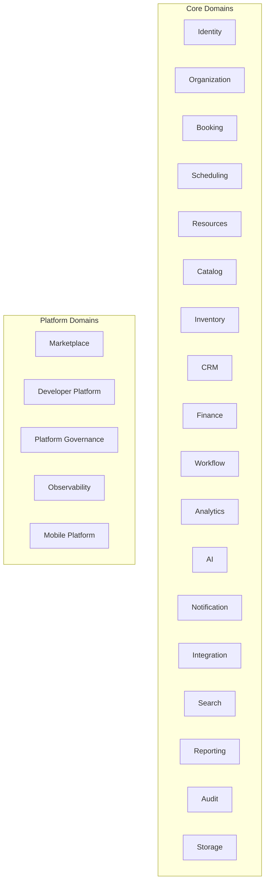

# CoreFlow — Domain Registry

**Documento:** `docs/DomainRegistry.md`  
**Versão:** 1.0 · **Data:** 2026-07-09  
**Status:** Normativo — catálogo único de domínios da plataforma  
**Relacionados:** `BoundedContexts.md`, `BusinessCapabilities.md`, `CoreMetaModel.md`

---

## Propósito

O **Domain Registry** unifica Business Capabilities, Bounded Contexts, Plugins e Core em um **catálogo único** — facilitando governança, roadmap e onboarding. Cada domínio é a unidade de evolução arquitetural.

**Regra:** Todo módulo novo ou contexto novo **deve** ser registrado aqui antes de RFC.

---

## Mapa de domínios

---

## Legenda de status

| Status | Significado |
|--------|-------------|
| **production** | Operacional em piloto/prod |
| **partial** | MVP ou Strangler Fig ativo |
| **design** | Documentado, não implementado |
| **planned** | Roadmap futuro |

---

## Registro por domínio

### Identity

| Campo | Valor |
|-------|-------|
| **Objetivo** | Autenticação, autorização, RBAC multi-tenant |
| **Owner** | Platform Team |
| **Entidades** | User, Role, Session, APIKey (🔜) |
| **Ports** | AuthPort, TokenPort |
| **APIs** | `/auth/*` |
| **Eventos publicados** | `user.registered` |
| **Eventos consumidos** | — |
| **Feature flags** | — |
| **Plugins que utilizam** | Todos |
| **Dependências** | Organization |
| **Roadmap** | R3 OAuth2 · R6 API keys |
| **Status** | production |

### Organization

| Campo | Valor |
|-------|-------|
| **Objetivo** | Tenant, locations, plugin config |
| **Owner** | Platform Team |
| **Entidades** | Company, Location, TenantConfig |
| **Ports** | TenantPort, LocationPort |
| **APIs** | `/companies/*`, `/v1/plugins/config/*` |
| **Eventos publicados** | `company.created` |
| **Eventos consumidos** | `plugin.installed` (🔜) |
| **Feature flags** | — |
| **Plugins** | Todos |
| **Dependências** | Identity |
| **Roadmap** | R2 Location module · R3 Business entity |
| **Status** | partial |

### Booking

| Campo | Valor |
|-------|-------|
| **Objetivo** | Reserva universal — lifecycle |
| **Owner** | Core Domain Team |
| **Entidades** | CoreBooking, BookingStatus |
| **Ports** | BookingPort, LegacyBookingAdapter |
| **APIs** | `/v1/bookings` |
| **Eventos publicados** | `booking.created`, `booking.approved`, `booking.rejected` |
| **Eventos consumidos** | `payment.deposit.confirmed` |
| **Feature flags** | `booking.core.enabled` |
| **Plugins** | beauty, sports, clinic, restaurant, hotel… |
| **Dependências** | Catalog, Customer, Scheduling, Payments |
| **Roadmap** | **R2 domain puro** |
| **Status** | partial (ACL legado) |

### Scheduling

| Campo | Valor |
|-------|-------|
| **Objetivo** | Disponibilidade, slots, conflitos |
| **Owner** | Core Domain Team |
| **Entidades** | ScheduleBlock, AvailabilitySlot |
| **Ports** | SchedulingPort, AvailabilityPort |
| **APIs** | `/v1/scheduling/*` |
| **Eventos publicados** | `schedule.blocked` (🔜) |
| **Eventos consumidos** | `booking.*`, `resource.updated` |
| **Feature flags** | — |
| **Plugins** | Todos com agenda |
| **Dependências** | Resources, Booking |
| **Roadmap** | R3 Scheduling v2 |
| **Status** | partial |

### Resources

| Campo | Valor |
|-------|-------|
| **Objetivo** | Recursos reserváveis universais |
| **Owner** | Core Domain Team |
| **Entidades** | CoreResource, ResourceType, ResourcePool (🔜) |
| **Ports** | ResourcePort, ResourceAllocationPort |
| **APIs** | `/v1/resources` |
| **Eventos publicados** | `resource.created`, `resource.updated` |
| **Eventos consumidos** | `location.created` |
| **Feature flags** | `resource.engine.enabled` (🔜 R2) |
| **Plugins** | Todos — ver `ResourceEngine.md` |
| **Dependências** | Organization |
| **Roadmap** | **R2 Resource Engine v1** · R3 hierarchy |
| **Status** | partial |

### Catalog

| Campo | Valor |
|-------|-------|
| **Objetivo** | Catálogo comercial — offerings |
| **Owner** | Core Domain Team |
| **Entidades** | CoreCatalog, CoreOffering |
| **Ports** | CatalogRepositoryPort |
| **APIs** | `/v1/catalogs` |
| **Eventos publicados** | `catalog.created` (🔜) |
| **Plugins** | Todos |
| **Roadmap** | R2 hexagonal repos |
| **Status** | partial |

### Inventory

| Campo | Valor |
|-------|-------|
| **Objetivo** | Estoque e movimentações |
| **Entidades** | CoreInventory, InventoryMovement |
| **APIs** | `/v1/inventory`, `/v1/assets` |
| **Eventos** | `inventory.updated` |
| **Plugins** | beauty, restaurant, retail |
| **Status** | partial |

### CRM

| Campo | Valor |
|-------|-------|
| **Objetivo** | Relacionamento, segmentos, campanhas |
| **Entidades** | Customer (+ segments, tags) |
| **APIs** | `/v1/customers`, `/v1/crm/*` (🔜) |
| **Eventos** | `customer.created`, `campaign.sent` (🔜) |
| **Plugins** | Todos |
| **Roadmap** | R3 CRM base |
| **Status** | partial |

### Finance

| Campo | Valor |
|-------|-------|
| **Objetivo** | Pagamentos, orders, invoices |
| **Entidades** | Payment, Order, Invoice |
| **APIs** | `/v1/payments`, `/v1/orders`, `/v1/invoices` |
| **Eventos** | `payment.*`, `invoice.generated` |
| **Plugins** | Todos |
| **Status** | partial |

### Workflow

| Campo | Valor |
|-------|-------|
| **Objetivo** | Automação event-driven |
| **Entidades** | WorkflowDefinition, WorkflowRun |
| **APIs** | `/v1/workflows` |
| **Eventos** | `workflow.started`, `workflow.completed` |
| **Feature flags** | `workflow.enabled` |
| **Status** | production |

### Analytics

| Campo | Valor |
|-------|-------|
| **Objetivo** | KPIs operacionais + BI |
| **APIs** | `/v1/platform/*`, `/v1/analytics/*` (🔜) |
| **Doc** | `BusinessIntelligence.md` |
| **Roadmap** | R3 read models |
| **Status** | partial |

### AI

| Campo | Valor |
|-------|-------|
| **Objetivo** | LLM gateway, agents, RAG |
| **Doc** | `AIArchitecture.md`, `AgenticAIArchitecture.md` |
| **APIs** | `/v1/ai` |
| **Feature flags** | `ai.core.enabled` |
| **Roadmap** | R2 migrate agents · R4 platform |
| **Status** | partial |

### Marketplace

| Campo | Valor |
|-------|-------|
| **Objetivo** | Distribuição plugins e assets |
| **Doc** | `APIMarketplace.md`, `MarketplaceEconomy.md` |
| **APIs** | `/v1/marketplace` |
| **Roadmap** | R5 |
| **Status** | design |

### Developer Platform

| Campo | Valor |
|-------|-------|
| **Objetivo** | SDK, CLI, portal, sandbox |
| **Doc** | `DeveloperExperience.md` |
| **Roadmap** | R6 |
| **Status** | partial |

### Notification

| Campo | Valor |
|-------|-------|
| **Objetivo** | Push, email, SMS multicanal |
| **APIs** | `/v1/devices` |
| **Eventos** | `notification.sent` |
| **Status** | partial |

### Integration

| Campo | Valor |
|-------|-------|
| **Objetivo** | Hub de sistemas externos |
| **Doc** | `IntegrationHub.md` |
| **Roadmap** | R3 |
| **Status** | design |

### Search

| Campo | Valor |
|-------|-------|
| **Objetivo** | Busca global cross-entity |
| **Doc** | `SearchEngine.md` |
| **Roadmap** | R4 |
| **Status** | planned |

### Reporting

| Campo | Valor |
|-------|-------|
| **Objetivo** | Relatórios exportáveis |
| **Doc** | `LowCodePlatform.md` |
| **Roadmap** | R4–R5 |
| **Status** | planned |

### Audit

| Campo | Valor |
|-------|-------|
| **Objetivo** | Trilha imutável compliance |
| **Roadmap** | R3 |
| **Status** | planned |

### Storage

| Campo | Valor |
|-------|-------|
| **Objetivo** | Arquivos, mídia, CDN |
| **Roadmap** | R3 port formal |
| **Status** | partial |

### Platform Governance

| Campo | Valor |
|-------|-------|
| **Objetivo** | Health, flags, readiness, fitness |
| **APIs** | `/v1/platform/*` |
| **Doc** | `DigitalOperationsCenter.md` |
| **Status** | production |

### Observability

| Campo | Valor |
|-------|-------|
| **Objetivo** | Logs, traces, metrics, business metrics |
| **Doc** | `ObservabilityPlatform.md` |
| **Status** | partial |

### Mobile Platform

| Campo | Valor |
|-------|-------|
| **Objetivo** | BFF, SDK, offline, realtime |
| **Doc** | `MobilePlatform.md`, `RealtimePlatform.md` |
| **Status** | partial |

---

## Matriz domínio × release

| Domínio | R2 | R3 | R4 | R5 | R6 |
|---------|----|----|----|----|-----|
| Booking | ████ | ██ | ██ | ██ | ██ |
| Resources | ████ | ███ | ██ | ██ | ██ |
| Integration | — | ███ | ███ | ████ | ████ |
| Search | — | █ | ███ | ███ | ███ |
| AI | ██ | ██ | ████ | ████ | ████ |
| Mobile | ██ | ███ | ████ | ███ | ████ |

---

## Processo de registro

1. Propor domínio em RFC
2. Adicionar entrada neste registry
3. Criar/atualizar Bounded Context doc
4. Registrar em Event Catalog + Event Storming
5. ADR se novo CoreConcept

---

## Referências

- `docs/BoundedContexts.md`
- `docs/BusinessCapabilities.md`
- `docs/CapabilityMaturityDashboard.md`
- `docs/EventStorming.md`
