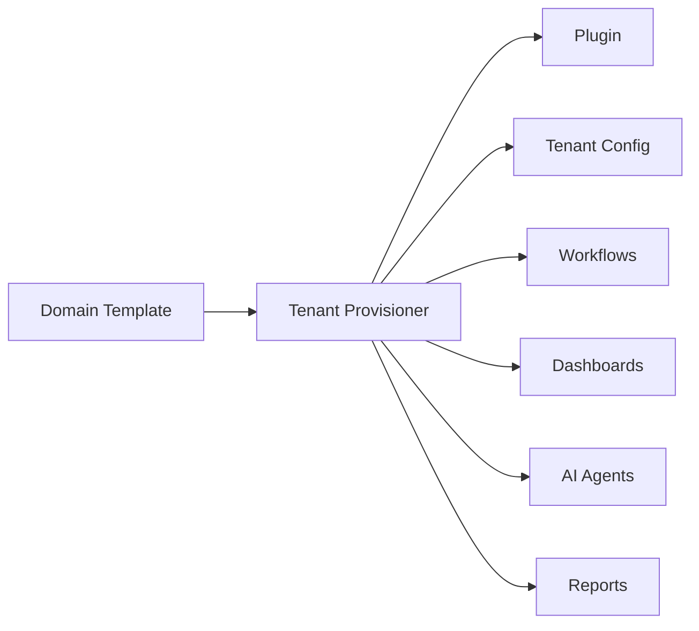

# CoreFlow — Domain Templates (Starters)

**Documento:** `docs/DomainTemplates.md`  
**Versão:** 1.0 · **Data:** 2026-07-09  
**Status:** Estratégico — onboarding acelerado por vertical  
**Distribuição:** Marketplace + CLI `coreflow scaffold`

---

## Visão

**Domain Templates** (Starters) permitem provisionar tenant **production-ready** em minutos — plugin + config + menus + workflows + dashboards + AI + reports pré-instalados.



---

## Catálogo de starters

| Template ID | Vertical | Plugin | Release |
|-------------|----------|--------|---------|
| `beauty-starter` | Salão, trancista, barbearia | beauty ✅ | R3 |
| `sports-starter` | Quadras, academias | sports | R4 |
| `clinic-starter` | Clínicas, consultórios | clinic | R4 |
| `restaurant-starter` | Restaurantes | restaurant | R5 |
| `coworking-starter` | Coworking | coworking | R5 |
| `education-starter` | Escolas, cursos | education | R5 |
| `events-starter` | Eventos, espaços | events | R5 |
| `hotel-starter` | Hotéis, pousadas | hotel | R6 |
| `pet-starter` | Pet shops, vet | pet | R5 |

---

## Conteúdo de cada template

### 1. Plugin

- Manifest preconfigured
- Terminology defaults
- Features enabled set
- Resource types

### 2. Menus

- Admin navigation order
- Mobile tab bar
- Role visibility (owner vs staff)

### 3. Terminology

- Locale PT-BR default
- Labels overridden per segment (trancista vs barbearia variant)

### 4. Workflows (YAML packs)

**beauty-starter example:**

- Deposit reminder 24h before
- Auto-approve when deposit confirmed
- No-show follow-up
- CRM welcome new customer

### 5. Dashboards

- Owner: revenue, occupancy, top offerings
- Staff: today agenda
- KPIs from `BusinessIntelligence.md`

### 6. AI agents

- beauty: crm_followup, payment_reminder
- sports: booking_confirm, waitlist_notify

### 7. Reports

- Monthly revenue PDF
- Worker productivity
- Customer list export

### 8. Business rules (🔜 R4)

- Deposit 30% default
- Cancel policy 24h

### 9. Integrations (optional)

- WhatsApp templates stub
- Stripe connect placeholder

### 10. Sample data

- Demo customers, resources, one booking (sandbox only)

---

## Instalação

```bash
# Future CLI
coreflow scaffold install beauty-starter --tenant=demo-salon

# API
POST /v1/tenants/provision
{
  "template_id": "beauty-starter",
  "company_name": "Salão Demo",
  "segment": "trancista"
}
```

Event: `tenant.provisioned.from_template`

---

## Customização pós-install

Templates são **starting point** — TCE allows override without code.

---

## Marketplace

Templates published as `asset_type: template` — free official, paid partner packs.

---

## Roadmap

| Release | Entrega |
|---------|---------|
| R3 | beauty-starter manual script |
| R4 | Provision API, sports + clinic stubs |
| R5 | Marketplace templates, 5 verticals |
| R6 | CLI scaffold, partner templates |

---

## Referências

- `docs/APIMarketplace.md`
- `docs/TenantCustomizationEngine.md`
- `docs/ResourceEngine.md`
- `backend/plugins/beauty/manifest.yaml`
