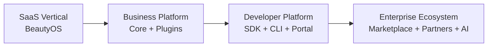
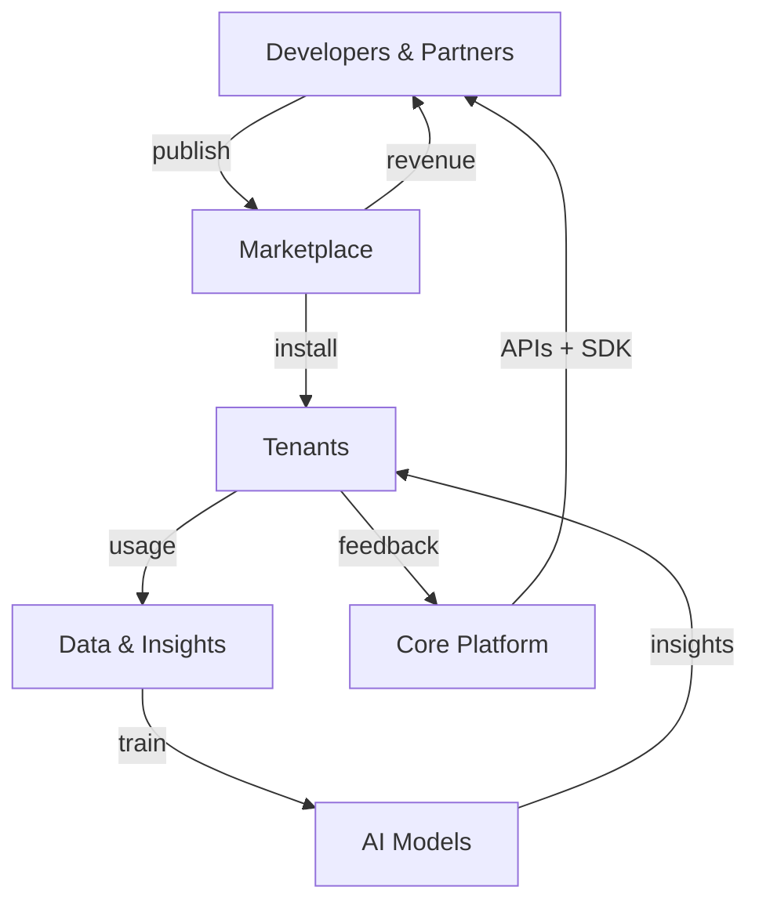

# CoreFlow — Ecosystem Strategy

**Documento:** `docs/EcosystemStrategy.md`  
**Versão:** 2.0 · **Data:** 2026-07-09  
**Status:** Estratégico — transformação Plataforma → Ecossistema Empresarial  
**Horizonte:** 2027 – 2031  
**Changelog v2:** Expandido — Partner Network, Community, AI Marketplace, i18n, Certifications

---

## Tese

O CoreFlow evolui em **quatro estágios** — de SaaS vertical a ecossistema enterprise global:



| Estágio | Receita | Moat | PMM Level |
|---------|---------|------|-----------|
| **SaaS** | Assinatura tenant | Produto operacional | — |
| **Platform** | Multi-vertical SaaS | Core reutilizável | N2 |
| **Developer Platform** | SaaS + API + tools | DX + SDK | N3 |
| **Ecosystem** | Marketplace + partners + AI | Rede + dados | N4–N6 |

Ver `docs/PlatformMaturityModel.md`.

---

## Objetivo estratégico

> Transformar o CoreFlow em um **Ecossistema Empresarial** onde Core Framework, Plugins, Marketplace, SDK, CLI, AI Platform, BI, Low-Code, Integration Hub e Tenant Customization convergem para permitir **qualquer segmento de serviços** operar sem fork.

**Pergunta gate:**

> Esta capacidade torna o CoreFlow melhor para **todos** os segmentos?

---

## Pilares do ecossistema (expandido)

### 1. Marketplace unificado

**Plugin Marketplace** + **API Marketplace** — single storefront.

| Asset type | Release | Doc |
|------------|---------|-----|
| Plugins | R5 | `APIMarketplace.md` |
| Connectors | R5 | `IntegrationHub.md` |
| Workflows, dashboards, agents | R5–R6 | `LowCodePlatform.md` |
| Templates, SDKs, themes | R6 | `APIMarketplace.md` |

Monetização: ver `APIMarketplace.md` — free, freemium, subscription, usage, revenue share.

### 2. Partner Network

Rede formal de implementadores, ISVs e integradores.

| Programa | Descrição | Release |
|----------|-----------|---------|
| **Registered Partner** | Acesso docs + sandbox | R3 |
| **Certified Partner** | 1+ asset certificado, listing | R5 |
| **Premier Partner** | 5+ tenants, co-marketing | R6 |
| **Enterprise Partner** | White-label, private marketplace | R7 |

Benefícios: revenue share boost, lead referral, early access, dedicated support.

**Partner Portal** (R6): deal registration, tenant provisioning, earnings dashboard.

### 3. Developer Portal

| Componente | Release | Doc |
|------------|---------|-----|
| Docs estáticos | ✅ | `DeveloperPortal.md` |
| Interactive tutorials | R3 | — |
| API Explorer | R6 | `DeveloperExperience.md` |
| Sandbox tenants | R6 | — |
| CLI auth | R6 | — |
| Community forum | R6 | — |
| Status page | R3 | — |

URL: `developers.coreflow.app`

### 4. Open SDK

| Package | Audience | Release |
|---------|----------|---------|
| `@coreflow/sdk` | Frontend, integradores | ✅ |
| `@coreflow/cli` | All developers | R6 |
| `@coreflow/plugin-sdk` | Plugin authors | R6 |
| OpenAPI codegen (any lang) | Enterprise | R6 |
| Mobile SDK wrappers | Partners | R6 |

**Open SDK commitment:** Core API = Public API. Sem surface divergente.

### 5. Templates & Community Plugins

| Canal | Governance |
|-------|------------|
| **Official templates** | CoreFlow published, certified |
| **Partner templates** | Certified partner review |
| **Community plugins** | Automated certification pipeline |

Community contribution flow:

```
Fork → Develop → coreflow validate → PR → Certification → Marketplace
```

**Community Plugins** policy:

- MIT/Apache license required
- No trademark violation
- Security scan mandatory
- Support disclaimer — community best-effort

Incentivos: revenue share, featured listing, hackathons.

### 6. Public API Ecosystem

| Capability | Release |
|------------|---------|
| REST `/v1/*` + API keys | R6 |
| Webhooks outbound (HMAC) | R3–R6 |
| GraphQL read API (optional) | R6 |
| Rate limits + tiers | R3 |
| OAuth2 enterprise | R7 |
| SLA 99.9% → 99.95% | R6–R7 |

Integração com **Integration Hub** — inbound/outbound event bridge.

### 7. AI Marketplace

Distinto de plugins — **agents, models, prompt packs, insight modules**.

| Asset | Publisher | Example |
|-------|-----------|---------|
| Agent | Plugin/partner | CRM follow-up beauty |
| Model pack | CoreFlow | No-show predictor LATAM |
| Prompt template | Community | Booking confirmation PT |
| Insight module | Partner | Revenue anomaly detector |

Billing: usage-based + subscription. Ver `APIMarketplace.md`.

Integração: AI Platform shell (R4) + Feature Store (BI R4).

### 8. White Label

| Layer | Status | Release |
|-------|--------|---------|
| Mobile EAS whitelabel | ✅ | — |
| CDN per plugin | ✅ | — |
| Admin theming | 🔜 | R4 TCE |
| Custom domain | 🔜 | R7 |
| Remove CoreFlow branding | 🔜 | Enterprise |
| Reseller portal | 🔜 | R6 |

### 9. Internacionalização

| Capability | Release |
|------------|---------|
| Plugin terminology i18n | R4 |
| Tenant locale | R4 |
| Multi-currency | R5–R7 |
| Regional payment providers | R3–R7 |
| Regional marketplace | R7 |
| LATAM first → US/EU | R7 |

Ver `PlatformRoadmap2030.md` Release 7.

### 10. Certificações

| Certification | Escopo | Doc |
|---------------|--------|-----|
| **Asset certification** | All marketplace assets | `PluginCertification.md` |
| **Partner certification** | Business + technical exam | R6 |
| **Security certification** | SOC2 Type II (enterprise) | R7 |
| **Plugin compatibility badge** | Per platform version | R5 |

Badge levels: Community → Verified → Official → Enterprise.

### 11. Programa de Parceiros (detalhado)

| Tier | Requisitos | Revenue share | Support |
|------|------------|---------------|---------|
| **Registered** | Conta dev portal | — | Forum |
| **Certified** | 1 asset certified + exam | 25% | Email 48h |
| **Premier** | 5 tenants + 2 assets | 20% | 4h SLA |
| **Enterprise** | Contract + white-label | Custom | Dedicated CSM |

Perks escalonados: co-marketing, lead gen, beta access, architecture office hours.

---

## Capacidades de ecossistema (cross-cutting)

| Capability | Documento | Release |
|------------|-----------|---------|
| Integration Hub | `IntegrationHub.md` | R3+ |
| Tenant Customization | `TenantCustomizationEngine.md` | R3+ |
| Business Rules Engine | `BusinessRulesEngine.md` | R4+ |
| Low-Code Platform | `LowCodePlatform.md` | R4+ |
| Business Intelligence | `BusinessIntelligence.md` | R3+ |
| Architecture Fitness | `ArchitectureFitnessFunctions.md` | R3+ |
| Business Capabilities | `BusinessCapabilities.md` | — |

---

## Flywheel do ecossistema (v2)



**Métricas flywheel v2:**

| Métrica | Target 2030 |
|---------|-------------|
| Plugins + assets published | 200+ |
| Certified partners | 50+ |
| Tenants with ≥1 marketplace asset | 40% |
| API calls / day (public) | 10M+ |
| Marketplace GMV / year | $8M+ |
| Developer NPS | >60 |
| Community contributors | 100+ |

---

## Community strategy

| Iniciativa | Descrição | When |
|------------|-----------|------|
| **Hackathons** | Vertical plugin challenge | R5 annual |
| **Bounty program** | Paid issues for connectors | R6 |
| **Ambassador program** | Regional advocates LATAM | R6 |
| **Open source core** | Evaluate partial open core | R7 spike |
| **Discord/Slack community** | Dev support channel | R5 |

---

## Riscos do ecossistema (atualizado)

| Risco | Mitigação |
|-------|-----------|
| Marketplace vazio | Official 10 assets at launch |
| Malicious plugins | Certification + signing + sandbox |
| API fragmentation | Constitution + fitness functions |
| Partner channel conflict | Clear tier rules + deal reg |
| AI liability | Disclaimers + human-in-loop options |
| Regulatory (LGPD/GDPR) | Audit trail + data residency R7 |
| Community toxicity | Code of conduct + moderated forum |

---

## Roadmap ecossistema

| Release | Foco ecossistema |
|---------|------------------|
| R2 | Plugin formalization — foundation for ecosystem |
| R3 | Integration Hub, BI, partner registered program |
| R4 | Low-Code, BRE, AI Platform, community forum |
| R5 | Marketplace MVP, certification, AI marketplace |
| R6 | Developer Platform complete, partner premier |
| R7 | Enterprise ecosystem, i18n, global expansion |

---

## Referências

- `docs/PlatformVision.md`
- `docs/PlatformMaturityModel.md`
- `docs/PlatformRoadmap2030.md`
- `docs/APIMarketplace.md`
- `docs/PluginCertification.md`
- `docs/DeveloperExperience.md`
- `docs/BusinessCapabilities.md`
- `docs/ArchitectureVision2030.md`
