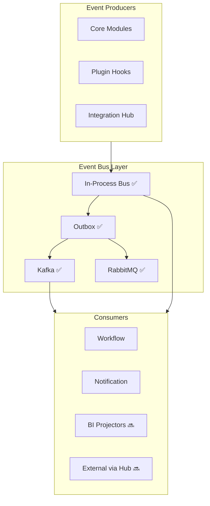

# CoreFlow — Event-Driven Architecture

**Documento:** `docs/EventDrivenArchitecture.md`  
**Versão:** 1.0 · **Data:** 2026-07-09  
**Status:** Normativo — arquitetura de eventos current → future  
**Código:** `backend/app/shared/events/`

---

## Visão

CoreFlow adota **Event-Driven Architecture (EDA)** como backbone de integração entre bounded contexts, plugins e sistemas externos. Eventos são contratos versionados — não detalhes de implementação.



---

## Estado atual (Current)

| Componente | Implementação | Config |
|------------|---------------|--------|
| In-process EventBus | `event_bus.py` ✅ | always |
| DomainEvent | `domain_event.py` ✅ | — |
| Outbox pattern | `outbox.py` ✅ | `OUTBOX_DISPATCH_MODE` |
| Kafka adapter | `kafka_adapter.py` ✅ | `KAFKA_ENABLED` |
| RabbitMQ | pika worker ✅ | `RABBITMQ_ENABLED` |
| Avro schemas | `backend/schemas/events/` ✅ | Schema Registry |
| DLQ + replay | workers ✅ | `KAFKA_DLQ_*` |
| Architecture metrics | event count R1-F2 ✅ | — |

**Modo default dev:** `OUTBOX_DISPATCH_MODE=sync`

---

## Estado futuro (Target 2030)

| Transport | Uso | Release |
|-----------|-----|---------|
| **In-process** | Handlers síncronos, workflow | Always |
| **Kafka** | Streaming analytics, integrations, multi-service | ✅ → expand R3 |
| **RabbitMQ** | Task queues, legacy bridges | Optional |
| **AWS SNS/SQS** | Cloud-native adapter | R7 optional |
| **Azure Event Grid** | Enterprise Azure tenants | R7 optional |
| **Google Pub/Sub** | GCP tenants | R7 optional |

**Princípio:** Abstração via `EventTransportPort` — adapters plugáveis. Domínio nunca importa Kafka.

---

## Event Envelope (padrão)

Todo evento publicado — interno ou externo — segue envelope unificado:

```json
{
  "envelope_version": "1.0",
  "event_id": "550e8400-e29b-41d4-a716-446655440000",
  "event_type": "booking.created",
  "event_version": "v2",
  "occurred_at": "2026-07-09T15:00:00.000Z",
  "published_at": "2026-07-09T15:00:00.001Z",
  "correlation_id": "req-abc-123",
  "causation_id": "evt-parent-456",
  "tenant_id": 42,
  "aggregate_type": "Booking",
  "aggregate_id": "1001",
  "producer": "coreflow.booking",
  "metadata": {
    "plugin_id": "beauty",
    "user_id": "7",
    "trace_id": "otel-trace-id",
    "idempotency_key": "idem-xyz"
  },
  "payload": {
    "customer_id": 55,
    "scheduled_at": "2026-07-10T10:00:00Z",
    "status": "pending"
  }
}
```

| Campo | Obrigatório | Descrição |
|-------|-------------|-----------|
| `event_id` | ✅ | UUID único |
| `event_type` | ✅ | `{aggregate}.{action}` |
| `event_version` | ✅ | Schema major version |
| `correlation_id` | ✅ | Rastreio request/saga |
| `causation_id` | ⚠️ | Evento pai |
| `tenant_id` | ✅ | Multi-tenant isolation |
| `occurred_at` | ✅ | Quando fato ocorreu |
| `metadata` | ⚠️ | trace, plugin, user |
| `payload` | ✅ | Dados de negócio |

---

## Versionamento de eventos

| Regra | Detalhe |
|-------|---------|
| Backward compatible | Novos campos optional em Avro |
| Breaking change | Nova major `booking.created.v3` |
| Dual consume | Handlers suportam v1+v2 durante migração |
| Sunset | 12 meses após nova major |

---

## Padrões

| Padrão | Uso CoreFlow |
|--------|--------------|
| **Event Notification** | Default — eventos leves + query se needed |
| **Event-Carried State Transfer** | Payload rico em booking.created |
| **Outbox** | At-least-once para Kafka ✅ |
| **Idempotent Consumer** | `idempotency_key` + dedup table |
| **Choreography** | Default entre contexts |
| **Orchestration** | Workflow engine para multi-step |
| **Saga** | Payment→Booking compensations R3 |

---

## Tópicos Kafka (proposta)

| Topic | Events | Partitions key |
|-------|--------|----------------|
| `coreflow.events.booking` | booking.* | tenant_id |
| `coreflow.events.payment` | payment.* | tenant_id |
| `coreflow.events.platform` | workflow.*, outbox.* | tenant_id |
| `coreflow.events.dlq` | failed ✅ | — |
| `coreflow.events.analytics` | all (tap) 🔜 | tenant_id |

---

## Correlation & tracing

- `correlation_id` = request HTTP ou saga ID
- OpenTelemetry `trace_id` em metadata
- Grafana: trace → events timeline (R3)

---

## Roadmap EDA

| Release | Entrega |
|---------|---------|
| R2 | Envelope spec in DomainEvent · correlation_id |
| R3 | BI projectors consume Kafka · Integration Hub bridge |
| R4 | EventTransportPort abstraction |
| R5 | Analytics tap topic |
| R7 | Multi-cloud transport adapters |

---

## RFC/ADR

| Artefato | Release |
|----------|---------|
| RFC-009 Event Envelope Standard | R2 prep |
| ADR-022 Event Transport Abstraction | R4 |

---

## Referências

- `docs/EventStorming.md`
- `docs/architecture/EventCatalog.md`
- `docs/IntegrationHub.md`
- `docs/AgenticAIArchitecture.md`
