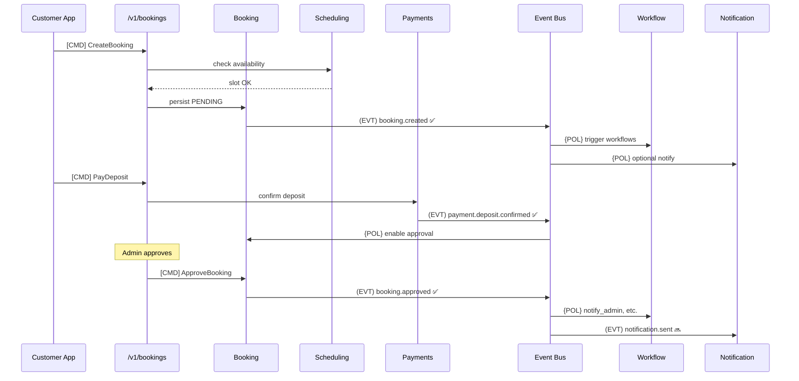

# CoreFlow — Event Storming

**Documento:** `docs/EventStorming.md`  
**Versão:** 1.0 · **Data:** 2026-07-09  
**Status:** Normativo — fluxos oficiais de eventos de domínio  
**Complementa:** `architecture/EventCatalog.md`, `EventDrivenArchitecture.md`

---

## Propósito

O **Event Catalog** lista eventos. O **Event Storming** documenta **fluxos causais** — a narrativa que conecta comandos, agregados, eventos e políticas. Essencial para Kafka, novos plugins e onboarding.

---

## Legenda

| Símbolo | Significado |
|---------|-------------|
| `[CMD]` | Comando (intenção) |
| `(EVT)` | Evento de domínio |
| `{POL}` | Política / reação |
| `[EXT]` | Sistema externo |
| `✅` | Implementado |
| `🔜` | Planejado |

---

## Fluxo 1 — Booking completo (happy path)



### Lista linear

```
(CMD) CreateBooking
    → (EVT) booking.created ✅
        → {POL} Workflow: on_booking_created
        → {POL} Push: optional confirmation 🔜

(CMD) PayDeposit / webhook
    → (EVT) payment.deposit.confirmed ✅
        → {POL} Booking: mark deposit paid
        → {POL} Workflow: payment.deposit.confirmed ✅

(CMD) ApproveBooking
    → (EVT) booking.approved ✅
        → {POL} Workflow: notify_admin ✅
        → (EVT) notification.sent 🔜
        → {POL} Integration Hub: WhatsApp 🔜

(CMD) RejectBooking
    → (EVT) booking.rejected ✅
        → {POL} Workflow: cleanup
        → {POL} Payment: refund policy 🔜
```

---

## Fluxo 2 — Customer lifecycle

```
(EVT) customer.created 🔜
    → {POL} CRM: welcome segment
    → {POL} BI: update rm_customer_activity

(EVT) customer.updated 🔜
    → {POL} Search: reindex

(CMD) CreateBooking (existing customer)
    → (EVT) booking.created
        → {POL} CRM: increment activity
```

---

## Fluxo 3 — Waitlist → Booking

```
(CMD) JoinWaitlist
    → (EVT) waitlist.joined 🔜

{POL} Slot available (scheduling)
    → (EVT) waitlist.slot_available 🔜
        → {POL} Plugin hook: beauty on_waitlist_approved ✅
        → (CMD) CreateBooking (from waitlist)
            → (EVT) booking.created
```

---

## Fluxo 4 — Resource & Scheduling

```
(CMD) CreateResource 🔜 R2
    → (EVT) resource.created 🔜
        → {POL} Search: index

(CMD) BlockSchedule
    → (EVT) schedule.blocked 🔜
        → {POL} Scheduling: recalculate availability

(EVT) booking.created
    → {POL} Resource: allocate capacity
    → {POL} Scheduling: mark slot occupied
```

---

## Fluxo 5 — Order & Invoice

```
(EVT) booking.approved
    → {POL} Order: create draft 🔜
        → (EVT) order.created 🔜
            → (EVT) invoice.generated 🔜
                → {POL} Integration: ERP export 🔜
                → {POL} Notification: send invoice 🔜
```

---

## Fluxo 6 — Plugin & Marketplace

```
(EVT) marketplace.asset.installed 🔜
    → (EVT) plugin.installed 🔜
        → (EVT) tenant.config.changed 🔜
            → {POL} TCE: reload config
            → {POL} Menu: rebuild

(EVT) rule.version.deployed 🔜
    → {POL} BRE: invalidate cache
```

---

## Fluxo 7 — AI Agent

```
(EVT) booking.created
    → {POL} AI: evaluate trigger 🔜
        → (EVT) ai.agent.invoked 🔜
            → {POL} Tools: query booking, customer
            → (EVT) notification.sent OR workflow.started
```

Ver `AgenticAIArchitecture.md`.

---

## Fluxo 8 — Platform ops

```
(HTTP) legacy write detected
    → (METRIC) architecture_metrics
    → {POL} Enforcement: warn/block

(EVT) outbox.dispatched ✅
    → [EXT] Kafka
        → {POL} BI projector 🔜
        → {POL} Integration Hub 🔜

(EVT) dlq.message.recorded ✅
    → {POL} Alertmanager
    → {POL} DOC: ops notification
```

---

## Hot spots (discussões abertas)

| # | Questão | ADR/RFC |
|---|---------|---------|
| 1 | Dual-write booking legado + core em R2 | RFC-003 |
| 2 | `reservation.created` vs `booking.created` sunset | ADR-009 |
| 3 | Saga vs choreography para payment→booking | R3 RFC |
| 4 | Event sourcing para audit select aggregates | Could R4 |

---

## Workshop cadence

| Frequência | Atividade |
|------------|-----------|
| Per new domain | Event storming session → update this doc |
| Per release | Review implemented vs 🔜 |
| Per plugin | Plugin-specific flows appendix |

---

## Referências

- `docs/architecture/EventCatalog.md`
- `docs/EventDrivenArchitecture.md`
- `backend/app/shared/events/event_catalog.py`
- `docs/DomainRegistry.md`
