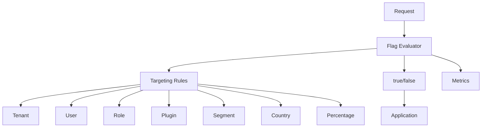

# CoreFlow — Feature Flag Platform

**Documento:** `docs/FeatureFlagPlatform.md`  
**Versão:** 1.0 · **Data:** 2026-07-09  
**Status:** Estratégico — evolução de flags simples → plataforma  
**Estado atual:** `feature_flags.py` + settings ✅

---

## Visão

Feature flags evoluem de **boolean env vars** para **plataforma de rollout** com targeting, percentage, kill switch e observabilidade — essencial para SaaS multi-tenant em escala.



---

## Estado atual (R1)

| Flag | Setting | Default |
|------|---------|---------|
| `booking.core.enabled` | `FEATURE_BOOKING_CORE_ENABLED` | false |
| `ai.core.enabled` | `FEATURE_AI_CORE_ENABLED` | false |
| `workflow.enabled` | `FEATURE_WORKFLOW_ENABLED` | false |
| `plugin.engine.enabled` | `FEATURE_PLUGIN_ENGINE_ENABLED` | false |
| `legacy.telemetry.enabled` | `FEATURE_LEGACY_TELEMETRY_ENABLED` | false |

API: `GET /v1/platform/feature-flags` ✅

---

## Estado alvo (Platform)

### Dimensões de targeting

| Dimensão | Exemplo |
|----------|---------|
| **Global** | On/off platform-wide |
| **Tenant** | Company 42 only |
| **User** | Beta tester user_ids |
| **Role** | owner, admin, staff |
| **Plugin** | beauty tenants only |
| **Segment** | trancista, barbearia |
| **Country** | BR, AR, MX |
| **Environment** | staging, production |
| **Percentage** | 10% canary rollout |
| **Beta program** | `beta_features_enabled` tenant flag |

### Kill switch

Emergency off without deploy:

```
POST /v1/platform/flags/{key}/kill
→ instant false all evaluations + alert
```

Use cases: AI runaway cost, bad booking path, integration failure.

---

## Modelo de dados (futuro)

```json
{
  "flag_key": "booking.core.enabled",
  "default": false,
  "rules": [
    {
      "priority": 100,
      "conditions": {"tenant_id": [42, 99], "environment": "staging"},
      "value": true
    },
    {
      "priority": 50,
      "conditions": {"plugin_id": "beauty", "percentage": 10},
      "value": true
    }
  ],
  "metadata": {
    "owner": "core-domain-team",
    "adr": "ADR-009",
    "rollback_doc": "docs/sprints/R2-F1.md"
  }
}
```

---

## Tipos de flags

| Tipo | Uso |
|------|-----|
| **Release** | Gradual feature rollout |
| **Ops** | Kill switch, maintenance |
| **Experiment** | A/B test (link BI) |
| **Permission** | Entitlement per plan (link Platform Billing) |
| **Plugin** | Feature pack enabled |

---

## Observabilidade

- Metric: `coreflow_flag_evaluation_total{flag, result, tenant}`
- Log: debug evaluation reason (staging only)
- Dashboard: flag adoption % in DOC

---

## Governance

| Regra | Detalhe |
|-------|---------|
| Every migration flag | ADR + rollback doc |
| Default safe | false for risky paths |
| Remove flag | After 100% rollout + 1 release |
| Max active release flags | Track in Architecture Metrics |

---

## Roadmap

| Release | Entrega |
|---------|---------|
| R2 | Env flags + booking/resource flags |
| R3 | Rule engine MVP (tenant + percentage) |
| R4 | Admin UI, kill switch API |
| R5 | Entitlement flags linked to Platform Billing |
| R6 | External provider option (LaunchDarkly compat export) |

---

## Referências

- `docs/PlatformBilling.md`
- `docs/ObservabilityPlatform.md`
- `backend/app/core/feature_flags.py`
- RFC-002
