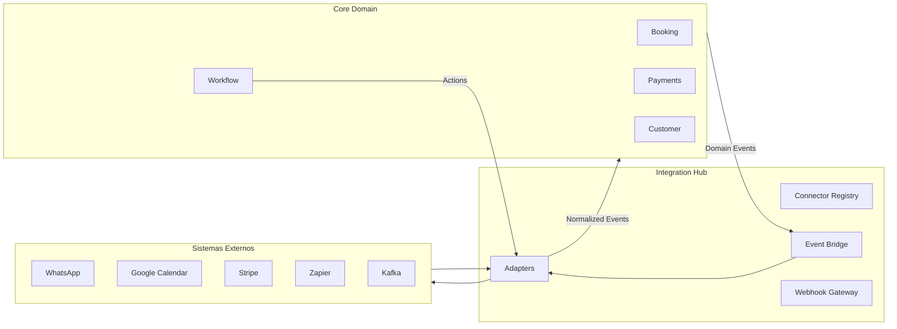

# CoreFlow — Integration Hub

**Documento:** `docs/IntegrationHub.md`  
**Versão:** 1.0 · **Data:** 2026-07-09  
**Status:** Estratégico — design do Hub de Integrações  
**Princípio:** **Nunca acoplar domínio a sistemas externos.** Toda integração via eventos e ports.

---

## Visão

O **Integration Hub** é um bounded context dedicado que centraliza todas as conexões com sistemas externos. O Core publica/consome **eventos de domínio**; o Hub traduz para protocolos externos e vice-versa.



---

## Princípios arquiteturais

| # | Princípio |
|---|-----------|
| 1 | **Event-first** — integração inbound/outbound via eventos normalizados |
| 2 | **Adapter pattern** — cada connector é adapter isolado |
| 3 | **Zero domain import** — Hub não importa `modules/booking/domain` |
| 4 | **Tenant-scoped credentials** — secrets por company, encrypted at rest |
| 5 | **Idempotency** — dedup por external_id + connector_id |
| 6 | **Retry + DLQ** — reutilizar infra outbox/Kafka DLQ existente |
| 7 | **Feature flag per connector** — rollout incremental |
| 8 | **Plugin extension** — connectors verticais via marketplace |

---

## Modelo de dados (conceitual)

| Entidade | Descrição |
|----------|-----------|
| `IntegrationConnector` | Tipo (stripe, whatsapp), version, schema |
| `IntegrationConnection` | Instância por tenant — credentials, status |
| `IntegrationMapping` | Field map external ↔ core event payload |
| `IntegrationLog` | Audit trail requests/responses (sanitized) |
| `WebhookSubscription` | Outbound URL + events + HMAC secret |

---

## Event Bridge

### Outbound (Core → Externo)

```
booking.created → IntegrationHub → WhatsAppAdapter → send template message
payment.received → IntegrationHub → QuickBooksAdapter → create invoice
```

### Inbound (Externo → Core)

```
Stripe webhook → StripeAdapter → payment.deposit.confirmed (normalized)
WhatsApp message → WhatsAppAdapter → customer.message.received (🔜)
```

### Eventos normalizados do Hub

| Evento | Direção | Descrição |
|--------|---------|-----------|
| `integration.connected` | Out | Connection established |
| `integration.disconnected` | Out | Connection removed |
| `integration.event.received` | In | External → normalized |
| `integration.event.dispatched` | Out | Sent to external |
| `integration.error` | Out | Failure with retry count |
| `webhook.delivered` | Out | Outbound webhook success |

---

## Catálogo de integrações

### Mensageria & Comunicação

| Integração | Tipo | Prioridade | Release | Eventos |
|------------|------|------------|---------|---------|
| **WhatsApp Business** | Messaging | P1 | R3 | `notification.sent`, inbound messages |
| **SMS** (Twilio/Zenvia) | Messaging | P2 | R3 | `notification.sent` |
| **Email** (SendGrid/SES) | Messaging | P2 | R3 | `notification.sent` |
| **Slack** | Notification | P3 | R4 | workflow actions |
| **Discord** | Notification | P3 | R5 | workflow actions |
| **Microsoft Teams** | Notification | P3 | R5 | workflow actions |

### Calendário

| Integração | Tipo | Prioridade | Release |
|------------|------|------------|---------|
| **Google Calendar** | Sync | P2 | R4 |
| **Outlook / Microsoft 365** | Sync | P3 | R5 |

### Pagamentos

| Integração | Tipo | Prioridade | Release |
|------------|------|------------|---------|
| **Stripe** | PaymentProviderPort | P1 | R3 |
| **Mercado Pago** | PaymentProviderPort | P1 | R3 |
| **PIX** (BACEN) | PaymentProviderPort | P1 | R3 |
| **Asaas** | PaymentProviderPort | P2 | R4 |
| **PagSeguro** | PaymentProviderPort | P2 | R4 |

### Automação & iPaaS

| Integração | Tipo | Prioridade | Release |
|------------|------|------------|---------|
| **Webhook** (generic) | Protocol | P1 | R3 |
| **REST** (generic connector) | Protocol | P1 | R3 |
| **Zapier** | iPaaS | P2 | R6 |
| **Make** (Integromat) | iPaaS | P2 | R6 |
| **n8n** | iPaaS | P3 | R6 |

### Financeiro / ERP

| Integração | Tipo | Prioridade | Release |
|------------|------|------------|---------|
| **QuickBooks** | ERP export | P3 | R5 |
| **Conta Azul** | ERP export | P2 | R5 |
| **Bling** | ERP export | P2 | R5 |
| **NFe** (Brasil) | Fiscal | P2 | R5 |

### Streaming & Protocolos

| Integração | Tipo | Prioridade | Release |
|------------|------|------------|---------|
| **Kafka** | Streaming | ✅ Existe | outbox worker |
| **RabbitMQ** | Queue | ✅ Existe | outbox mode |
| **MQTT** | IoT (🔜) | P3 | R7 |
| **GraphQL** (external) | Protocol | P3 | R6 |

---

## Arquitetura de connector

```python
# Conceitual — não implementar até RFC-004

class IntegrationPort(Protocol):
    """
    Port para connector de integração.

    Args:
        connection: IntegrationConnection com credentials.
        payload: Evento normalizado ou dict externo.

    Returns:
        IntegrationResult com status e external_id.
    """
    def dispatch(self, connection, event: DomainEvent) -> IntegrationResult: ...
    def receive(self, connection, raw_payload: dict) -> DomainEvent: ...
```

### Estrutura de pacotes (futuro)

```
modules/integration/
├── domain/
│   ├── connector.py
│   └── connection.py
├── application/
│   ├── integration_hub_service.py
│   └── ports/
├── infrastructure/
│   ├── adapters/
│   │   ├── stripe_adapter.py
│   │   ├── whatsapp_adapter.py
│   │   └── webhook_adapter.py
│   └── credentials_vault.py
└── api/
    └── v1_integrations.py
```

---

## Workflow integration

Workflow actions delegam ao Hub — **nunca** chamam API externa diretamente:

```yaml
# workflow example
steps:
  - action: integration.dispatch
    params:
      connector: whatsapp
      template: booking_confirmation
      mapping: beauty_booking_confirm
```

Action catalog expande em R3 com `integration.*` actions.

---

## Segurança

| Controle | Implementação |
|----------|---------------|
| Credentials | Vault / encrypted DB column per tenant |
| Webhook verify | HMAC-SHA256 signature |
| OAuth refresh | Token rotation job |
| PII in logs | Redact phone, email in IntegrationLog |
| Rate limits | Per connector per tenant |
| Sandbox mode | Test credentials flag |

---

## Rollout por release

| Release | Entregas Hub |
|---------|--------------|
| **R2** | Design + PaymentProviderPort formalizado (sem new connectors) |
| **R3** | Webhook gateway, Stripe, MP, PIX, WhatsApp MVP |
| **R4** | Google Calendar, email/SMS, REST generic connector |
| **R5** | ERP exports, NFe, Conta Azul, Bling |
| **R6** | Zapier/Make/n8n, GraphQL, public API webhooks |
| **R7** | MQTT, multi-region routing |

---

## Feature flags (propostas)

| Flag | Default | Connector |
|------|---------|-----------|
| `FEATURE_INTEGRATION_HUB_ENABLED` | false | Hub master |
| `FEATURE_INTEGRATION_STRIPE_ENABLED` | false | Stripe |
| `FEATURE_INTEGRATION_WHATSAPP_ENABLED` | false | WhatsApp |
| `FEATURE_INTEGRATION_WEBHOOK_OUTBOUND_ENABLED` | false | Webhooks |

---

## Métricas

- Connectors active per tenant
- Dispatch success rate per connector
- Inbound events normalized / rejected
- Retry count / DLQ depth
- Latency p95 per adapter

Dashboard: extensão `coreflow-api-layers` → `coreflow-integrations` (R3).

---

## RFC/ADR necessários

| Artefato | Release |
|----------|---------|
| RFC-004 Integration Hub | R3 prep |
| ADR-014 Integration Hub Architecture | R3 |
| ADR-015 Credential Vault Strategy | R3 |

---

## Referências

- `docs/BusinessCapabilities.md` — Integration capability
- `docs/BoundedContexts.md`
- `backend/app/shared/events/` — outbox, kafka, DLQ
- `docs/APIMarketplace.md` — connectors as marketplace assets
- `docs/CONSTITUTION.md` — Hexagonal, ACL
