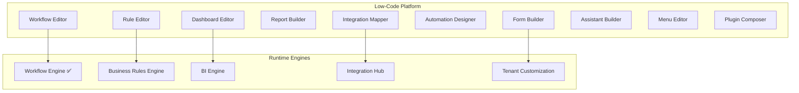

# CoreFlow — Low-Code Platform

**Documento:** `docs/LowCodePlatform.md`  
**Versão:** 1.0 · **Data:** 2026-07-09  
**Status:** Estratégico — plataforma visual no-code/low-code  
**Posicionamento:** Complementa Workflow YAML existente — evolui para editor visual enterprise

---

## Visão

A **Low-Code Platform (LCP)** permite que administradores e parceiros construam soluções sobre CoreFlow **sem código**, usando editores visuais conectados ao Meta Model, Event Catalog e Integration Hub.



---

## Módulos da plataforma

### 1. Workflow Editor (Visual)

**Estado hoje:** YAML files + `WorkflowEngine` ✅

**Alvo:**

- Drag-and-drop canvas
- Triggers from Event Catalog dropdown
- Actions from Action Catalog
- Conditions via BRE expressions
- Test mode (dry-run com sample event)
- Export/import YAML (round-trip)

**Release:** R4 MVP · R5 marketplace templates

### 2. Form Builder

- Drag fields (core + custom fields TCE)
- Validation rules visual
- Multi-step forms
- Embed in mobile/web via config JSON
- Submit → API `/v1/{entity}` or custom entity

**Release:** R4 spike · R5 production

### 3. Dashboard Editor

- Widget library (KPI cards, charts, tables, heatmaps)
- Data sources: BI read models
- Filters: date range, location, worker
- Role-based visibility
- Export Grafana-compatible (ops) vs tenant dashboard (business)

**Release:** R4-R5

### 4. Report Builder

- Column picker, grouping, aggregations
- Schedule (cron) → email/PDF
- Templates per plugin vertical
- Export CSV, PDF, Excel

**Release:** R5 · link `Reporting` capability

### 5. Integration Mapper

- Visual field mapping external ↔ core events
- Test connection (Integration Hub)
- OAuth wizard UI
- Webhook endpoint generator

**Release:** R4 with Integration Hub

### 6. Automation Designer

- Combines workflow + rules + integrations
- "When booking created → if gold customer → WhatsApp + discount rule"
- Template gallery

**Release:** R5

### 7. Rule Editor

- Visual IF/THEN (delegates to BRE)
- Expression builder with autocomplete (fields, functions)
- Version diff viewer
- Rollback one-click

**Release:** R4 with BRE

### 8. Assistant Builder (AI)

- Configure agent: name, tools, prompt, triggers
- Tool picker from catalog (booking, customer, payment)
- Test chat sandbox
- Publish to tenant or marketplace

**Release:** R5 · requires AI Platform R4

### 9. Menu Editor

- Reorder/hide menu items from plugin routes
- Custom links (external URL)
- Role visibility matrix

**Release:** R4 · extends TCE menus

### 10. Plugin Composer (Advanced)

- Visual manifest builder for partners
- Terminology wizard
- Feature toggles
- Hook binding UI
- Generate scaffold via CLI

**Release:** R6 · Developer Platform

---

## Arquitetura técnica

### Artifact model

Tudo que LCP produz é **artifact versionado**:

```json
{
  "artifact_type": "workflow",
  "artifact_id": "beauty_deposit_reminder",
  "version": "3",
  "tenant_id": 42,
  "plugin_id": "beauty",
  "content": { },
  "status": "published",
  "created_by": "user@tenant.com"
}
```

| artifact_type | Runtime consumer |
|---------------|------------------|
| `workflow` | WorkflowEngine |
| `form` | Frontend renderer |
| `dashboard` | BI dashboard service |
| `report` | Reporting service |
| `rule` | BusinessRulesEngine |
| `integration_mapping` | Integration Hub |
| `menu` | TCE menu resolver |
| `assistant` | AI agent registry |

### Storage

- DB: `lowcode_artifacts` table tenant-scoped
- Git sync optional (export for version control)
- Marketplace publish = artifact + metadata

### Permissions

| Role | Capabilities |
|------|--------------|
| owner | Full LCP |
| admin | Edit tenant artifacts |
| staff | View dashboards only |
| partner | Sandbox + publish to marketplace |

---

## Action Catalog (extensível)

| Action | Release | Hub |
|--------|---------|-----|
| `notify.push` | ✅ | Notification |
| `notify.admin` | ✅ | Notification |
| `approve_booking_if_pending` | ✅ | Booking |
| `integration.dispatch` | R3 | Integration Hub |
| `rule.evaluate` | R4 | BRE |
| `ai.agent.run` | R5 | AI Platform |
| `report.generate` | R5 | Reporting |
| `webhook.post` | R3 | Integration Hub |

Plugins registram actions via manifest `actions:` block (R5).

---

## UX principles

1. **Progressive disclosure** — simple mode default, advanced YAML export
2. **Live preview** — forms, dashboards preview with sample data
3. **Undo/version** — every publish creates version; rollback instant
4. **Guardrails** — invalid configs blocked before publish (fitness functions)
5. **Mobile-aware** — form/dashboard preview em viewport mobile

---

## Relação com concorrentes

| Concorrente | Low-code approach | CoreFlow diferencial |
|-------------|-------------------|----------------------|
| Odoo Studio | Forms/views in ERP | Event-driven + multi-vertical plugin |
| Zapier | Integrations only | Full domain model + workflows + BI |
| n8n | Technical workflows | Business user friendly + Meta Model |

---

## Roadmap

| Release | LCP Scope |
|---------|-----------|
| R2 | — (focus core domain) |
| R3 | Workflow action catalog expand |
| R4 | Visual workflow editor MVP, rule editor, menu editor |
| R5 | Forms, dashboards, report builder, assistant builder |
| R6 | Plugin composer, full marketplace round-trip |
| R7 | Enterprise: git sync, approval workflows for publish |

---

## Métricas de sucesso

- % tenants using ≥1 LCP artifact
- Artifacts published to marketplace / month
- Time to configure new tenant (target: <4h without dev)
- LCP-generated vs code-custom ratio (target: 80/20)

---

## RFC/ADR

| Artefato | Release |
|----------|---------|
| RFC-006 Low-Code Platform | R4 prep |
| ADR-018 Low-Code Artifact Model | R4 |

---

## Referências

- `docs/BusinessRulesEngine.md`
- `docs/TenantCustomizationEngine.md`
- `docs/IntegrationHub.md`
- `modules/workflow/` — engine existente
- `docs/BusinessIntelligence.md`
