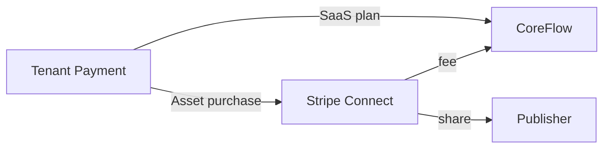

# CoreFlow — Marketplace Economy

**Documento:** `docs/MarketplaceEconomy.md`  
**Versão:** 1.0 · **Data:** 2026-07-09  
**Status:** Estratégico — economia e monetização do marketplace  
**Complementa:** `APIMarketplace.md`, `EcosystemStrategy.md`

---

## Visão

Documentar **como dinheiro flui** no ecossistema CoreFlow — revenue share, subscriptions, trials, refunds — separado de billing do cliente final (Finance domain).

---

## Participantes

| Ator | Papel |
|------|-------|
| **CoreFlow** | Platform operator, storefront, certification |
| **Publisher** | ISV, partner, community — sells assets |
| **Tenant** | Compra/instala assets |
| **End customer** | Usa tenant's business — fora scope marketplace |

---

## Modelos de receita

### 1. Revenue share

| Tier | Platform take | Publisher gets |
|------|---------------|----------------|
| Community | 30% | 70% |
| Certified Partner | 20% | 80% |
| Premier ISV | 15% | 85% |
| Official CoreFlow | — | N/A |

Settlement: monthly via Stripe Connect / Mercado Pago split.

### 2. Subscriptions (asset)

| Model | Example |
|-------|---------|
| Monthly | AI agent $29/mo |
| Annual | Workflow pack $199/yr |
| Per-seat | CRM extension $5/user/mo |

### 3. One-time license

- Template bundle $49 one-time
- Plugin vertical license $999 enterprise

### 4. Usage-based

| Meter | Unit |
|-------|------|
| AI invocations | per 1k tokens |
| API calls (partner) | per 1k requests |
| SMS/WhatsApp | per message |
| Storage | per GB-month |

Linked: `PlatformBilling.md`

### 5. Trial

| Type | Duration |
|------|----------|
| Free trial | 14 days |
| Freemium tier | Unlimited limited features |
| Demo tenant | Sandbox only |

Auto-convert or uninstall on expiry.

### 6. Refund policy

| Case | Policy |
|------|--------|
| 7-day satisfaction | Full refund first install |
| Technical failure | Pro-rated credit |
| Fraud | Platform discretion |

---

## Plugin billing (tenant → CoreFlow SaaS)

Distinct from marketplace — CoreFlow subscription plans:

| Plan | Includes |
|------|----------|
| Starter | 1 plugin, 2 users |
| Pro | 3 plugins, 10 users, basic AI |
| Business | All plugins, unlimited users, integrations |
| Enterprise | White-label, SLA, private marketplace |

---

## Certification economics

| Level | Fee | Benefit |
|-------|-----|---------|
| Community | Free | Listed |
| Verified | $99/mo | Badge, priority listing |
| Featured | CoreFlow selects | Homepage |

See `PluginCertification.md`.

---

## Reviews & ranking

| Signal | Weight |
|--------|--------|
| Star rating | 30% |
| Install count | 25% |
| Retention 90d | 20% |
| Certification level | 15% |
| Support response | 10% |

Anti-gaming: verified installs only, no self-review.

---

## Financial flows

---

## Tax & compliance

- NF-e for BR publishers R5
- VAT MOSS EU R7
- 1099/US reporting partners R7

---

## Metrics

- GMV (Gross Merchandise Value)
- Take rate %
- Publisher count active
- ARPU tenant
- Marketplace attach rate (% tenants with ≥1 paid asset)

Dashboard: DOC Marketplace panel.

---

## Roadmap

| Release | Entrega |
|---------|---------|
| R3 | Billing model design |
| R5 | Stripe Connect MVP, revenue share |
| R6 | Publisher earnings portal |
| R7 | Multi-currency marketplace |

---

## Referências

- `docs/APIMarketplace.md`
- `docs/PlatformBilling.md`
- `docs/PluginCertification.md`
- `docs/EcosystemStrategy.md`
