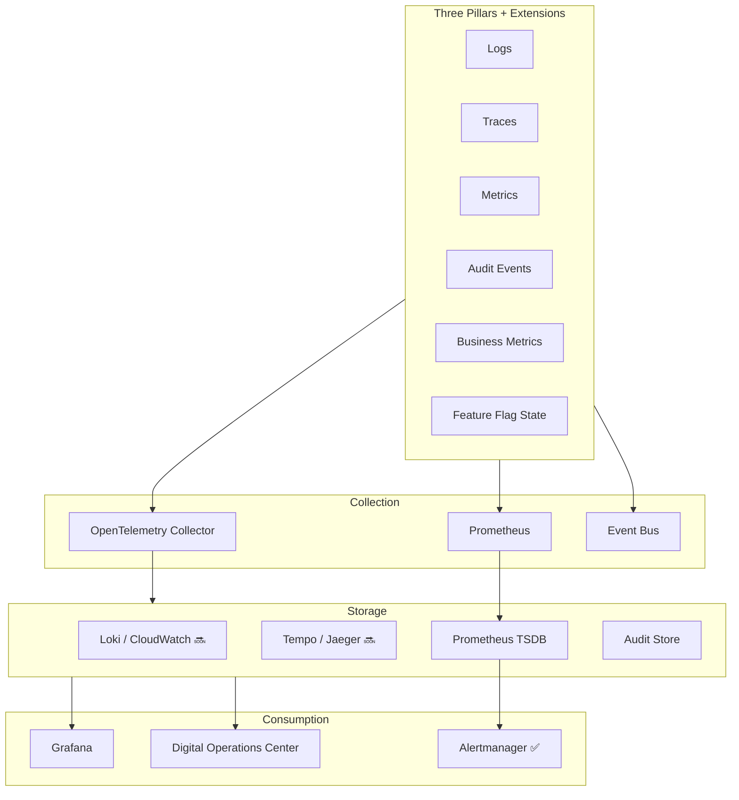

# CoreFlow — Observability Platform

**Documento:** `docs/ObservabilityPlatform.md`  
**Versão:** 1.0 · **Data:** 2026-07-09  
**Status:** Estratégico — logs, traces, metrics, audit unificados  
**Estado atual:** Prometheus export ✅ · OTEL optional ✅ · Grafana as code ✅

---

## Visão

**Observability Platform** cobre sinais técnicos **e** de negócio — não apenas HTTP metrics. OpenTelemetry desde o design.



---

## Logs

| Aspecto | Padrão |
|---------|--------|
| Format | Structured JSON |
| Fields | `timestamp`, `level`, `logger`, `message`, `company_id`, `correlation_id`, `trace_id` |
| Library | `logging_config.py` ✅ |
| PII | Redact phone, email in production |
| Aggregation | Loki or CloudWatch R3 |
| Retention | 30d ops · 7y audit separate |

---

## Tracing (OpenTelemetry)

| Span | Coverage |
|------|----------|
| HTTP request | ✅ `setup_telemetry()` |
| DB queries | 🔜 SQLAlchemy instrument |
| Event publish | 🔜 R3 |
| Kafka produce/consume | 🔜 R3 |
| LLM calls | 🔜 R4 |
| Agent tool calls | 🔜 R4 |

Propagation: W3C `traceparent` — correlate logs ↔ traces ↔ events.

---

## Metrics

### Technical (Prometheus ✅)

- `coreflow_http_requests_total`
- `coreflow_http_request_duration_seconds`
- Outbox lag, DLQ depth
- CI duration

### Business metrics (R3+)

| Metric | Type | Labels |
|--------|------|--------|
| `coreflow_bookings_created_total` | counter | tenant, plugin, status |
| `coreflow_payments_confirmed_total` | counter | tenant, method |
| `coreflow_legacy_api_ratio` | gauge | — |
| `coreflow_plugin_active` | gauge | plugin_id |
| `coreflow_ai_tokens_total` | counter | tenant, provider |
| `coreflow_marketplace_installs_total` | counter | asset_type |

Dashboard: `coreflow-api-layers` ✅ + `coreflow-business` 🔜

---

## Audit (distinct from logs)

- Immutable business audit trail
- Who changed what when — config, rules, bookings
- Domain: Audit in `DomainRegistry.md`
- Not same retention as debug logs

---

## Events as observability

- `outbox.dispatched`, `dlq.message.recorded` ✅
- Event lag monitoring
- Kafka consumer lag alerts

---

## Feature flag observability

Expose flag state:

```
GET /v1/platform/feature-flags ✅
coreflow_feature_flag_enabled{flag="booking.core.enabled"} 0|1 🔜
```

Track flag evaluations per request for debugging rollouts.

---

## Alerting (Alertmanager ✅)

| Alert | Severity |
|-------|----------|
| API 5xx rate >1% | critical |
| DLQ depth >10 | critical |
| Legacy usage >50% 7d | warning |
| Outbox lag >500 | warning |
| AI budget exceeded | warning |

---

## Digital Operations Center

Executive view — ver `DigitalOperationsCenter.md`.

---

## Roadmap

| Release | Entrega |
|---------|---------|
| R2 | OTEL span on booking core path |
| R3 | Docker stack Grafana+Prometheus+AM+Loki |
| R3 | Business metrics counters |
| R4 | Trace full request → event → workflow |
| R5 | DOC integration live |

---

## Referências

- `docs/ArchitectureMetrics.md`
- `docs/DigitalOperationsCenter.md`
- `docs/FeatureFlagPlatform.md`
- `modules/observability/`
- `infra/grafana/`
