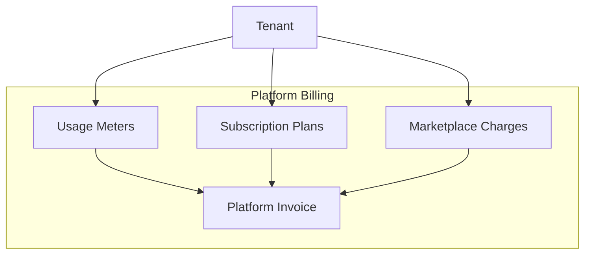

# CoreFlow — Platform Billing

**Documento:** `docs/PlatformBilling.md`  
**Versão:** 1.0 · **Data:** 2026-07-09  
**Status:** Estratégico — billing da plataforma CoreFlow (SaaS)  
**Distinção:** Finance domain = billing do **cliente final** do tenant

---

## Visão

CoreFlow como SaaS precisa cobrar **tenants** por: plano base, plugins, marketplace, consumo (AI, API, SMS), storage — separado de invoices que o salão emite para Maria (cliente final).



---

## Componentes de cobrança

### 1. Plano / Assinatura

| Plan | Monthly | Includes |
|------|---------|----------|
| Starter | $49 | beauty plugin, 2 users, 1 location |
| Pro | $149 | 2 plugins, 10 users, integrations basic |
| Business | $349 | all plugins, AI budget $50, API 100k |
| Enterprise | Custom | White-label, SLA, private marketplace |

Billing cycle: monthly / annual (-20%).

### 2. Marketplace

- Plugin paid installs (revenue share — `MarketplaceEconomy.md`)
- Template purchases
- AI agent subscriptions

### 3. Plugins pagos

| Model | Example |
|-------|---------|
| Included in plan | beauty in Pro+ |
| Add-on | sports +$29/mo |
| Perpetual license | enterprise vertical |

### 4. Consumo IA

| Meter | Price |
|-------|-------|
| LLM tokens | Pass-through + 15% margin |
| Agent invocations | $0.01/run |
| RAG queries | $0.001/query |

Budget cap per tenant — `AIArchitecture.md` cost control.

### 5. Consumo API

| Tier | Included | Overage |
|------|----------|---------|
| Pro | 100k req/mo | $0.50/1k |
| Business | 1M req/mo | $0.30/1k |

Public API R6 — meter by API key.

### 6. Storage

| Resource | Free tier | Overage |
|----------|-----------|---------|
| File storage | 5 GB | $0.10/GB |
| CDN bandwidth | 50 GB/mo | $0.05/GB |

### 7. SMS / WhatsApp

Pass-through + margin — Integration Hub meters messages.

### 8. WhatsApp Business API

Per conversation pricing by Meta + platform fee.

---

## Entitlements

Link to **Feature Flag Platform**:

```json
{
  "plan": "pro",
  "entitlements": {
    "max_users": 10,
    "plugins": ["beauty", "sports"],
    "ai_monthly_budget_usd": 50,
    "api_requests_monthly": 100000,
    "features": ["workflow", "integrations.stripe"]
  }
}
```

Flag evaluation: `entitlements.features.includes('workflow')`

---

## Billing engine (futuro)

| Component | Release |
|-----------|---------|
| Subscription model | R5 |
| Stripe Billing integration | R5 |
| Usage metering pipeline | R5 |
| Platform invoice PDF | R5 |
| Dunning / retry | R6 |
| Tax (NF platform) | R7 |

**Not duplicate** tenant→customer invoicing (`/v1/invoices`).

---

## Eventos

| Evento | Uso |
|--------|-----|
| `platform.subscription.created` | Provision tenant |
| `platform.usage.recorded` | Meter aggregation |
| `platform.invoice.generated` | Charge tenant |
| `platform.payment.failed` | Suspend grace period |

---

## Grace & suspension

| State | Behavior |
|-------|----------|
| Active | Full access |
| Past due 7d | Warning banner |
| Past due 14d | Read-only |
| Suspended | No login except billing |

---

## Roadmap

| Release | Entrega |
|---------|---------|
| R2–R4 | Manual billing (current) |
| R5 | Stripe subscriptions MVP |
| R5 | Usage meters AI + API |
| R6 | Self-serve plan upgrade |
| R7 | Multi-currency billing |

---

## Referências

- `docs/MarketplaceEconomy.md`
- `docs/FeatureFlagPlatform.md`
- `docs/AIArchitecture.md`
- Finance domain — tenant customer invoices
