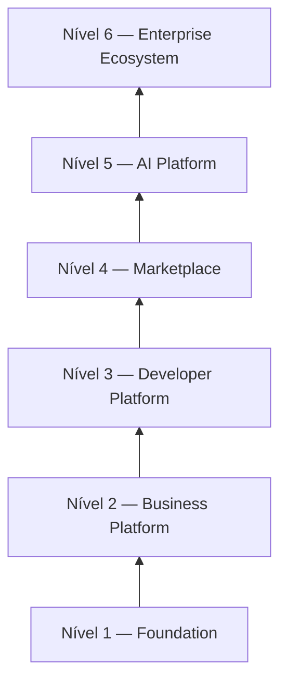

# CoreFlow — Platform Maturity Model

**Documento:** `docs/PlatformMaturityModel.md`  
**Versão:** 1.0 · **Data:** 2026-07-09  
**Status:** Estratégico — níveis de maturidade e critérios de evolução  
**Relacionado:** Readiness Score (R1-F2), Architecture Assessment

---

## Visão

O **Platform Maturity Model (PMM)** define **6 níveis** de evolução do CoreFlow — da fundação técnica ao ecossistema enterprise global. Cada nível tem critérios objetivos de entrada/saída.

**Estado atual (jul/2026):** **Nível 1 completo** → transição para **Nível 2** (Release 2).

---

## Nível 1 — Foundation ✅

**Release:** R1 · **Versão:** `1.17.0-r1-f2`

### Definição

Governança arquitetural, observabilidade, plugin registry, ACL, feature flags, event catalog — infraestrutura para evoluir sem degradação.

### Critérios de entrada

- Código operacional piloto (BeautyOS)
- Documentação básica

### Critérios de saída (todos ✅)

| Critério | Evidência |
|----------|-----------|
| Constituição + ADR + RFC | `docs/CONSTITUTION.md`, ADR 001–008 |
| Feature flags + ACL | R1-F1, R1-F2 |
| Platform health API | `/v1/platform/health` |
| Event catalog machine-readable | `event_catalog.py` |
| Architecture metrics | R1-F2 |
| Definition of Done | `DefinitionOfDone-Architecture.md` |
| ≥250 testes | 268 passed |
| Strategic docs v1 | PlatformVision, BoundedContexts, etc. |

### Capabilities ativas

Identity, Organization (partial), Booking (delegating), Plugins (beauty), Workflow YAML, Events/Outbox, Mobile DevOps, Observability export.

---

## Nível 2 — Business Platform

**Release:** R2–R3 · **Versão alvo:** `2.0.0` – `2.2.0`

### Definição

Core domain consolidado — booking, resource, scheduling no domínio puro. Capacidades de negócio transversal (CRM, billing, BI base, Integration Hub MVP).

### Critérios de entrada

- Nível 1 completo ✅
- R2-ExecutionPlan aprovado
- RFC-003 + ADR-009–011 aceitos

### Critérios de saída (Nível 2 completo = R2 + R3)

| Critério | Métrica | R2 entrega? |
|----------|---------|-------------|
| Booking domain puro | Sem ReservationService em commands | ✅ R2-F2 |
| Resource Engine | `/v1/resources` operacional | ✅ R2-F3 |
| Plugin separation | BeautyAgent no plugin | ✅ R2-F4 |
| API First writes (booking) | 100% booking writes via `/v1/*` staging | ✅ R2-F6 |
| Hexagonal ports | 6+ modules | ✅ R2-F3b |
| Integration Hub MVP | Webhook + 1 payment provider | ❌ R3 |
| BI read models | KPI API live | ❌ R3 |
| Assessment score | ≥6.5 | ✅ R2-F6 target |
| Readiness average | ≥50 | Parcial ~45 R2 |

### R2 — Exit parcial PMM Nível 2 (~65%)

| Critério R2 | Evidência |
|-------------|-----------|
| RFC-003 + ADR-009–033 | Governança fechada |
| Booking aggregate + state machine | ADR-009, ADR-026 |
| Dual-write strategy definida | ADR-024 |
| Resource meta model definitivo | ADR-010 |
| Plugin lifecycle formal | ADR-011 |
| Paridade 12/12 | R2-ParityMatrix |
| Enforcement block narrow staging | ADR-033 |
| Fitness CI ERROR | R2-F5 |

**Score esperado pós-R2:** Readiness ~45–50; PMM L2 partial **65%**; exit completo L2 após R3 (Integration Hub + BI).

### Releases incluídas

R2 (Core Consolidation — partial L2) + R3 (Business Platform — L2 exit)

---

## Nível 3 — Developer Platform

**Release:** R4–R6 · **Versão alvo:** `2.5.0` – `3.1.0`

### Definição

Produtividade de terceiros — CLI, portal, SDK codegen, fitness functions CI, sandbox, documentação interativa.

### Critérios de saída

| Critério | Métrica |
|----------|---------|
| CLI `coreflow` | ≥8 commands production |
| Developer portal web | Live |
| Public API + API keys | Documented + rate limits |
| Fitness functions CI | Block merge on violation |
| New plugin time | <1 day with CLI |
| SDK auto-gen | OpenAPI → TS/Python |
| Assessment score | ≥7.5 |

---

## Nível 4 — Marketplace

**Release:** R5 · **Versão alvo:** `2.6.0` – `2.8.0`

### Definição

Ecossistema de extensões — install plugins/assets, certification, billing, templates.

### Critérios de saída

| Critério | Métrica |
|----------|---------|
| Plugin install per tenant | Without core deploy |
| API Marketplace | ≥3 asset types live |
| Certification pipeline | Automated |
| Published assets | ≥10 |
| Revenue marketplace | >$0 (first GMV) |
| Tenant installs marketplace asset | ≥20% tenants |
| Assessment score | ≥8.0 |

---

## Nível 5 — AI Platform

**Release:** R4–R5 (paralelo) · **Versão alvo:** `2.3.0+`

### Definição

IA como camada — agents, RAG, predictions, assistant builder, AI marketplace.

### Critérios de saída

| Critério | Métrica |
|----------|---------|
| Agent registry | ≥3 agents in plugins |
| Zero vertical agents in core | Audit pass |
| No-show prediction | Production |
| Prompt engine versioned | Git-backed |
| AI marketplace assets | ≥5 |
| LLM provider abstraction | ≥2 providers |

**Nota:** Nível 5 pode ser alcançado em paralelo com 3–4 — não é estritamente sequencial.

---

## Nível 6 — Enterprise Ecosystem

**Release:** R6–R7 · **Versão alvo:** `3.2.0+`

### Definição

Escala global — multi-região, i18n, white-label enterprise, partner network, compliance, optional service extraction.

### Critérios de saída

| Critério | Métrica |
|----------|---------|
| Active plugins | ≥10 |
| Active regions | ≥3 |
| Languages supported | ≥3 |
| Enterprise customers | ≥5 white-label |
| Partner network | ≥20 certified partners |
| Platform API SLA | 99.95% |
| Assessment score | ≥9.0 |
| Constitution violations | 0 for 12 months |

---

## Matriz de maturidade por dimensão

| Dimensão | N1 ✅ | N2 | N3 | N4 | N5 | N6 |
|----------|-------|----|----|----|----|-----|
| Governance | ████ | ████ | ████ | ████ | ████ | ████ |
| Core Domain | ██ | ████ | ████ | ████ | ████ | ████ |
| Plugin Engine | ██ | ████ | ████ | ████ | ████ | ████ |
| Integration | █ | ███ | ████ | ████ | ████ | ████ |
| BI / Analytics | █ | ███ | ████ | ████ | ████ | ████ |
| Low-Code / BRE | — | █ | ███ | ████ | ████ | ████ |
| Developer DX | ██ | ██ | ████ | ████ | ████ | ████ |
| Marketplace | — | █ | ██ | ████ | ████ | ████ |
| AI Platform | █ | ██ | ███ | ███ | ████ | ████ |
| Enterprise | — | — | █ | ██ | ███ | ████ |

---

## Relação com Readiness Score

| PMM Level | Readiness Average (target) |
|-----------|----------------------------|
| N1 ✅ | ~35–45 |
| N2 | 50–60 |
| N3 | 60–70 |
| N4 | 70–78 |
| N5 | 75–85 |
| N6 | 85–95 |

Readiness Score (`/v1/platform/readiness-score`) atualiza automaticamente com HTTP migration %; PMM é avaliação qualitativa quarterly.

---

## Processo de avaliação

| Frequência | Atividade |
|------------|-----------|
| Per sprint | Readiness + fitness functions |
| Per release | PMM gate review — can advance level? |
| Quarterly | Architecture Assessment re-run |
| Annual | PMM criteria update |

### Gate review checklist

- [ ] All exit criteria for current level met?
- [ ] No open P0 architecture debt?
- [ ] Stakeholder sign-off?
- [ ] Update `ArchitectureAssessment.md` appendix?

---

## Referências

- `docs/PlatformRoadmap2030.md`
- `docs/R2-ExecutionPlan.md`
- `docs/ArchitectureMetrics.md`
- `docs/ArchitectureAssessment.md`
- `/v1/platform/readiness-score`
