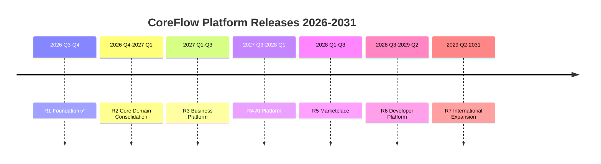

# CoreFlow — Platform Roadmap 2030

**Documento:** `docs/PlatformRoadmap2030.md`  
**Versão:** 1.0 · **Data:** 2026-07-09  
**Horizonte:** 2026 – 2031  
**Status:** Estratégico — substitui visão tática de sprints por releases de plataforma  
**Base:** Release 1 concluída (`1.17.0-r1-f2`)

---

## Visão de releases

---

## Release 1 — Foundation ✅

**Período:** Jul – Set 2026 · **Versão:** `1.16.0` – `1.18.0` · **Status:** Concluída

### Objetivo

Estabelecer governança arquitetural e infraestrutura de evolução — **sem alterar regras de negócio**.

### Capacidades entregues

- Constituição, ADR 001–008, RFC 001–002
- Feature flags, ACL contrato, telemetria HTTP
- Event catalog machine-readable
- Platform health, architecture metrics, readiness score
- Plugin registry documentado
- Enforcement WARN
- Definition of Done arquitetural

### Dependências

Nenhuma — baseline do projeto.

### Riscos

Baixo — mostly docs e observabilidade.

### Critérios de sucesso ✅

- [x] 268+ testes passando
- [x] Zero flags ativas por default
- [x] Documentação viva sincronizada
- [x] Platform health operacional

---

## Release 2 — Core Domain Consolidation

**Período:** Out 2026 – Dez 2026 · **Versão alvo:** `1.19.0` – `2.0.0-beta`  
**Plano detalhado:** `docs/R2-ExecutionPlan.md`

### Objetivo

Transição definitiva de SaaS vertical para **plataforma reutilizável** — Core Framework consolidado, Booking no domínio puro, Resource Engine, Plugin Engine formalizado, Beauty separado do Core.

### Capacidades

| Capacidade | Prioridade |
|------------|------------|
| Booking create/approve/reject **sem legado** | Must |
| Resource Engine v1 (`/v1/resources`) | Must |
| Hexagonal ports/repos (booking, catalog, customer) | Must |
| Plugin hook structure formal | Must |
| BeautyAgent → plugin beauty | Must |
| Frontend admin via `@coreflow/sdk` (fase 1) | Should |
| Enforcement `block` rotas com paridade | Should |
| Sports/Clinic manifest enriquecido | Could |

### Dependências

- Release 1 ✅
- RFC-003 (propor) + ADR-009+ aprovados
- Paridade tests booking

### Riscos

| Risco | Mitigação |
|-------|-----------|
| Regressão BeautyOS piloto | Paridade tests, feature flags, rollback |
| Scope creep hexagonal | Fase por módulo — booking first |
| Big-bang migration | Strangler + ACL + flags |

### Critérios de sucesso

- [ ] ≥70% HTTP writes via `/v1/*`
- [ ] Booking commands usam domain service core (não ReservationService)
- [ ] BeautyAgent fora de `modules/ai/`
- [ ] Resource API operacional
- [ ] ArchitectureAssessment score ≥ 6.5
- [ ] Zero violações Constituição em audit

---

## Release 3 — Business Platform

**Período:** Jan – Mar 2027 · **Versão alvo:** `2.0.0` – `2.2.0`

### Objetivo

Capacidades de **negócio transversal** — CRM, billing avançado, analytics, audit — que todo vertical precisa, independente de segmento.

### Capacidades

| Capacidade | Prioridade |
|------------|------------|
| Scheduling Engine v2 (recurring, no-show) | Must |
| CRM segmentation + campaigns base | Should |
| Audit trail API | Should |
| Business analytics dashboards | Should |
| Observability runtime stack (Docker) | Should |
| Rate limiting + auth audit | Should |
| Order/Invoice fluxo completo sem legado | Should |

### Dependências

- Release 2 booking core
- Resource Engine operacional

### Riscos

| Risco | Mitigação |
|-------|-----------|
| CRM scope infinito | MVP tags + segments only |
| Analytics prematuro | Read models from events |

### Critérios de sucesso

- [ ] Scheduling sem legacy adapter
- [ ] Audit API com retenção configurável
- [ ] Grafana stack operacional em staging
- [ ] Score ≥ 7.5

---

## Release 4 — AI Platform

**Período:** Abr – Jun 2027 · **Versão alvo:** `2.3.0` – `2.5.0`

### Objetivo

IA como **camada de plataforma** — agents registráveis, prompt engine, tools sobre ports, RAG tenant-scoped.

### Capacidades

| Capacidade | Prioridade |
|------------|------------|
| Agent registry + base class | Must |
| Prompt engine versionado | Should |
| Tools catalog (booking, customer, workflow) | Should |
| RAG tenant-scoped MVP | Should |
| MCP port integration | Could |
| Workflow visual editor (MVP) | Could |
| Offline mobile sync spike | Could |

### Dependências

- Release 3 event stream estável
- Ports hexagonal nos contextos principais

### Riscos

| Risco | Mitigação |
|-------|-----------|
| Scope AI amplo | MVP: registry + mock + 2 agents plugin |
| Custo LLM | Provider abstraction + caching |
| Privacidade RAG | Tenant isolation ADR |

### Critérios de sucesso

- [ ] 3+ agents em plugins distintos (beauty, sports stub)
- [ ] Zero agent vertical no core
- [ ] Prompt templates versionados em git

---

## Release 5 — Marketplace

**Período:** Jul – Set 2027 · **Versão alvo:** `2.6.0` – `2.8.0`

### Objetivo

Ecossistema de **extensões** — instalar plugins, templates, workflows, dashboards por tenant.

### Capacidades

| Capacidade | Prioridade |
|------------|------------|
| Plugin install/uninstall per tenant | Must |
| Manifest validation + security scan | Must |
| Publisher onboarding | Should |
| Billing revenue share | Should |
| Template marketplace (workflows, dashboards) | Could |
| Reviews + ratings | Could |

### Dependências

- Release 2 Plugin Engine formal
- Release 3 billing

### Riscos

| Risco | Mitigação |
|-------|-----------|
| Sem demanda marketplace | Manifest-only plugins primeiro |
| Segurança plugins terceiros | Sandbox + certification |

### Critérios de sucesso

- [ ] Tenant instala sports plugin sem deploy core
- [ ] 5+ plugins listados (beauty + 4 stubs ativos)
- [ ] Zero plugin acessa DB cross-tenant

---

## Release 6 — Developer Platform

**Período:** Out 2027 – Mar 2028 · **Versão alvo:** `2.9.0` – `3.1.0`

### Objetivo

**Developer Experience** completa — CLI, portal web, API pública, webhooks, SDKs, documentação interativa.

### Capacidades

| Capacidade | Prioridade |
|------------|------------|
| CLI `coreflow` (plugin init, event add, deploy) | Must |
| Developer Portal web | Must |
| API pública versionada + API keys | Must |
| Webhooks outbound | Should |
| Plugin SDK Python + TS generators | Should |
| CI templates GitHub Actions | Could |
| Sandbox environment | Could |

### Dependências

- Release 5 marketplace base
- OpenAPI 3.1 completo

### Riscos

| Risco | Mitigação |
|-------|-----------|
| DX over-engineering | CLI com 3 commands MVP |
| API abuse | Rate limits Release 3 |

### Critérios de sucesso

- [ ] Parceiro cria plugin stub via CLI em <1h
- [ ] API pública documentada com 99.9% uptime SLA draft
- [ ] 10+ integrações webhook documentadas

---

## Release 7 — International Expansion

**Período:** Abr 2028 – Jun 2031 · **Versão alvo:** `3.2.0+`

### Objetivo

Escala **global** — multi-idioma, multi-moeda, multi-região, providers de pagamento regionais, compliance.

### Capacidades

| Capacidade | Prioridade |
|------------|------------|
| i18n core + plugin locale | Must |
| Multi-currency (Offering, Order) | Must |
| Payment providers regionais (Pix, Stripe, MP) | Must |
| DB read replicas multi-região | Should |
| Kafka multi-região | Should |
| LGPD/GDPR compliance tooling | Should |
| White-label custom domains | Should |
| Extração seletiva microserviços | Could |

### Dependências

- Release 6 API pública
- Release 3 audit trail

### Riscos

| Risco | Mitigação |
|-------|-----------|
| Complexidade operacional | Uma região por vez (LATAM first) |
| Compliance | Legal review por mercado |

### Critérios de sucesso

- [ ] 3 países LATAM operacionais
- [ ] 2+ plugins não-beauty em produção
- [ ] SLO 99.95% platform API

---

## Métricas de progresso por release

| Release | API v1 writes | Modules w/ ports | Plugins ativos | Score Assessment |
|---------|---------------|------------------|----------------|------------------|
| R1 ✅ | ~20% | 2/18 | 1 (beauty) | 5.4 |
| R2 | 70% | 6/18 | 1 + 2 stubs | 6.5 |
| R3 | 85% | 12/18 | 2+ | 7.5 |
| R4 | 90% | 14/18 | 3+ | 8.0 |
| R5 | 95% | 15/18 | 5+ | 8.2 |
| R6 | 98% | 16/18 | 10+ | 8.5 |
| R7 | 99% | 18/18 | 15+ | 9.0 |

---

## Relação com roadmap 12M

`docs/roadmap/Roadmap-12M.md` cobre Jul 2026 – Jun 2027 (R1–R4 parcial).  
Este documento estende o horizonte até 2031 com releases de plataforma.

---

## Referências

- `docs/PlatformVision.md`
- `docs/ProductCapabilityMap.md`
- `docs/EcosystemStrategy.md`
- `docs/R2-ExecutionPlan.md`
- `docs/ArchitectureVision2030.md`
