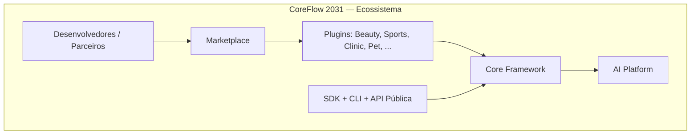

# CoreFlow — Platform Vision

**Documento:** `docs/PlatformVision.md`  
**Versão:** 1.0 · **Data:** 2026-07-09  
**Status:** Estratégico — precede Release 2  
**Autoridade:** Principal Software Architect / CTO  
**Base factual:** `1.17.0-r1-f2`, Release 1 concluída (R1-F1, R1-F2)

---

## Missão

**Qual problema a plataforma resolve?**

Pequenas e médias empresas de serviços — salões, clínicas, quadras, pet shops, restaurantes, hotéis, escolas, coworkings — precisam de software de gestão que combine **agendamento, clientes, pagamentos, operação e automação**, mas o mercado oferece duas opções insatisfatórias:

1. **Sistemas verticais fechados** (MindBody, Zenoti, Booksy) — excelentes em um nicho, impossíveis de adaptar a outro segmento sem reescrever tudo.
2. **ERPs genéricos** (Odoo, ERPNext) — flexíveis na teoria, pesados na prática, com experiência mobile fraca e IA como afterthought.

O CoreFlow resolve isso sendo uma **plataforma de desenvolvimento de sistemas de gestão orientados a serviços**: um **Core reutilizável** + **Plugins verticais** + **API First** + **AI Platform** + **Event-Driven automation**.

A missão em uma frase:

> **Permitir que qualquer negócio de serviços opere com software de classe enterprise, construído uma vez no Core e especializado por Plugin — sem reescrever agendamento, pagamentos ou identidade a cada novo vertical.**

---

## Visão

**Como o CoreFlow deverá estar em cinco anos (2031)?**

Em 2031, o CoreFlow será reconhecido como a **plataforma latino-americana** para construir e operar sistemas de gestão de serviços — não um produto único, mas um **ecossistema**.

| Dimensão | 2026 (hoje) | 2031 (visão) |
|----------|-------------|--------------|
| **Produto** | BeautyOS piloto + Core em Strangler Fig | 10+ verticais via Plugins certificados |
| **Arquitetura** | Modular Monolith maduro | Monolith + extração seletiva por métricas |
| **API** | `/v1/*` + legado coexistindo | API pública versionada + webhooks + SDKs |
| **AI** | LLM factory + agent beauty acoplado | AI Platform com agents por plugin, MCP, RAG tenant-scoped |
| **Marketplace** | Stub MVP | Instalação, billing, reviews, templates |
| **Developer Experience** | Docs + `@coreflow/sdk` | CLI, Developer Portal, Plugin SDK completo |
| **Operação** | Export-as-code observability | SLOs, multi-região, white-label em escala |
| **Modelo de negócio** | SaaS vertical (Beauty) | Plataforma + revenue share marketplace + enterprise |

**O CoreFlow não será** um sistema para salão, clínica ou quadra. **Será** o runtime onde esses produtos nascem.

---

## Objetivos

### Curto prazo (6–12 meses · 2026–2027)

| Objetivo | Indicador |
|----------|-----------|
| Consolidar Core Domain (Release 2) | Booking create/approve/reject sem delegação legado |
| Formalizar Plugin Engine | Novo vertical via manifest sem alterar core |
| Resource Engine v1 | Resource como conceito first-class |
| Separar Beauty do Core | `BeautyAgent` e hooks beauty fora de `modules/` genéricos |
| API First operacional | ≥70% escritas via `/v1/*` |
| Manter compatibilidade | Zero regressão piloto BeautyOS |

### Médio prazo (12–24 meses · 2027–2028)

| Objetivo | Indicador |
|----------|-----------|
| Business Platform (Release 3) | CRM, billing avançado, analytics, audit trail |
| AI Platform base | Provider registry, prompt engine, agent shell genérico |
| Scheduling Engine v2 | Recurring, no-show, conflitos sem legacy adapter |
| Developer Portal v1 | Criar plugin, evento, workflow documentado e testável |
| Observabilidade runtime | Stack Prometheus/Grafana/Alertmanager operacional |
| Novos plugins stub→ativo | Sports ou Clinic em produção piloto |

### Longo prazo (24–60 meses · 2028–2031)

| Objetivo | Indicador |
|----------|-----------|
| Marketplace operacional | Instalação + billing + certificação de plugins |
| Developer Platform | CLI, templates, CI plugin, API pública |
| International expansion | Multi-idioma, multi-moeda, providers regionais |
| White-label em escala | EAS whitelabel + theming API + custom domains |
| Ecossistema de parceiros | Integradores, agências, ISVs construindo sobre CoreFlow |
| Extração seletiva | Microserviço apenas onde métricas provarem necessidade |

---

## Personas

### Administrador (Super Admin / Platform Ops)

- **Quem:** Equipe CoreFlow, DevOps, suporte L3.
- **Necessidades:** Saúde da plataforma, métricas arquiteturais, feature flags, rollback, auditoria cross-tenant.
- **Interfaces:** `GET /v1/platform/health`, Grafana dashboards, Alertmanager, Terraform.
- **Sucesso:** Uptime, tempo de deploy, % legado decrescente, zero violações da Constituição.

### Empresa (Tenant Owner)

- **Quem:** Dono de salão, clínica, academia, pet shop.
- **Necessidades:** Configurar unidades, profissionais, catálogo, pagamentos, relatórios, automações.
- **Interfaces:** Admin web, mobile app whitelabel, plugin terminology.
- **Sucesso:** Redução no-show, receita previsível, operação sem planilhas.

### Funcionário (Worker / Staff)

- **Quem:** Trancista, recepcionista, terapeuta, instrutor.
- **Necessidades:** Agenda do dia, aprovar reservas, fila, notificações push, mobile first.
- **Interfaces:** App mobile Expo, deep links, push notifications.
- **Sucesso:** Menos atrito operacional, agenda cheia, confirmações automáticas.

### Cliente (End Customer)

- **Quem:** Pessoa que agenda serviço.
- **Necessidades:** Agendar, pagar sinal, remarcar, receber lembretes, avaliar.
- **Interfaces:** App/web do tenant, WhatsApp (futuro), links universais.
- **Sucesso:** Agendamento em <2 min, confirmação clara, pagamento seguro.

### Desenvolvedor de Plugins

- **Quem:** Engenheiro interno ou parceiro ISV construindo vertical (SportsOS, ClinicOS).
- **Necessidades:** Meta Modelo claro, SDK, manifest schema, event catalog, ports/adapters, CI.
- **Interfaces:** Developer Portal, `@coreflow/sdk`, Plugin manifest, OpenAPI.
- **Sucesso:** Novo plugin MVP em semanas, não meses; zero fork do core.

### Parceiros (Integradores / Agências)

- **Quem:** Consultorias que implementam CoreFlow para clientes finais.
- **Necessidades:** White-label, templates, webhooks, documentação, suporte técnico.
- **Interfaces:** API pública, webhooks, theming, marketplace privado (futuro).
- **Sucesso:** Implementação repetível, margem saudável, clientes satisfeitos.

### Marketplace (Publisher / Consumer)

- **Quem:** Publisher de plugin; tenant que instala extensões.
- **Necessidades:** Descoberta, instalação one-click, billing, reviews, segurança.
- **Interfaces:** Marketplace UI, manifest validation, billing API (futuro).
- **Sucesso:** Catálogo crescente, receita recorrente compartilhada, plugins certificados.

---

## Diferenciais competitivos

### Posicionamento

| Concorrente | Tipo | Força | Fraqueza vs CoreFlow |
|-------------|------|-------|----------------------|
| **Odoo** | ERP modular open-source | Ecossistema enorme, módulos | Pesado, UX mobile fraca, domínio genérico demais para serviços |
| **ERPNext** | ERP open-source | Custo, flexibilidade | Curva de customização alta, não nasceu para booking-first |
| **MindBody** | Vertical wellness | Escala, marketplace wellness | Fechado, US-centric, impossível reutilizar para pet/education |
| **Zenoti** | Vertical beauty enterprise | Feature-rich beauty | Enterprise caro, zero extensibilidade cross-vertical |
| **Booksy** | Vertical beauty SMB | UX mobile, discovery | Marketplace fechado, sem plataforma para terceiros |
| **Fresha** | Vertical beauty + marketplace | Free tier, discovery | Modelo marketplace fechado, sem API platform |
| **Square** | Payments + POS | Pagamentos, hardware | Booking secundário, não é platform de plugins |
| **Vagaro** | Vertical beauty | All-in-one salão | Vertical único, sem meta model |

### Onde o CoreFlow inova

| Diferencial | Descrição |
|-------------|-----------|
| **Platform, not product** | Um Core serve Beauty, Sports, Clinic, Pet — concorrentes são produtos únicos |
| **Meta Model universal** | Worker, Resource, Booking, Offering — terminologia via plugin, não schema duplicado |
| **API First real** | Regra de negócio na API; mobile/web substituíveis; OpenAPI como contrato |
| **Event-Driven nativo** | Outbox, Kafka, Avro, workflow YAML — automação desde o design |
| **AI Platform layer** | IA como capacidade de plataforma, não feature de salão |
| **Plugin Engine formal** | Manifest-driven: terminology, features, hooks, mobile, CDN, EAS |
| **Strangler Fig disciplinado** | ACL, feature flags, telemetria — migração sem big-bang |
| **Mobile DevOps maduro** | EAS OTA canary, CDN, Terraform — raro em SMB vertical SaaS |
| **Governança arquitetural** | Constituição, ADR, RFC, DoD — reduz degradação ao longo de anos |
| **Developer Platform path** | SDK, CLI, marketplace — caminho para ecossistema, não só SaaS |

### Onde NÃO competir (por ora)

- Discovery/marketplace de consumidor final (Fresha/Booksy) — foco B2B operacional primeiro
- ERP financeiro completo (Odoo) — Invoice/Order suficientes para serviços; integrar contabilidade
- Hardware POS (Square) — integrar via PaymentProviderPort

---

## Estratégia de Produto

### Por que uma plataforma?

Porque **80% das necessidades** de negócios de serviços são idênticas: identidade, tenant, agenda, reserva, cliente, pagamento, notificação, automação. Os **20% restantes** são terminologia, UX e regras específicas do segmento.

Construir um SaaS por vertical (BeautyOS, SportsOS, ClinicOS) como codebases separados **multiplica dívida técnica, custo de manutenção e time to market**. Uma plataforma amortiza investimento em booking, events, mobile DevOps e AI **uma única vez**.

### Por que Plugins?

Plugins encapsulam **especialização vertical** sem contaminar o Core:

- Terminologia (`Tranca` → `Catalog` no core, label "Categoria" no beauty)
- Features opcionais (`deposit_payment`, `ai_vision`)
- Hooks de evento (`waitlist.approved` → handler beauty)
- Mobile whitelabel (EAS, CDN, deep links)
- Segmentos (`trancista`, `barbearia`, `salao`)

Critérios objetivos: `docs/CoreVsPlugins.md`.

### Por que Meta Model?

O Meta Model (`docs/CoreMetaModel.md`) impede que cada vertical invente entidades incompatíveis. **Booking** é universal; "Agendamento", "Consulta", "Reserva de quadra" são labels.

Benefícios:

- APIs estáveis (`/v1/bookings` para todos os plugins)
- Eventos reutilizáveis (`booking.created`)
- Relatórios cross-vertical
- SDK único (`@coreflow/sdk`)

### Por que Resource Engine?

Agendamento real depende de **o que está sendo reservado**: cadeira, quadra, sala, equipamento, profissional. Hoje o Core tem `Worker` e sync legado; o **Resource Engine** (ADR-007) generaliza:

- Hierarquia Location → Resource
- Tipos configuráveis via plugin manifest
- Conflitos e disponibilidade desacoplados de domínio beauty
- Base para Scheduling Engine v2

Sem Resource Engine, cada vertical reinventa "disponibilidade" no legado.

### Por que AI Platform?

IA em sistemas de serviços não é chatbot — é **automação contextual**: lembrete de pagamento, follow-up CRM, confirmação de booking, análise de no-show, sugestão de horários.

A AI Platform (shell genérico no Core) fornece:

- Provider registry (OpenAI, Anthropic, mock)
- Agent base com tools sobre ports (booking, customer)
- RAG tenant-scoped (futuro)
- MCP como port de integração

**Agents verticais** (ex.: follow-up de trancista) vivem no **plugin beauty**, nunca no core.

---

## Princípio orientador

Antes de qualquer implementação, responder:

> **Esta implementação pode servir para qualquer segmento?**

Se **não** → Plugin.  
Se **sim** → Core, alinhado ao Meta Model, com ADR/RFC.

---

## Referências

| Documento | Path |
|-----------|------|
| Platform Strategy Index (20 pilares) | `docs/PlatformStrategyIndex.md` |
| Domain Registry | `docs/DomainRegistry.md` |
| Resource Engine | `docs/ResourceEngine.md` |
| Constituição | `docs/CONSTITUTION.md` |
| Meta Modelo | `docs/CoreMetaModel.md` |
| Bounded Contexts | `docs/BoundedContexts.md` |
| Core vs Plugins | `docs/CoreVsPlugins.md` |
| Capability Map | `docs/ProductCapabilityMap.md` |
| Roadmap 2030 | `docs/PlatformRoadmap2030.md` |
| R2 Execution Plan | `docs/R2-ExecutionPlan.md` |
| Architecture Assessment | `docs/ArchitectureAssessment.md` |
