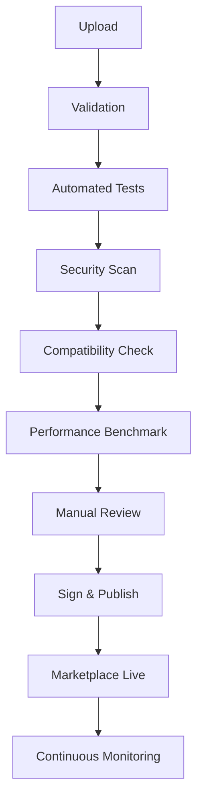

# CoreFlow — Plugin & Asset Certification

**Documento:** `docs/PluginCertification.md`  
**Versão:** 1.0 · **Data:** 2026-07-09  
**Status:** Estratégico — processo oficial Marketplace  
**Escopo:** Plugins + todos asset types do API Marketplace

---

## Objetivo

Garantir que **todo ativo publicado** no Marketplace atende padrões de **segurança**, **compatibilidade**, **performance** e **qualidade** — protegendo tenants e reputação da plataforma.

---

## Pipeline de certificação



---

## Etapas detalhadas

### 1. Upload

| Input | Validação |
|-------|-----------|
| Asset bundle (zip/git ref) | Size < 50MB |
| manifest.yaml ou asset.json | Schema version |
| Publisher account | Verified identity |
| Changelog | Semver bump documented |

CLI: `coreflow marketplace publish --asset-type=plugin`

### 2. Validação

| Check | Ferramenta |
|-------|------------|
| Manifest schema | JSON Schema validator |
| Required fields | Custom linter |
| Terminology covers concepts used | Meta model validator |
| Event types exist in catalog | event_catalog sync |
| Hooks importable | Python import test |
| No forbidden imports | Fitness functions |
| OpenAPI diff (if API extension) | oasdiff |

**Fail = block pipeline** with report.

### 3. Testes automatizados

| Test type | Requirement |
|-----------|-------------|
| Unit tests | ≥10 tests, pass 100% |
| Integration tests | Core API smoke with plugin |
| Manifest tests | Terminology, features |
| Parity (if booking-related) | Optional for plugins |
| Snapshot tests | UI config (if applicable) |

Sandbox tenant provisioned automatically.

### 4. Segurança

| Scan | Tool / Method |
|------|---------------|
| Dependency vulnerabilities | pip-audit, npm audit |
| Secrets in bundle | gitleaks |
| SQL injection patterns | semgrep rules |
| Cross-tenant data access | Static analysis |
| Arbitrary code execution | Sandbox run isolation |
| OWASP API Top 10 | Custom ruleset |

**Critical CVE = auto reject.** High = 30 day fix window.

### 5. Compatibilidade

| Check | Rule |
|-------|------|
| `min_platform_version` | Must be ≤ current release |
| Core API version | No deprecated endpoints |
| Plugin conflicts | No duplicate plugin_id |
| Resource types | Valid against Resource Engine schema |
| Breaking manifest change | Major version bump |

Matrix test against **last 2 platform versions**.

### 6. Performance

| Metric | Threshold |
|--------|-----------|
| Hook execution p95 | <100ms |
| Manifest load time | <50ms |
| Memory footprint | <50MB delta |
| Event handler batch | <500ms / 100 events |

Load test in isolated sandbox.

### 7. Revisão manual

| Reviewer | Focus |
|----------|-------|
| Automated | All above |
| CoreFlow architect | Constitution compliance |
| Security (if paid/official) | Threat model |
| Product (optional) | UX, naming |

SLA: 5 business days community · 2 days certified partner.

### 8. Assinatura

```
asset_signature = sign(
  asset_hash + version + publisher_key,
  coreflow_signing_key
)
```

Tenants verify signature on install. Tamper = reject.

### 9. Marketplace publish

- Catalog entry live
- Version immutable
- Previous version remains available
- Deprecation policy: 12 months notice

### 10. Monitoramento contínuo

| Monitor | Action |
|---------|--------|
| Runtime errors spike | Alert publisher |
| Security CVE in dependency | Suspend + notify |
| Compatibility break new platform | Require recertification |
| Abuse reports | Investigation queue |

---

## Níveis de certificação

| Level | Badge | Requirements |
|-------|-------|--------------|
| **Community** | — | Automated pipeline pass |
| **Verified** | ✓ | + manual architect review |
| **Official** | ★ CoreFlow | Published by CoreFlow team |
| **Enterprise** | 🔒 Private | Partner private marketplace |

---

## Versionamento

- **Semver** strict for all assets
- Breaking change → major bump + recertification
- Patch: auto if only metadata
- Minor: automated retest, skip manual if green

---

## Rollback

| Scenario | Action |
|----------|--------|
| Publisher rollback | Activate version N-1 in marketplace |
| Tenant rollback | `marketplace.assets/{id}/rollback?version=N-1` |
| Emergency suspend | Platform ops flag `asset.suspended` |
| Tenant impact | Event `marketplace.asset.rollback` → notify admin |

Rollback não deleta dados — desativa config.

---

## Uninstall

- Remove hooks from registry
- Revoke integration connections (if connector)
- Archive tenant artifacts (not delete — audit)
- Event `marketplace.asset.uninstalled`

---

## Publisher requirements

| Tier | Identity verification | Support SLA |
|------|----------------------|-------------|
| Community | Email | Best effort |
| Certified | Business verification | 48h |
| Premier | Contract | 4h |

---

## Integração CI (publisher-side)

```yaml
# .github/workflows/certify.yml
on: [push, release]
jobs:
  certify:
    runs-on: ubuntu-latest
    steps:
      - uses: coreflow/validate-action@v1
      - uses: coreflow/security-scan-action@v1
      - run: coreflow test --plugin=${{ matrix.plugin }}
```

---

## Roadmap

| Release | Entrega |
|---------|---------|
| R2 | Manifest validator script (local) |
| R3 | Automated validation in CI (fitness) |
| R4 | Security scan integration |
| R5 | Full certification pipeline + marketplace |
| R6 | Publisher portal + signing + monitoring |
| R7 | Enterprise private marketplace certification |

---

## Referências

- `docs/APIMarketplace.md`
- `docs/ArchitectureFitnessFunctions.md`
- `docs/EcosystemStrategy.md`
- `docs/CONSTITUTION.md`
- `docs/DeveloperExperience.md`
