# CoreFlow — Release 2 Execution Plan

**Documento:** `docs/R2-ExecutionPlan.md`  
**Versão:** 4.0 · **Data:** 2026-07-09  
**Status:** ✅ Aprovado ARB — **implementação autorizada após GO/NO-GO checklist**  
**Release:** R2 — Core Domain Consolidation (PMM Nível 1 → Nível 2 parcial)  
**Versão alvo:** `1.19.0-r2-f1` → `2.0.0-beta.1`  
**Governança:** [RFC-003](rfc/RFC-003-CoreDomainConsolidation.md) · ADR-009–033

---

## Objetivo da Release 2

Consolidar o **Core Framework**: Booking domain puro, Resource Engine v1, Plugin Engine formal, hexagonal padronizado — **sem ambiguidade arquitetural**.

**Escopo narrow:** Core Domain only. Integration Hub, TCE, BRE, Low-Code, Marketplace = R3–R6.

---

## Sequenciamento final (único caminho)

| Fase | Versão | Foco | Flag principal |
|------|--------|------|----------------|
| **R2-F0** | N/A | RFC-003 + ADR-009–033 + paridade + fitness baseline | — |
| **R2-F0.5** | `1.18.5-r2-f0.5` | ACL wiring commands → ports | — |
| **R2-F1** | `1.19.0-r2-f1` | Booking create domain | `FEATURE_BOOKING_CORE_ENABLED` |
| **R2-F1b** | `1.19.1-r2-f1b` | Idempotency + events + correlation | same |
| **R2-F2** | `1.20.0-r2-f2` | Approve / Reject + PaymentQueryPort | same |
| **R2-F2b** | `1.20.1-r2-f2b` | Cancel + paridade 12/12 | same |
| **R2-F3** | `1.21.0-r2-f3` | Resource Engine v1 | `FEATURE_RESOURCE_ENGINE_ENABLED` |
| **R2-F3b** | `1.21.1-r2-f3b` | Catalog + Customer repos | — |
| **R2-F4** | `1.22.0-r2-f4` | Plugin Engine + BeautyAgent | `FEATURE_PLUGIN_ENGINE_ENABLED` |
| **R2-F5** | `1.23.0-r2-f5` | Fitness CI ERROR + OTEL + reconciliation | — |
| **R2-F6** | `2.0.0-beta.1` | Enforcement block narrow + release beta | `CORE_ENFORCEMENT_MODE=block` staging |

**Removido de R2 v3:** R2-F6 Frontend SDK → **R3** (opcional).  
**Renumerado:** Enforcement era F7 → agora **F6**.

---

## Dependências entre fases

```mermaid
flowchart LR
    F0[R2-F0 Docs] --> F05[R2-F0.5 ACL]
    F05 --> F1[R2-F1 Create]
    F1 --> F1b[R2-F1b Idempotency]
    F1b --> F2[R2-F2 Approve/Reject]
    F2 --> F2b[R2-F2b Cancel]
    F2b --> F3[R2-F3 Resource]
    F3 --> F3b[R2-F3b Repos]
    F3b --> F4[R2-F4 Plugins]
    F4 --> F5[R2-F5 Hardening]
    F5 --> F6[R2-F6 Enforcement]
```

| Dependência oculta resolvida | Solução |
|------------------------------|---------|
| F1 precisa scheduling sem tranca | SchedulingPort interim (ADR-029) F0.5 |
| F1 create usa catalog/customer | Query ports; full repos F3b |
| F2 approve precisa payment | PaymentQueryPort (ADR-028) |
| F3 antes de repos | Resource desacopla scheduling |
| F6 block quebra payments | ADR-033 narrow scope |

---

## Fases detalhadas

### R2-F0 — Governança

**Duração:** 1 sprint · **Rollback:** N/A

| Entrega | Artefato |
|---------|----------|
| RFC-003 | `docs/rfc/RFC-003-CoreDomainConsolidation.md` ✅ |
| ADR-009–011, 024–033 | `docs/adr/` ✅ |
| Paridade matrix 12 cenários | `docs/architecture/R2-ParityMatrix.md` ✅ |
| Fitness functions v2 | `docs/ArchitectureFitnessFunctions.md` |
| GO/NO-GO checklist | `docs/reviews/R2-GoNoGo-Checklist.md` |
| Event catalog review | `reservation.*` → `booking.*` plan |

**Critérios de entrada:** Release 1 ✅ · Docs v3 ✅

**Critérios de saída:**

- [x] RFC-003 aprovado ARB
- [x] ADR-009–033 aceitos
- [ ] Stakeholder sign-off
- [ ] Architecture Board approval registrada

---

### R2-F0.5 — ACL Wiring

**Versão:** `1.18.5-r2-f0.5` · **Flag:** nenhuma nova

| Entrega | Detalhe |
|---------|---------|
| Commands usam ports only | create/approve/reject → `LegacyBookingPort`, `SchedulingPort` |
| Zero ReservationService import | commands layer |
| Zero LegacySyncService import | commands layer |
| SchedulingPort interface | ADR-029 estágio 1 |
| Testes regressão | flag OFF = identical R1-F2 |

**Critérios de saída:** FF-BKG-002 WARN; behavior unchanged flag OFF

**Rollback:** Git revert PR — zero flag impact

---

### R2-F1 — Booking Create

**Versão:** `1.19.0-r2-f1` · **Flag:** `FEATURE_BOOKING_CORE_ENABLED=false`

| Entrega | Path |
|---------|------|
| `Booking` aggregate + create | `modules/booking/domain/` |
| `CoreBookingRepository` | `infrastructure/` |
| `BookingDomainService.create()` | domain/application |
| SchedulingPort integration | availability check |
| Dual-write TX | ADR-024/025 |
| Paridade P01, P02, P09 | tests |

**Rollback:** `FEATURE_BOOKING_CORE_ENABLED=false` + revert PR

---

### R2-F1b — Idempotency & Events

**Versão:** `1.19.1-r2-f1b`

| Entrega | Detalhe |
|---------|---------|
| Idempotency-Key mandatory | ADR-031 |
| `correlation_id` in envelope | RFC-009 minimum |
| `booking.created` + alias | ADR-027 |
| Paridade P12 | idempotent retry |

---

### R2-F2 — Approve / Reject

**Versão:** `1.20.0-r2-f2`

| Entrega | Detalhe |
|---------|---------|
| State machine approve/reject | ADR-026 |
| `PaymentQueryPort` | ADR-028 |
| Optimistic lock version | ADR-031 |
| FF-BKG-001 ERROR | zero ReservationService |
| Paridade P03–P05, P08 | tests |

---

### R2-F2b — Cancel & Paridade completa

**Versão:** `1.20.1-r2-f2b`

| Entrega | Detalhe |
|---------|---------|
| Cancel command + domain | ADR-026 |
| `booking.cancelled` event | ADR-027 |
| **12/12 paridade PASS** | gate F2b |

---

### R2-F3 — Resource Engine v1

**Versão:** `1.21.0-r2-f3` · **Flag:** `FEATURE_RESOURCE_ENGINE_ENABLED`

| Entrega | Detalhe |
|---------|---------|
| `core_resources` CRUD | `modules/resource/` |
| API `/v1/resources` | router |
| ResourcePort in scheduling | ADR-029 estágio 2 |
| Plugin manifest resource_types | beauty: chair |
| Paridade P11 | resource unavailable |

**Rollback:** `FEATURE_RESOURCE_ENGINE_ENABLED=false`

---

### R2-F3b — Catalog + Customer Repositories

**Versão:** `1.21.1-r2-f3b`

| Entrega | Detalhe |
|---------|---------|
| `CatalogRepository` + ACL | ADR-030 |
| `CustomerRepository` + ACL | ADR-030 |
| Query services via ports | application layer |

**Rollback:** Git revert — paridade garante equivalência

---

### R2-F4 — Plugin Engine + Beauty Separation

**Versão:** `1.22.0-r2-f4` · **Flag:** `FEATURE_PLUGIN_ENGINE_ENABLED`

| Entrega | Detalhe |
|---------|---------|
| Typed hook registry | ADR-011 |
| BeautyAgent → `plugins/beauty/` | zero in modules/ai |
| Sports/clinic stub manifests | enriched |
| Paridade P10 | waitlist hook |

**Rollback:** `FEATURE_PLUGIN_ENGINE_ENABLED=false`

---

### R2-F5 — Hardening

**Versão:** `1.23.0-r2-f5`

| Entrega | Detalhe |
|---------|---------|
| Fitness CI ERROR critical rules | ArchitectureFitnessFunctions v2 |
| OTEL spans booking core path | observability |
| Reconciliation job spec + metric | ADR-024 |
| Tests ≥300 | FF-TST-001 |
| Coupling ≤3 | FF-CPL-001 |

---

### R2-F6 — Enforcement + Release Beta

**Versão:** `2.0.0-beta.1` · **Flag:** `CORE_ENFORCEMENT_MODE=block` (staging)

| Entrega | Detalhe |
|---------|---------|
| Block booking legado writes | ADR-033 narrow |
| Sunset headers | LegacySunsetMiddleware |
| Release notes + migration guide | docs |
| PMM L2 partial assessment | ≥65% criteria |

**Rollback:** `CORE_ENFORCEMENT_MODE=warn`

---

## Feature flags R2

Ver **ADR-032** para lifecycle completo.

| Flag | Default | Fases |
|------|---------|-------|
| `FEATURE_BOOKING_CORE_ENABLED` | false | F1–F2b |
| `FEATURE_RESOURCE_ENGINE_ENABLED` | false | F3 |
| `FEATURE_PLUGIN_ENGINE_ENABLED` | false | F4 |
| `CORE_ENFORCEMENT_MODE` | warn | F6 staging block |

---

## Critérios de sucesso Release 2

| Critério | Métrica |
|----------|---------|
| Booking domain puro | FF-BKG-001 ERROR |
| Resource Engine | `/v1/resources` operacional |
| Beauty separated | FF-PLG-005 ERROR |
| Paridade | 12/12 PASS |
| Tests | ≥300 |
| Coupling | ≤3 |
| PMM L2 partial | ≥65% exit criteria |
| Assessment | ≥6.5 |

---

## PMM Nível 2 — Escopo R2

R2 entrega **~65%** dos critérios PMM L2. Exit completo L2 = R2 + R3 (Integration Hub MVP, BI).

Ver `docs/PlatformMaturityModel.md` § Nível 2 partial.

---

## Referências

| Documento | Path |
|-----------|------|
| RFC-003 | `docs/rfc/RFC-003-CoreDomainConsolidation.md` |
| Paridade | `docs/architecture/R2-ParityMatrix.md` |
| GO/NO-GO | `docs/reviews/R2-GoNoGo-Checklist.md` |
| Fitness v2 | `docs/ArchitectureFitnessFunctions.md` |
| ADR Index | `docs/ArchitectureDecisionIndex.md` |
| Parecer ARB | `docs/reviews/R2-ARB-FinalVerdict.md` |

---

**Implementação:** Autorizada após checklist GO/NO-GO completo em `docs/reviews/R2-GoNoGo-Checklist.md`.
