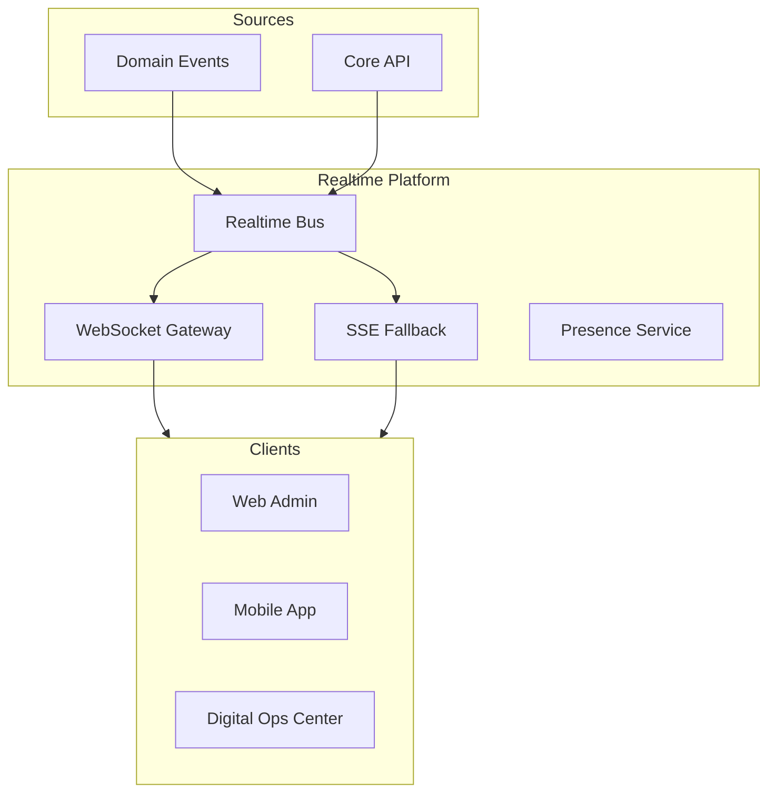

# CoreFlow — Realtime Platform

**Documento:** `docs/RealtimePlatform.md`  
**Versão:** 1.0 · **Data:** 2026-07-09  
**Status:** Estratégico — comunicação tempo real  
**Release alvo:** R4 production

---

## Visão

Capacidade transversal para atualizações live — agenda, fila, notificações, dashboards — sem polling agressivo.



---

## Protocolos

| Protocolo | Uso | Client |
|-----------|-----|--------|
| **WebSocket** | Bidirectional — chat, presence | Mobile, admin |
| **SSE** | Server push one-way | Web dashboards |
| **Long poll** | Fallback legacy browsers | Rare |

Endpoint: `wss://api.coreflow.app/v1/realtime` (🔜)

---

## Canais (channels)

Tenant-scoped: `{tenant_id}.{channel}`

| Channel | Eventos | Use case |
|---------|---------|----------|
| `bookings` | booking.* | Agenda live update |
| `queue` | waitlist.*, queue.* | Fila operacional |
| `notifications` | notification.* | In-app inbox |
| `dashboard` | analytics.snapshot | Live KPIs |
| `presence` | user.online | Staff availability |
| `platform` | ops metrics | DOC (superuser) |

---

## Casos de uso

### Booking updates

Staff A aprova booking → Staff B vê update instantâneo na agenda.

```
(EVT) booking.approved → Realtime Bus → channel bookings → WS push
```

### Queue / waitlist

Cliente entra fila → recepcionista vê posição update.

### Typing / presence (🔜)

```
{ type: "presence", user_id: 7, status: "online", location_id: 2 }
```

### Live dashboard

Owner dashboard KPIs refresh on `payment.received` without page reload.

### Notification fanout

Complement push Expo — in-app toast via WS when app foreground.

---

## Autenticação

- JWT in WS handshake query or `Sec-WebSocket-Protocol`
- Subscribe only channels authorized by RBAC
- Superuser `platform.*` channels isolated

---

## Escalabilidade (monolith first)

| Fase | Implementação |
|------|---------------|
| R4 MVP | In-process pub/sub + FastAPI WS |
| R5 | Redis Pub/Sub bridge multi-instance |
| R7 | Dedicated realtime service if metrics require |

**Extract only when:** >10k concurrent WS connections sustained.

---

## Message envelope

```json
{
  "type": "event",
  "channel": "42.bookings",
  "event_type": "booking.approved",
  "payload": { "booking_id": 1001, "status": "approved" },
  "timestamp": "2026-07-09T15:00:00Z",
  "correlation_id": "..."
}
```

---

## Feature flags

| Flag | Default |
|------|---------|
| `FEATURE_REALTIME_ENABLED` | false |
| `FEATURE_REALTIME_PRESENCE_ENABLED` | false |

---

## Roadmap

| Release | Entrega |
|---------|---------|
| R3 | Design + spike SSE for dashboard |
| R4 | WS gateway, bookings + queue channels |
| R5 | Presence, Redis bridge, mobile SDK helper |
| R6 | Partner WS API documented |

---

## Referências

- `docs/MobilePlatform.md`
- `docs/EventDrivenArchitecture.md`
- `docs/DigitalOperationsCenter.md`
- `docs/Notification` in DomainRegistry
