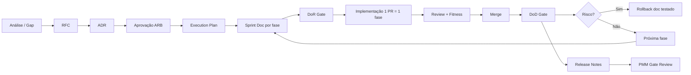

# CoreFlow — Release Governance

**Documento:** `docs/ReleaseGovernance.md`  
**Versão:** 1.0 · **Data:** 2026-07-09  
**Autoridade:** `docs/CONSTITUTION.md`, RFC-001, ADR-003

---

## Propósito

Define o **fluxo oficial de uma Release** — da proposta à entrega — para que nenhuma fase inicie sem pré-requisitos e nenhuma entrega conclua sem critérios objetivos.

---

## Fluxo oficial

---

## Fases do processo

### 1. RFC (Request for Comments)

| Item | Regra |
|------|-------|
| Onde | `docs/rfc/RFC-NNN-*.md` |
| Conteúdo | Objetivo, escopo IN/OUT, alternativas, riscos, rollback, métricas |
| Aprovação | Architecture Review Board |
| Exemplo | RFC-003 Core Domain Consolidation |

### 2. ADR (Architecture Decision Record)

| Item | Regra |
|------|-------|
| Onde | `docs/adr/ADR-NNN-*.md` |
| Quando | Após RFC aprovado; **antes** de código estrutural |
| Conteúdo | Contexto, decisão única, trade-offs, consequências |
| Índice | Atualizar `ArchitectureDecisionIndex.md` |

### 3. Execution Plan

| Item | Regra |
|------|-------|
| Onde | `docs/R{N}-ExecutionPlan.md` |
| Conteúdo | Fases, flags, paridade, critérios sucesso, sequência |
| Versão | Semver documento (v4, v5…) |

### 4. Sprint Doc (por fase)

| Item | Regra |
|------|-------|
| Onde | `docs/sprints/R{N}-F{M}.md` |
| Template | `docs/templates/SprintTemplate.md` — **obrigatório** |
| Obrigatório antes de código | Objetivo, escopo, ADRs, rollback, testes (17 seções) |
| Após merge | Entregas ✅, versão, lições aprendidas §17 |

### 5. Definition of Ready (DoR)

Gate **antes** de iniciar implementação da fase. Ver `docs/decisions/DefinitionOfReady-Architecture.md`.

### 6. Pull Request

| Regra | Detalhe |
|-------|---------|
| 1 PR = 1 fase | Proibido misturar F1 + F2 |
| Checklist | `docs/decisions/PR-Checklist.md` |
| Fitness | Conforme fase em `ArchitectureFitnessFunctions.md` |
| Review | Mínimo 1 reviewer; arquitetura se structural |

### 7. Definition of Done (DoD)

Gate **após** merge. Ver `docs/decisions/DefinitionOfDone-Architecture.md`.

### 8. Rollback

| Mecanismo | Quando |
|-----------|--------|
| Feature flag OFF | Comportamento novo |
| `CORE_ENFORCEMENT_MODE=warn/off` | Block legado |
| Git revert | PR de fase isolada |
| Alembic downgrade | Schema (se aplicável) |

Procedimento **documentado no sprint doc** antes do merge.

### 9. Release Notes

Atualizar em tag semver (`APP_VERSION`). Migration guide quando breaking ou enforcement.

### 10. PMM Gate Review

Ao fim da release: avaliar critérios `PlatformMaturityModel.md`.

### 11. Architecture Compliance Review

Executar checklist em `docs/reviews/ArchitectureCompliance.md` — registrar em `ArchitectureDecisionLog.md`. Partial vs complete documentado.

---

## Hierarquia de autoridade (fonte única)

1. `CONSTITUTION.md`
2. RFC da release
3. ADRs vinculados
4. Execution Plan
5. ArchitectureFitnessFunctions
6. Sprint doc da fase

Conflito → **Constituição vence**. Ambiguidade → **parar e escalar ao ARB**.

---

## Releases atuais

| Release | RFC | Plan | Status |
|---------|-----|------|--------|
| R1 | RFC-001, RFC-002 | R1-F1, R1-F2 | ✅ Concluída |
| R2 | RFC-003 | R2-ExecutionPlan v4 | 🔄 Em execução |
| R3 | RFC-004 (planejado) | — | ⏳ Design |

---

## Critério de parada

Interromper implementação e solicitar decisão ARB se:

- Escopo indefinido
- ADR conflitante
- Documento ausente
- Dúvida arquitetural
- Risco de quebra de paridade

**Nunca assumir.**

---

## Referências

- `docs/ArchitecturePrinciples.md`
- `docs/decisions/DefinitionOfReady-Architecture.md`
- `docs/decisions/DefinitionOfDone-Architecture.md`
- `docs/reviews/R2-GoNoGo-Checklist.md`
