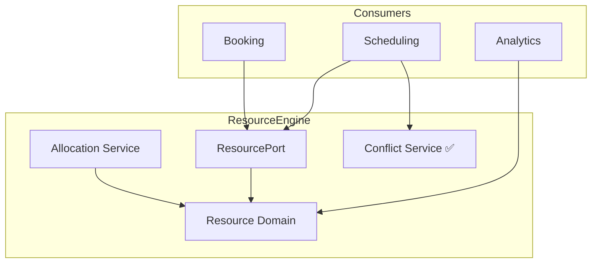

# CoreFlow — Resource Engine

**Documento:** `docs/ResourceEngine.md`  
**Versão:** 1.0 · **Data:** 2026-07-09  
**Status:** Estratégico — **Core universal** para qualquer vertical  
**ADR:** ADR-007, ADR-010 · **Release:** R2-F3

---

## Tese estratégica

O **Resource Engine** é um dos maiores módulos da plataforma porque **todo negócio de serviços reserva algo** — cadeira, quadra, consultório, mesa, quarto. Universalizando Resource, CoreFlow atende Beauty, Sports, Clinic, Hotel, Restaurant, Coworking com **um único motor**.

```
Worker (quem) + Resource (o quê) + Time (quando) = Booking
```

---

## Conceito Meta Model

| Core | Descrição |
|------|-----------|
| **Resource** | Entidade reservável com capacidade |
| **ResourceType** | Classificação configurável via plugin |
| **ResourcePool** | Agrupamento (ex.: todas quadras) |
| **Location** | Onde resource existe |

**Proibido no core:** `Tranca`, `Quadra` — são `ResourceType` labels no plugin.

---

## Mapeamento por vertical

| Vertical | Resource examples | Worker | Plugin |
|----------|-------------------|--------|--------|
| **Beauty** | cadeira, lavatório | profissional | beauty |
| **Sports** | quadra, campo | instrutor, juiz | sports |
| **Clinic** | consultório, equipamento | médico | clinic |
| **Coworking** | mesa, sala, auditório | — | coworking |
| **Hotel** | quarto, salão, garagem | — | hotel |
| **Restaurant** | mesa, cozinha | garçom | restaurant |
| **Education** | sala, laboratório | professor | education |
| **Events** | palco, equipamento AV | — | events |
| **Office** | sala reunião, projetor | — | rental |
| **Pet** | baia, sala banho | groomer | pet |

---

## Plugin manifest — resource types

```yaml
# plugins/sports/manifest.yaml
resource_types:
  - id: court
    label: Quadra
    default_capacity: 4
    booking_unit: hour
    min_duration_minutes: 60
  - id: field
    label: Campo
    default_capacity: 22
    min_duration_minutes: 90

# plugins/beauty/manifest.yaml
resource_types:
  - id: chair
    label: Cadeira
    default_capacity: 1
  - id: wash_station
    label: Lavatório
    default_capacity: 1
```

---

## Capacidades do engine

| Capability | Release | Descrição |
|------------|---------|-----------|
| CRUD Resource | **R2** | `/v1/resources` |
| Capacity | **R2** | `capacity` field |
| Conflict detection | **R2** | `ResourceConflictService` ✅ |
| Link Worker optional | R2 | worker_id on booking |
| Hierarchy parent/child | R3 | sala → cadeiras |
| Resource pools | R3 | allocate any in pool |
| Multi-resource booking | R4 | mesa + garçom |
| Pricing per resource | R4 | BRE integration |
| Maintenance blocks | R3 | schedule.blocked |
| Utilization analytics | R3 | BI heatmaps |

---

## Arquitetura



### Ports

| Port | Métodos |
|------|---------|
| `ResourceQueryPort` | get, list, by_location |
| `ResourceAllocationPort` | allocate, release, check_conflict |
| `ResourceTypePort` | resolve types from plugin manifest |

---

## Integração Scheduling

```
Booking.create → Scheduling.check_availability(resource_id, slot)
              → ResourceConflictService.validate
              → persist booking
              → allocate resource capacity
```

Scheduling Engine **nunca** conhece "tranca" — only `resource_id`.

---

## ACL legado (transitório)

| Core | Legado beauty |
|------|---------------|
| CoreResource | Tranca via legacy_sync |

Sunset when legacy API sunset complete.

---

## Eventos

| Evento | Quando |
|--------|--------|
| `resource.created` | CRUD create |
| `resource.updated` | Update capacity, status |
| `resource.allocated` | Booking confirmed |
| `resource.released` | Booking cancelled |

---

## Feature flag

`FEATURE_RESOURCE_ENGINE_ENABLED=false` — R2-F3

---

## R2-F3 entregáveis (referência)

Ver `R2-ExecutionPlan.md`:

- Module `modules/resource/`
- API `/v1/resources`
- Plugin `resource_types` in manifest
- Scheduling consumes ResourcePort
- Tests + ACL beauty sync

---

## Por que Resource Engine ≈ Core universal

Qualquer vertical que responda **"o que está sendo reservado?"** mapeia para Resource. Verticals que só vendem produtos físicos sem slot (retail puro) usam Inventory — but hybrid (restaurant, pet grooming) usam ambos.

Investimento concentrado em R2–R3 maximiza reutilização 2027–2030.

---

## Referências

- `docs/DomainRegistry.md` — Resources domain
- `docs/resource-engine/README.md` — estado código
- ADR-007, ADR-010
- `docs/scheduling-engine/` (se existir)
- `docs/DomainTemplates.md`
