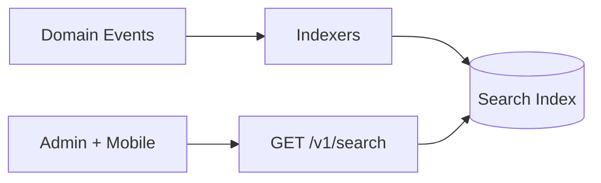

# CoreFlow — Search Engine

**Documento:** `docs/SearchEngine.md`  
**Versão:** 1.0 · **Data:** 2026-07-09  
**Status:** Estratégico — busca global cross-entity  
**Domínio:** Search (ver `DomainRegistry.md`)

---

## Visão

**Global Search** — uma barra de busca unificada para operadores e admins, indexando entidades core, custom fields, plugins e documentos.



---

## Escopo de indexação

| Categoria | Entidades | Plugin examples |
|-----------|-----------|-----------------|
| **People** | Customer, Worker | Paciente, instrutor |
| **Operations** | Booking, Waitlist | Reserva, fila |
| **Catalog** | Catalog, Offering | Tranca, modalidade |
| **Resources** | Resource, Location | Quadra, sala |
| **Commerce** | Order, Invoice, Payment | Pedido, NF |
| **Inventory** | Asset, Inventory item | Produto |
| **Platform** | Plugin configs | — |
| **Documents** | Files, reports | Ficha, contrato |
| **Custom** | TCE custom entities | Ficha capilar |

---

## API

```
GET /v1/search?q=maria&types=customer,booking&limit=20
```

```json
{
  "query": "maria",
  "took_ms": 12,
  "results": [
    {
      "type": "customer",
      "id": 55,
      "title": "Maria Silva",
      "subtitle": "Cliente · 5 reservas",
      "url": "/customers/55",
      "score": 0.95,
      "highlights": {"nome": ["<em>Maria</em> Silva"]}
    },
    {
      "type": "booking",
      "id": 1001,
      "title": "Reserva #1001 — Maria Silva",
      "subtitle": "2026-07-10 10:00",
      "url": "/bookings/1001",
      "score": 0.82
    }
  ],
  "facets": {
    "type": {"customer": 3, "booking": 7}
  }
}
```

| Param | Descrição |
|-------|-----------|
| `q` | Query full-text |
| `types` | Filter entity types |
| `from`, `to` | Date range |
| `location_id` | Scope unit |

---

## Indexação event-driven

| Evento | Ação |
|--------|------|
| `customer.created` | Index customer |
| `customer.updated` | Reindex |
| `booking.created` | Index booking + embed customer name |
| `catalog.updated` | Reindex offering |
| `tenant.custom_field.updated` | Reindex affected |

Projector consumes Kafka topic `coreflow.events.analytics` (🔜) or in-process.

---

## Backend options

| Opção | Release | Notas |
|-------|---------|-------|
| PostgreSQL FTS | R4 MVP | Same DB, tsvector |
| SQLite FTS5 | dev | Tests |
| Meilisearch | R5 | Self-hosted, fast |
| Elasticsearch | R6 enterprise | Optional |

Default: **PostgreSQL FTS** — modular monolith friendly.

---

## Multi-tenant isolation

- Every document: `company_id` mandatory filter
- Plugin-scoped custom entities: `plugin_id` filter
- RBAC: staff sees subset (own bookings) vs owner sees all

---

## Mobile & offline

- Search local cache for recent customers/bookings (offline read)
- Full search requires online
- SDK: `sdk.search(query, options)`

---

## Roadmap

| Release | Entrega |
|---------|---------|
| R3 | Index schema design |
| R4 | MVP PostgreSQL FTS, customers + bookings |
| R5 | Full entity coverage, facets |
| R6 | Meilisearch option, partner API |

---

## Referências

- `docs/EventDrivenArchitecture.md`
- `docs/DomainRegistry.md`
- `docs/TenantCustomizationEngine.md`
