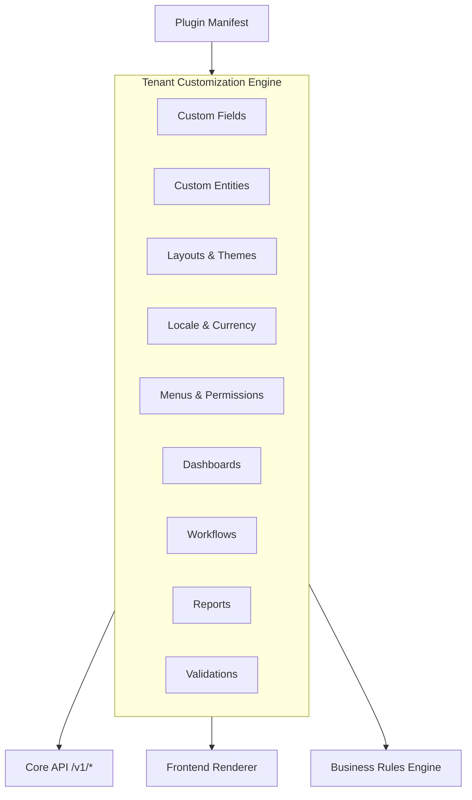

# CoreFlow — Tenant Customization Engine (TCE)

**Documento:** `docs/TenantCustomizationEngine.md`  
**Versão:** 1.0 · **Data:** 2026-07-09  
**Status:** Estratégico — personalização no-code por tenant  
**Princípio:** Configurar sem alterar código — Build Once. Configure Everywhere.

---

## Visão

O **Tenant Customization Engine** permite que cada empresa (tenant) adapte a plataforma às suas necessidades operacionais sem deploy de código. Especialização vertical continua via **Plugin**; TCE cobre **variação dentro do plugin**.



---

## Camadas de customização

| Camada | Escopo | Exemplo beauty | Exemplo sports |
|--------|--------|----------------|----------------|
| **L0 Plugin** | Vertical inteiro | Terminology, features | Quadra, modalidade |
| **L1 Tenant Config** | Empresa | Logo, cores, deposit 30% | Deposit 50%, min 1h slot |
| **L2 Custom Fields** | Entidade | "Tipo de cabelo" em Customer | "Nível" em Customer |
| **L3 Custom Entities** | Novas entidades | "Ficha capilar" | "Ranking jogador" |
| **L4 Layouts** | UI | Gallery 6 fotos | List view |
| **L5 Automation** | Processo | Workflow aprovação | Recurring booking |

**Regra:** L0 = Plugin manifest. L1–L5 = TCE. Nunca L2–L5 no core code.

---

## Capacidades

### 1. Campos personalizados (Custom Fields)

Estender entidades Meta Model sem migration core:

```json
{
  "entity": "customer",
  "fields": [
    {
      "key": "hair_type",
      "type": "enum",
      "label": "Tipo de cabelo",
      "options": ["liso", "cacheado", "crespo"],
      "required": false,
      "plugin_scope": "beauty"
    }
  ]
}
```

| Aspecto | Detalhe |
|---------|---------|
| Storage | `core_custom_field_values` (EAV JSON) ou JSONB column |
| API | `/v1/customers/{id}` inclui `custom_fields` |
| Validação | Schema JSON + BRE rules |
| Release | R3 MVP, R4 full |

### 2. Entidades customizadas (Custom Entities)

Entidades fora do Meta Model — **plugin-scoped**:

```json
{
  "entity_key": "hair_profile",
  "plugin_id": "beauty",
  "fields": [...],
  "relations": [{"type": "customer", "cardinality": "1:1"}]
}
```

**Regra Constitucional:** Custom entities **nunca** substituem CoreConcept. São extensões.

### 3. Layouts

| Tipo | Config |
|------|--------|
| Catalog list vs gallery | `ui.catalog_layout` (✅ manifest) |
| Form field order | TCE layout JSON |
| Mobile screen sections | Expo config-driven (R4) |
| Admin table columns | TCE column visibility |

### 4. Branding & Temas

| Item | Hoje | TCE alvo |
|------|------|----------|
| Mobile app name | EAS whitelabel ✅ | Tenant override |
| Logo / favicon | 🔜 | `/v1/tenant/branding` |
| Primary color | 🔜 | CSS variables / Expo theme |
| Font | 🔜 | Theme pack |
| Email header | 🔜 | Template branding |

### 5. Idiomas & Moedas

| Capacidade | Release |
|------------|---------|
| Plugin terminology i18n | R4 |
| Tenant locale override | R4 |
| Currency per Offering | R5 |
| Multi-currency display | R7 |

### 6. Validações

Declarativas — delegam ao BRE:

```yaml
validation:
  entity: booking
  rules:
    - field: scheduled_at
      rule: future_date
    - field: custom_fields.hair_type
      rule: required_if
      condition: plugin.feature.ai_vision
```

### 7. Menus & Permissões

| Item | Fonte |
|------|-------|
| Menu structure | Plugin manifest `sdk.routes` + TCE overrides |
| Role permissions | RBAC core + TCE `permission_grants` |
| Hide/show features | Plugin `features` + tenant toggles |

### 8. Dashboards & Relatórios

Tenant admin configura widgets a partir de catálogo BI — ver `BusinessIntelligence.md`, `LowCodePlatform.md`.

### 9. Workflows & Automações

Instanciar templates marketplace; parametrizar por tenant — ver `LowCodePlatform.md`.

---

## Modelo de dados (conceitual)

| Tabela | Propósito |
|--------|-----------|
| `tenant_config` | JSON blob config geral |
| `tenant_custom_field_def` | Schema fields por entity |
| `tenant_custom_field_value` | EAV values |
| `tenant_custom_entity_def` | Custom entity schemas |
| `tenant_custom_entity_row` | Custom entity data |
| `tenant_theme` | Branding tokens |
| `tenant_layout` | UI layout definitions |
| `tenant_locale` | i18n overrides |

Todas com `company_id` — isolamento multi-tenant obrigatório.

---

## APIs (propostas)

| Method | Path | Descrição |
|--------|------|-----------|
| GET | `/v1/tenant/config` | Config completa resolvida |
| PATCH | `/v1/tenant/config` | Atualizar config (owner) |
| GET | `/v1/tenant/custom-fields/{entity}` | Schema fields |
| PUT | `/v1/tenant/custom-fields/{entity}` | Definir fields (admin) |
| GET | `/v1/tenant/branding` | Theme tokens |
| GET | `/v1/tenant/menus` | Menu resolvido (plugin + overrides) |

---

## Eventos

| Evento | Quando |
|--------|--------|
| `tenant.config.changed` | Qualquer update config |
| `tenant.custom_field.updated` | Schema change |
| `tenant.theme.updated` | Branding change |

Consumers: Frontend cache invalidation, CDN purge, workflow rebind.

---

## Resolução de config (runtime)

```
effective_config = merge(
  platform_defaults,
  plugin_manifest.defaults,
  tenant_config,
  user_preferences  # futuro
)
```

Cache: Redis (🔜 R3) ou in-memory TTL per tenant.

---

## Limites e guardrails

| Limite | Valor | Motivo |
|--------|-------|--------|
| Custom fields per entity | 50 | Performance |
| Custom entities per tenant | 20 | Complexity |
| Config JSON size | 256 KB | Storage |
| Validation rules per entity | 30 | BRE eval cost |

Violations → Constitution audit via Fitness Functions.

---

## Roadmap

| Release | Entrega TCE |
|---------|-------------|
| **R2** | Terminology API (✅) — baseline |
| **R3** | Custom fields MVP, branding API, tenant_config |
| **R4** | Custom entities, layouts, validations + BRE |
| **R5** | Dashboard/report customization, marketplace templates |
| **R6** | Full admin UI builder |
| **R7** | i18n/multi-currency complete |

---

## RFC/ADR

| Artefato | Release |
|----------|---------|
| RFC-005 Tenant Customization Engine | R3 prep |
| ADR-016 Custom Fields EAV Strategy | R3 |
| ADR-017 Custom Entities Boundaries | R4 |

---

## Referências

- `docs/BusinessCapabilities.md`
- `docs/BusinessRulesEngine.md`
- `docs/LowCodePlatform.md`
- `backend/plugins/beauty/manifest.yaml` — terminology, ui
- `docs/CONSTITUTION.md` — Plugin First, Meta Model
