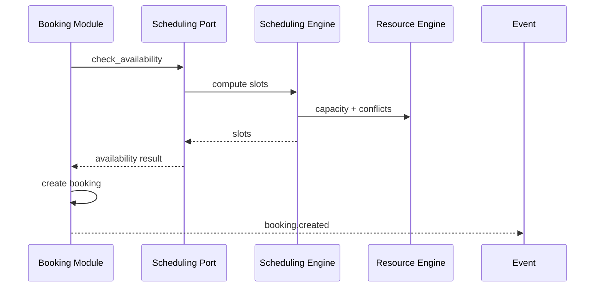

# ADR-008 — Scheduling Engine

| Campo | Valor |
|-------|-------|
| **Status** | Aceito |
| **Data** | 2026-07-09 |

## Contexto

Agenda deve ser motor reutilizável cross-vertical, separado de Booking e de regras de plugin.

## Problema

Booking, availability e fila estão parcialmente acoplados ao legado beauty.

## Decisão

### Separação de responsabilidades

| Componente | Responsabilidade | Módulo | Status |
|------------|------------------|--------|--------|
| **Availability** | Calcular slots livres | SchedulingEngine | ⚠️ Parcial |
| **Booking** | Criar/confirmar/cancelar reserva | `modules/booking/` | ⚠️ Delega legado |
| **Capacity** | Limites por resource | ResourceConflictService | ✅ |
| **Conflict Detection** | Sobreposição | ResourceConflictService | ✅ |
| **Pricing Rules** | Preço por slot/oferta | Plugin hook / offering | 🔜 Plugin |
| **Waiting List** | Fila quando sem slot | `modules/waitlist/` | ✅ separado |
| **No Show** | Detecção + evento | — | 🔜 |
| **Recurrence** | Reservas recorrentes | — | 🔜 |
| **Cancellation** | Políticas cancelamento | booking + plugin | ⚠️ |
| **Notification** | Efeito colateral | events → push | ⚠️ |
| **Audit** | Trilha alterações agenda | — | 🔜 |

### Regras

1. **SchedulingEngine** não cria Booking — apenas informa availability e conflitos
2. **Booking** consome availability via application service / port
3. Pricing e no-show **não** ficam no engine — plugins ou workflow
4. Waiting list integra via eventos (`booking.rejected` → waitlist offer)
5. ACL obrigatória para dados legado (`AgendaDiaService` → adapter → port)

### Fluxo alvo

## Consequências

- Refactor booking commands para usar port (Release 2)
- Legacy adapter removido em Scheduling v2 (Release 3)

## Benefícios

- Mesmo engine para salão, clínica, quadra

## Trade-offs

- Duplicação temporária legado/core

## Referências

- `docs/scheduling-engine/README.md`
- `backend/app/modules/scheduling/engine/scheduling_engine.py`
- ADR-007 Resource Engine
