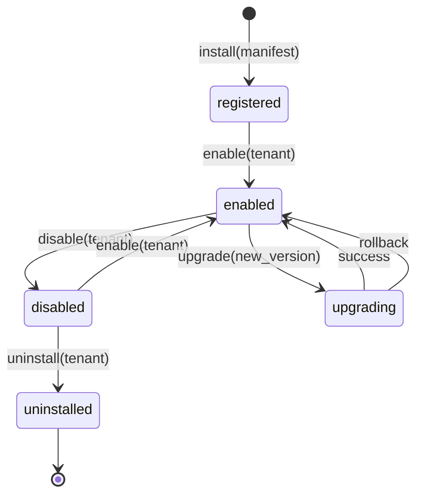

# ADR-011 — Plugin Hook Architecture

| Campo | Valor |
|-------|-------|
| **Status** | ✅ Aceito |
| **Data** | 2026-07-09 |
| **RFC** | [RFC-003](../rfc/RFC-003-CoreDomainConsolidation.md) |
| **Estende** | [ADR-006](./ADR-006-PluginArchitecture.md) |
| **Relacionado** | ADR-030, ADR-032 |

---

## Contexto

Plugins existem (beauty piloto) mas hooks são ad-hoc. `BeautyAgent` em `modules/ai/` viola Constituição. R2-F4 formaliza Plugin Engine.

## Decisão

### Lifecycle states



| Operação | Escopo | Efeito |
|----------|--------|--------|
| **install** | Platform registry | Valida manifest schema; registra hooks; **não** ativa tenant |
| **enable** | Per tenant (`company_id`) | Hooks invocados; config carregada |
| **disable** | Per tenant | Hooks ignorados; fallback core default |
| **upgrade** | Per tenant or global | Semver compat check; hot-swap handlers |
| **uninstall** | Per tenant | Remove config; hooks deregistered for tenant |

### Manifest (obrigatório)

```yaml
plugin_id: beauty
version: "2.0.0"
coreflow_min: "2.0.0"
coreflow_max: "3.x"
resource_types: [chair]
terminology:
  resource: Cadeira
  worker: Profissional
hooks:
  booking.created:
    handler: plugins.beauty.hooks.on_booking_created
    async: true
  booking.approved:
    handler: plugins.beauty.hooks.on_booking_approved
agents:
  - id: beauty-assistant
    path: plugins.beauty.agents.beauty_agent
```

### Typed hooks (v1 registry)

| Hook name | Payload type | When |
|-----------|--------------|------|
| `booking.created` | `BookingCreatedPayload` | After persist + outbox |
| `booking.approved` | `BookingApprovedPayload` | After approve |
| `booking.rejected` | `BookingRejectedPayload` | After reject |
| `booking.cancelled` | `BookingCancelledPayload` | After cancel |
| `waitlist.promoted` | `WaitlistPromotedPayload` | Waitlist → booking |
| `catalog.offering.selected` | `OfferingSelectedPayload` | UI/config |

Dispatch: **typed** via registry map `hook_name → list[HandlerRef]`. No string eval.

### Isolation rules

| Regra | Enforcement |
|-------|-------------|
| Plugin code under `app/plugins/{id}/` only | FF-PLG-002 |
| No plugin imports another plugin | FF-PLG-004 |
| No plugin imports `app.models.*` legado | FF-DEP-004 |
| No plugin imports `modules/*/domain` of other contexts | import-linter R4 |
| Hooks receive DTO/event payload — not ORM entities | Code review |

### Versioning & compatibility

| Rule | Detail |
|------|--------|
| Semver plugin | MAJOR breaking hook signature |
| `coreflow_min/max` | Enforced at enable time |
| Hook payload | Additive fields only in MINOR |
| Backward compat | Old plugins run with WARN if deprecated hook |

### Failure handling

| Cenário | Comportamento |
|---------|---------------|
| Hook handler exception | Log + DLQ; **core transaction already committed** |
| Hook timeout (>5s sync) | Async queue; core unaffected |
| Plugin disabled mid-flight | In-flight completes; new invocations skip |

### BeautyAgent migration (F4)

- **From:** `modules/ai/beauty_agent.py`
- **To:** `app/plugins/beauty/agents/beauty_agent.py`
- **Flag:** `FEATURE_PLUGIN_ENGINE_ENABLED`
- **Fallback:** Inline handler when flag OFF

## Matriz de decisão — hook dispatch

| Alt | Descrição | Decisão |
|-----|-----------|---------|
| A | String import dinâmico sem schema | ❌ Inseguro |
| B | Typed registry + manifest | ✅ Escolhida |
| C | Event-only (no sync hooks) | ❌ Insuficiente UX piloto |

## Consequências

- R2-F4 implementa registry + migration BeautyAgent
- Sports/clinic stubs com manifests vazios enriquecidos

## Referências

- `docs/CoreVsPlugins.md`
- `docs/PluginCertification.md`
- ADR-002, ADR-006
