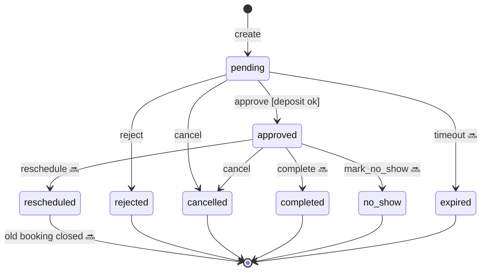

# ADR-026 — Booking State Machine

| Campo | Valor |
|-------|-------|
| **Status** | ✅ Aceito |
| **Data** | 2026-07-09 |
| **RFC** | [RFC-003](../rfc/RFC-003-CoreDomainConsolidation.md) |
| **Relacionado** | ADR-009, ADR-028 |

---

## Contexto

Estados de booking estavam implícitos no legado. Core exige máquina de estados explícita com eventos canônicos.

## Decisão — Estados e transições

### Estados

| Estado | Descrição | R2 implementa |
|--------|-----------|---------------|
| `pending` | Criado; aguarda aprovação/pagamento | ✅ F1 |
| `approved` | Confirmado | ✅ F2 |
| `rejected` | Recusado pelo operador | ✅ F2 |
| `cancelled` | Cancelado (cliente ou operador) | ✅ F2b |
| `completed` | Serviço realizado | 🔜 R3 |
| `no_show` | Cliente não compareceu | 🔜 R3 |
| `rescheduled` | Substituído por novo booking | ✅ R4-F11 |
| `expired` | Pending expirou (timeout) | 🔜 R3 |

### Diagrama (completo; R2 subset destacado)

### Transições R2 (implementar)

| De | Para | Comando | Regra | Evento |
|----|------|---------|-------|--------|
| — | `pending` | CreateBooking | Slot available | `booking.created` |
| `pending` | `approved` | ApproveBooking | Deposit confirmed (PaymentQueryPort) | `booking.approved` |
| `pending` | `rejected` | RejectBooking | Always if pending | `booking.rejected` |
| `pending` | `cancelled` | CancelBooking | Actor authorized | `booking.cancelled` |
| `approved` | `cancelled` | CancelBooking | Policy: até 24h before 🔜 plugin rule | `booking.cancelled` |

### Transições R3+ (documentadas; não implementar R2)

| De | Para | Evento |
|----|------|--------|
| `approved` | `completed` | `booking.completed` |
| `approved` | `no_show` | `booking.no_show` |
| `approved` | `rescheduled` | `booking.rescheduled` + new `booking.created` ✅ R4-F11 |
| `pending` | `expired` | `booking.expired` |

### Regras globais

| ID | Regra |
|----|-------|
| SM-1 | Transição inválida → `DomainError` → HTTP 409 Problem Details |
| SM-2 | Terminal states: `rejected`, `cancelled`, `completed`, `no_show`, `expired` — no outbound transitions |
| SM-3 | `version` incrementa a cada transição (optimistic lock) |
| SM-4 | Legacy projection mapeia status 1:1 via ACL mapping table |

### Legacy status mapping

| Core | Legado (agendamento) |
|------|---------------------|
| pending | pendente |
| approved | confirmado |
| rejected | recusado |
| cancelled | cancelado |

## Consequências

- F2b implementa cancel
- Reschedule permanece legado until R3 (RFC-003 OUT)

## Referências

- ADR-009
- `docs/EventStorming.md`
