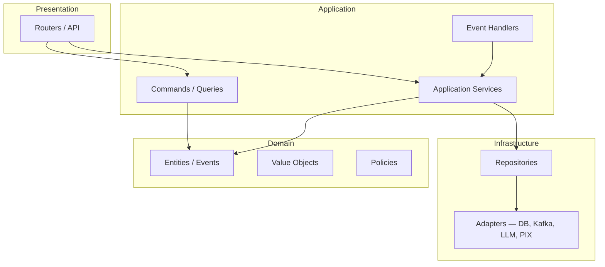

# CoreFlow — Target Architecture

## Observabilidade de plataforma (R1-F2)

| Endpoint | Propósito |
|----------|-----------|
| `GET /v1/platform/health` | Saúde arquitetural runtime |
| `GET /v1/platform/readiness-score` | Maturidade vs blueprint |
| `GET /v1/platform/plugin-registry` | Plugins ativos e dependências core |

**Versão:** 1.1 · **Status:** Alvo (observabilidade R1-F2 implementada)

---

## Diagrama — Core + Plugins

```mermaid
flowchart TB
    subgraph Clients
        Mobile[Expo Mobile]
        Web[Expo Web]
        SDK[@coreflow/sdk]
        WH[WhatsApp / Integrações]
    end

    subgraph API["API Layer — /v1/*"]
        R[Routers v1]
    end

    subgraph Core["Core Framework"]
        ID[Identity / Auth / Tenant]
        CAT[Catalog / Offering]
        BKG[Booking]
        SCH[Scheduling + Resource Engine]
        CUS[Customer]
        PAY[Payment]
        ORD[Order / Invoice]
        AST[Asset / Inventory]
        WFL[Workflow Engine]
        NT[Notification / Push]
        AI[AI Platform]
        MKT[Marketplace]
        AUD[Audit]
    end

    subgraph Shared
        EVT[Event Bus + Outbox]
        OBS[Observability]
    end

    subgraph Plugins
        PB[Beauty]
        PS[Sports]
        PC[Clinic]
        PN[...]
    end

    Mobile --> SDK --> R
    Web --> SDK --> R
    WH --> R
    R --> Core
    Core --> Shared
    Plugins -.->|manifest + hooks| Core
    EVT --> WFL
    EVT --> NT
    EVT --> AI
```

---

## Camadas (Clean / Hexagonal)



**Estado atual:** Presentation + Application + Domain (ORM) implementados; Infrastructure completa apenas em `identity`, `mobile`, parcial `payments`.

---

## Core vs Plugin — responsabilidades

| Core | Plugin |
|------|--------|
| Worker, Resource, Booking, Catalog | Terminologia (Tranca, Quadra, Consultório) |
| Scheduling rules genéricas | Pricing rules específicas |
| Payment port | Provedor preferido por vertical |
| Workflow triggers | Steps customizados |
| AI provider registry | Agent persona + tools |
| Tenant isolation | Branding / white-label |

---

## Engines

| Engine | Path alvo | Status |
|--------|-----------|--------|
| Resource | `docs/resource-engine/` | Parcial |
| Scheduling | `docs/scheduling-engine/` | Parcial |
| Workflow | `docs/workflow/` | Funcional |
| Plugin | `docs/plugins/` | Loader OK |
| AI | `docs/ai/` | Stub |

---

## Referências

- `BEAUTYOS_BLUEPRINT.md`
- `docs/07-META-MODEL/README.md`
- `docs/ArchitectureEvolutionPlan.md`
