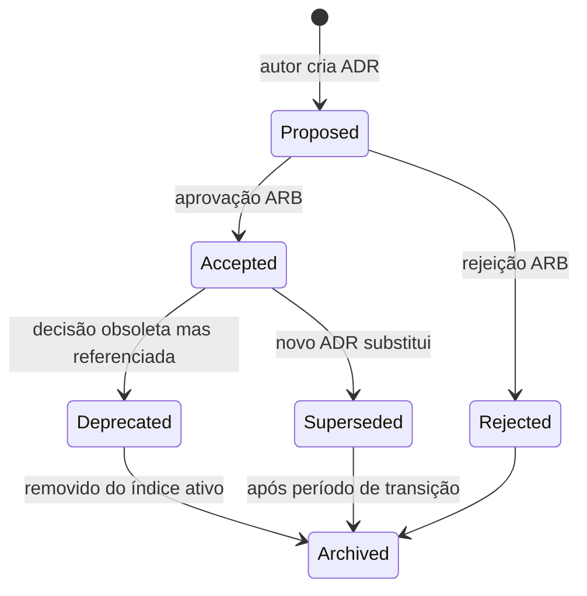

# ADR — Lifecycle & Immutability Policy

**Documento:** `docs/decisions/ADR-Lifecycle.md`  
**Versão:** 1.0 · **Data:** 2026-07-09  
**Autoridade:** `docs/CONSTITUTION.md`, RFC-001, ADR-003  
**Relacionado:** `docs/ReleaseGovernance.md`, `docs/ArchitectureDecisionIndex.md`

---

## Propósito

Define o ciclo de vida de um Architecture Decision Record e a política de **imutabilidade** após aceitação — evitando reescrita silenciosa de decisões históricas.

---

## Estados do lifecycle

| Estado | Significado | Editável? |
|--------|-------------|-----------|
| **Proposed** | Em revisão; pode ser alterado | ✅ Sim |
| **Accepted** | Decisão oficial vigente | ❌ **Não** (ver § Imutabilidade) |
| **Rejected** | Alternativa descartada | ❌ Não (registro histórico) |
| **Superseded** | Substituído por ADR mais novo | ❌ Não |
| **Deprecated** | Não aplicável a código novo; legado pode referenciar | ❌ Não |
| **Archived** | Fora do índice ativo; apenas histórico | ❌ Não |

---

## Imutabilidade (regra obrigatória)

### ADR Accepted **nunca** é editado

| Permitido | Proibido |
|-----------|----------|
| Corrigir typo de formatação (sem mudar decisão) — com nota no Decision Log | Alterar seção **Decisão** |
| Adicionar link para ADR successor no topo | Alterar trade-offs retroativamente |
| Criar **novo ADR** que supersede o anterior | "Atualizar" ADR Accepted in-place |

### Como evoluir uma decisão

1. Criar **novo ADR** (ex.: ADR-034) com status **Proposed**
2. Referenciar ADR anterior: `Substitui: ADR-024`
3. ARB aprova → novo ADR **Accepted**
4. ADR anterior → **Superseded** + campo `Substituído por: ADR-034`
5. Registrar em `docs/ArchitectureDecisionLog.md`
6. Atualizar `ArchitectureDecisionIndex.md`

---

## Metadados obrigatórios (cabeçalho ADR)

| Campo | Obrigatório |
|-------|-------------|
| Status | ✅ |
| Data | ✅ |
| RFC vinculado | Quando aplicável |
| Substituído por | Se Superseded |
| Substitui | Se supersede outro |

---

## Versionamento de conteúdo

- ADRs **não** usam semver interno
- Identidade = número fixo (`ADR-024`)
- Evolução = novo número (`ADR-034`)

---

## Responsabilidades

| Papel | Ação |
|-------|------|
| Autor | Cria Proposed; não merge sem ARB |
| ARB | Aceita / Rejeita / solicita novo ADR em vez de editar |
| Platform Lead | Mantém índice e Decision Log |
| Qualquer dev | Reporta conflito ADR vs código → Compliance Review |

---

## Referências

- `docs/ReleaseGovernance.md`
- `docs/ArchitectureDecisionLog.md`
- `docs/decisions/DefinitionOfReady-Architecture.md`
