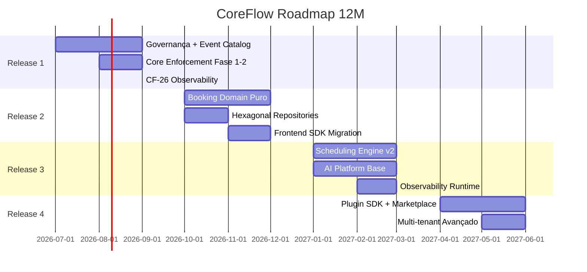

# CoreFlow — Roadmap 12 Meses

**Período:** julho 2026 – junho 2027  
**Versão código atual:** `1.17.0-r1-f2`  
**Processo:** RFC → ADR → Aprovação → Fases incrementais

---

## Visão por Release

---

## Release 1 — Fundação & Governança

**Jul – Set 2026** · Versão alvo: `1.16.0` – `1.18.0`

| Objetivo | Entregas | Prioridade | Complexidade |
|----------|----------|------------|--------------|
| Estabelecer governança | RFC-001/002 + ADR-003/004 aprovados | Must | Baixa |
| Visibilidade APIs | Mapa legado→v1, métricas Prometheus | Must | Baixa |
| Event Catalog | `docs/architecture/EventCatalog.md` completo | Must | Baixa |
| Observabilidade | CF-26: Slack AM, audit canary, TFC tasks | Should | Média |
| Enforcement staging | `CORE_ENFORCEMENT_MODE=warn` (R1-F2 ✅) | Must | Média |
| Platform Health API | `GET /v1/platform/health` + readiness score | Must | Baixa |

**Dependências:** Aprovação RFC-001, RFC-002  
**Não fazer:** Block legado, alterar booking domain

---

## Release 2 — API First & Domain Core

**Out – Dez 2026** · Versão alvo: `1.19.0` – `2.0.0-beta`

| Objetivo | Entregas | Prioridade | Complexidade |
|----------|----------|------------|--------------|
| Booking no core | Create/Approve/Reject sem legado | Must | Alta |
| Hexagonal | Ports/repos catalog, customer, booking | Should | Média |
| Frontend | Admin + tabs críticos via `@coreflow/sdk` | Must | Alta |
| Enforcement | Block rotas com paridade testada | Must | Média |
| Plugins | clinic/sports manifests enriquecidos | Could | Baixa |

**Dependências:** Release 1, testes paridade  
**Marco:** 70% escritas via `/v1/*`

---

## Release 3 — Engines & AI Platform

**Jan – Mar 2027** · Versão alvo: `2.0.0` – `2.2.0`

| Objetivo | Entregas | Prioridade | Complexidade |
|----------|----------|------------|--------------|
| Scheduling v2 | Sem legacy adapter, recurring, no-show | Should | Alta |
| Resource v2 | Hierarchy, types via manifest | Should | Média |
| AI Platform | Provider registry, prompt engine, agent base | Should | Alta |
| BeautyAgent | Migrado para plugin beauty | Should | Média |
| Observabilidade | Prometheus+Grafana+AM docker stack | Should | Média |
| Audit | Audit trail API + storage | Should | Média |
| Security | Rate limit, auth audit | Should | Média |

**Dependências:** Release 2 booking core  
**Marco:** Score ArchitectureAssessment ≥ 6.5

---

## Release 4 — Platform & Ecosystem

**Abr – Jun 2027** · Versão alvo: `2.3.0` – `2.5.0`

| Objetivo | Entregas | Prioridade | Complexidade |
|----------|----------|------------|--------------|
| Plugin SDK | CLI geradores (plugin, event, port) | Could | Alta |
| Marketplace | Install plugin per tenant MVP | Could | Alta |
| Multi-tenant | Business entity, branch (spike) | Could | Média |
| Mobile | Offline sync spike | Could | Muito alta |
| Workflow | Action catalog expandido | Could | Média |
| Novos plugins | Pet, Education stubs (manifest only) | Could | Baixa |

**Dependências:** Release 3 AI + Plugin engine  
**Marco:** Novo vertical via manifest + config (sem core change)

---

## Sprints técnicos (CF-26+)

| Sprint | Release | Foco provável |
|--------|---------|---------------|
| CF-26 | R1 | Slack AM + audit canary + TFC run tasks |
| CF-27 | R1 | Enforcement warn + route metrics |
| CF-28 | R2 | Booking domain phase 1 |
| CF-29 | R2 | Repositories catalog/customer |
| CF-30 | R2 | Frontend SDK migration phase 1 |
| CF-31 | R3 | AI Provider registry |
| CF-32 | R3 | Scheduling engine v2 phase 1 |
| CF-33 | R3 | Observability docker stack |
| CF-34 | R4 | Plugin SDK CLI spike |
| CF-35 | R4 | Marketplace install MVP |

*Sprints só iniciam após RFC/ADR da release aprovados.*

---

## Métricas de release

| Release | API v1 writes | Modules w/ ports | SDK frontend | Score |
|---------|---------------|------------------|--------------|-------|
| R1 (atual) | ~20% | 2/18 | ~15% | 5.4 |
| R2 | 70% | 6/18 | 60% | 6.5 |
| R3 | 85% | 12/18 | 75% | 7.5 |
| R4 | 95% | 15/18 | 90% | 8.0 |

---

## Riscos por release

| Release | Risco principal | Contingência |
|---------|-----------------|--------------|
| R1 | Baixo — mostly docs/obs | N/A |
| R2 | Quebra piloto beauty | Paridade tests, rollback settings |
| R3 | Scope AI muito amplo | MVP provider+prompt only |
| R4 | Marketplace sem demanda | Manifest-only plugins |

---

## Referências

- `docs/ArchitectureEvolutionPlan.md`
- `docs/Backlog.md`
- `docs/ArchitectureAssessment.md`
- `DOCUMENTACAO.md` §13 (histórico CF-0→25)
